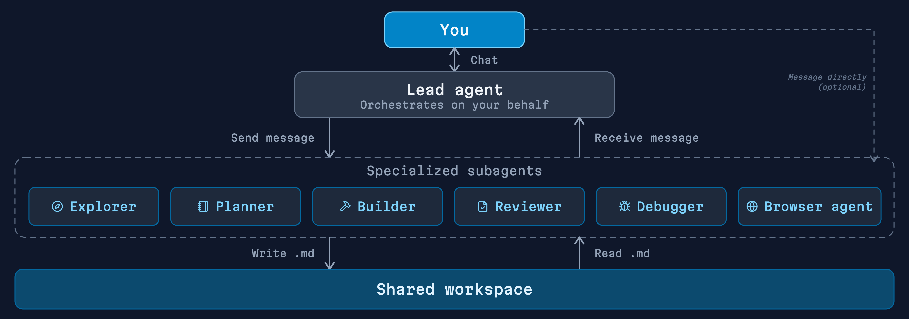

<p align="center">
  
</p>

<p align="center">
  <a href="https://docs.magnitude.dev" target="_blank"></a>  <a href="https://discord.gg/VcdpMh9tTy" target="_blank"></a> <a href="https://x.com/usemagnitude" target="_blank"></a>
</p>


Magnitude is an **open source coding agent** that orchestrates a full dev team of subagents. A lead agent delegates across explorers, planners, builders, reviewers, debuggers, and a browser agent.

- **Everything runs in subagents.** The lead stays focused on orchestration, while subagents handle implementation. The lead's context stays clean.
- **The dev process is built in.** The lead runs an explore, plan, build, review, debug cycle, iterating until checks pass or it needs your input. No manual orchestration.
- **Subagents stay alive.** The lead can tell the planner to consider more angles, or send bugs back to the same builder. No re-exploration, saving time and tokens.
- **Agents share context through files, not summaries.** No output tokens burned on lossy summaries. Every handoff is a file you can view later.
- **Mix models by role.** Fast models for exploration. Frontier models for planning and review. You control the cost-intelligence tradeoff.

<p align="center">
  
</p>

## Installation

```bash
npm install -g @magnitudedev/cli
```

Then navigate to the directory you want to work in and launch the TUI:

```bash
magnitude
```

This will launch Magnitude with a setup wizard for configuring providers and models.

### Providers

Magnitude works with most major model providers out of the box, including open source and local models.

You can use your **ChatGPT Plus/Pro** or **GitHub Copilot** subscription.

See the [provider docs](https://docs.magnitude.dev/configuration/providers) for full provider support.

## How it works

The lead agent manages all subagents on your behalf. It can message, stop, resume, or redirect them and run many in parallel. You can also message subagents directly.

Magnitude comes out of the box with the following subagents:
- **Explorer**: for doing codebase or web research, both broad and narrow
- **Planner**: for evaluating various implementation strategies
- **Builder**: for implementing code changes directly in your files
- **Reviewer**: for strict, independent review of code changes
- **Debugger**: for root causing bugs and fixing them
- **Browser**: for verifying UI changes with a built-in browser agent

Magnitude may use none or all of these in a given session. For a quick fix in a single file, it may edit it directly. For a very in-depth change, it may use the whole team. For most tasks, it will use some combination of explorer, planner, builder, and reviewer.

<p align="center">
  
</p>

## Why we built this

The community clearly wants more out of Claude Code. Projects like Superpowers have hit 100k+ GitHub stars by augmenting Claude Code with more skills/subagents. People want agents to follow better software development processes. 

But they're plugging into an existing coding agent that wasn't built around them. The result is inconsistent usage and mixed results, often having to repeatedly prompt the agent to actually use the skills. 

Instead of plugging into an existing primitive, we built a new one from the ground up. Imagine Claude Code was actually built around Superpowers. **That's Magnitude.**

## Documentation

Full documentation is available at [docs.magnitude.dev](https://docs.magnitude.dev).

## Contributing

See the [contributing guide](https://docs.magnitude.dev/contributing) to get started.

## Acknowledgements

Built on top of [BAML](https://boundaryml.com), [Effect](https://effect.website), and [OpenTUI](https://github.com/anomalyco/opentui).

Inspired by other open-source coding agents, including [OpenCode](https://github.com/anomalyco/opencode) and [Codex](https://github.com/openai/codex).
