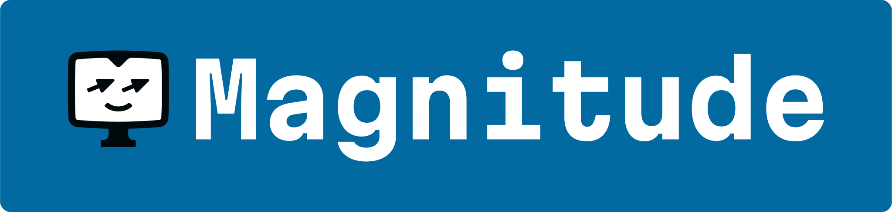
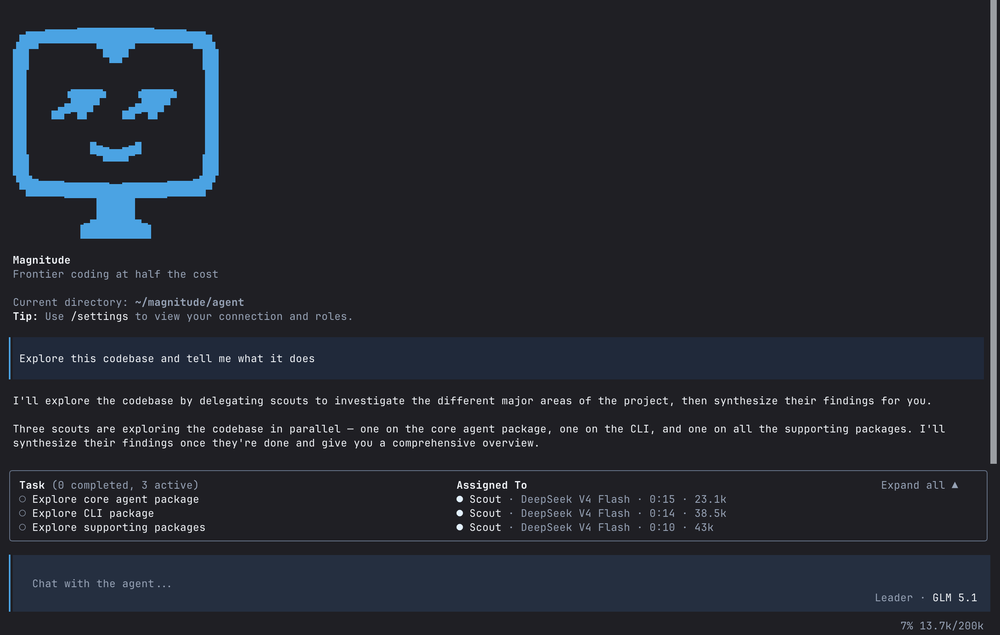

<p align="center">
  
</p>

<p align="center"><b>Open source coding agent</b></p>

<p align="center">
  <a href="https://docs.magnitude.dev" target="_blank"></a>  <a href="https://discord.gg/VcdpMh9tTy" target="_blank"></a> <a href="https://x.com/usemagnitude" target="_blank"></a>
</p>

Magnitude is an open source coding agent that follows intent more reliably, stays effective on longer tasks, and produces higher-quality code.

- **Managed orchestration** to keep long-running work on track
- **Specialized subagents** with role-specific context and tools
- **Shared markdown artifacts** for lossless context handoff between agents
- **Selective tool output** to keep noisy results out of context by default
- **Model flexibility** across frontier, open source, and local models

<p align="center">
  
</p>

## Installation

```bash
npm install -g @magnitudedev/cli
bun add -g @magnitudedev/cli
pnpm add -g @magnitudedev/cli
yarn global add @magnitudedev/cli
```

After installation, just run `magnitude` in your terminal to launch the TUI:

```bash
magnitude
```

This will launch Magnitude with a setup wizard for configuring providers and models.

Optionally, run `/init` to automatically set up an [AGENTS.md](https://agents.md) for your project.

### Skills

Magnitude supports the [Agent Skills](https://agentskills.io) standard. Skills are automatically discovered on launch from the following locations in order of priority:

1. `<project>/.magnitude/skills/`
2. `<project>/.agents/skills/`
3. `~/.magnitude/skills/`
4. `~/.agents/skills/`

## Philosophy

**The coding agent primitive is not solved.** Models often know what to do, but still fail to turn that intent into correct changes in a messy, evolving codebase. In practice, most failures come from two recurring patterns: **context degradation** over long sessions, and **local maximum traps** where the agent settles for the nearest plausible fix. Magnitude is built around those failure modes with managed orchestration, specialized subagents, explicit context handoff, progressive disclosure of tool output, and role-specific reasoning.

## Features

### Orchestrator → subagent architecture

The orchestrator manages the conversation and delegates to specialized subagents (explorer, planner, builder, reviewer, browser, debugger), each with its own context window, role-specific context, toolset, and permissions. Subagents do focused work and report back, keeping the orchestrator's context clean and focused on your intent.

### Context sharing via artifacts

Shared markdown documents pass context between agents. Instead of the orchestrator summarizing and relaying information, agents read and write artifacts directly. An explorer writes findings, a planner reads them and produces a plan, a builder reads the plan and implements. No context is lost in translation, and the orchestrator doesn't burn output tokens on handoff.

### Two-way agent communication

The orchestrator and subagents have full bidirectional messaging. The orchestrator can steer, redirect, or interrupt subagents mid-work. Subagents can message back when they hit blockers or need clarification. Not fire-and-forget delegation.

### Parallel by default

The orchestrator spins up multiple subagents concurrently and keeps working while they run. Independent tasks like exploring separate areas of the codebase, implementing unrelated features, or debugging multiple issues all happen in parallel.

### Progressive disclosure of tool output

Tool output does not flood the context window by default. Agents inspect results explicitly and pull in only what they need, keeping noisy, irrelevant output out of the main thread.

### Built-in browser agent

A vision-based browser agent built on [browser-agent](https://github.com/magnitudedev/browser-agent) runs natively in the same runtime. It can be used to verify UI changes and behavior as part of the workflow.

### Steerable and hackable

Skills, AGENTS.md, and persistent memory let Magnitude adapt to how you work, not the other way around. It can learn your preferences and codebase conventions over time, storing them in `.magnitude/memory.md` and applying them automatically to future sessions.

## Additional Info

### Provider and model support

See the [providers](https://docs.magnitude.dev/configuration/providers) and [models](https://docs.magnitude.dev/configuration/models) pages in the docs. If you would like another provider to be supported, please feel free to create an issue or raise a PR yourself.

### Contributing

See the [contributing guide](https://docs.magnitude.dev/contributing) to get started.

### Documentation

Full documentation is available at [docs.magnitude.dev](https://docs.magnitude.dev).

### Acknowledgements

Built on top of [BAML](https://boundaryml.com), [Effect](https://effect.website), and [OpenTUI](https://github.com/anomalyco/opentui).

Inspired by other open-source coding agents, including [OpenCode](https://github.com/anomalyco/opencode) and [Codex](https://github.com/openai/codex).
