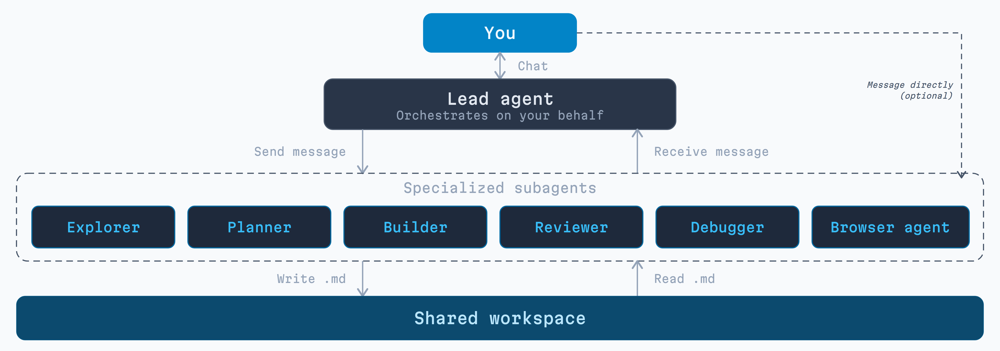

<p align="center">
  
</p>

<p align="center">
  <a href="https://docs.magnitude.dev" target="_blank"></a>  <a href="https://discord.gg/VcdpMh9tTy" target="_blank"></a> <a href="https://x.com/usemagnitude" target="_blank"></a>
</p>

Magnitude is an **open source coding agent** built from the ground up around subagents. You chat with a lead agent that coordinates specialized subagents on your behalf: explorers, planners, builders, reviewers, debuggers, and a browser agent.

- Building happens in subagents, so the **lead stays focused on you**
- Subagents are **long-lived** and **resumable**, not disposable
- The lead can **redirect subagents mid-task** without starting over
- Subagents are spun up in **parallel** for faster work
- A **shared workspace** keeps handoffs between agents lossless
- **Mix and match models** by role to balance intelligence and speed

<p align="center">
  
</p>

## Installation

```bash
npm install -g @magnitudedev/cli
```

Then navigate to the directory you want to work in and launch the TUI:

```bash
magnitude
```

This will launch Magnitude with a setup wizard for configuring providers and models.

### Providers

Magnitude works with most major model providers out of the box, including open source and local models.

You can use your **ChatGPT Plus/Pro** or **GitHub Copilot** subscription.

See the [provider docs](https://docs.magnitude.dev/configuration/providers) for full provider support.

## How it works

The lead agent manages all subagents on your behalf. It can message, stop, resume, or redirect them and run many in parallel. You can also message subagents directly.

Magnitude comes out of the box with the following subagents:
- **Explorer**: for doing codebase or web research, both broad and narrow
- **Planner**: for evaluating various implementation strategies
- **Builder**: for implementing code changes directly in your files
- **Reviewer**: for strict, independent review of code changes
- **Debugger**: for root causing bugs and fixing them
- **Browser**: for verifying UI changes with a built-in browser agent

Magnitude may use none or all of these in a given session. For a quick fix in a single file, it may edit it directly. For a very in-depth change, it may use the whole team. For most tasks, it will use some combination of explorer, planner, builder, and reviewer.

<p align="center">
  
</p>

## Why we built this

We became fully subagent-pilled the first time we saw Claude Code use an explore agent. We expected it to continue getting better and better. **But it didn't.**

The community clearly feels the same — projects like Superpowers have hit 100k+ GitHub stars augmenting Claude Code with more subagents. But they're plugging into an existing primitive that wasn't designed for deep subagent orchestration.

Instead of plugging into an existing primitive, we built a new one from the ground up. That's the difference between bolting on subagents and building around them.

## Additional Info

### Documentation

Full documentation is available at [docs.magnitude.dev](https://docs.magnitude.dev).

### Contributing

See the [contributing guide](https://docs.magnitude.dev/contributing) to get started.

### Acknowledgements

Built on top of [BAML](https://boundaryml.com), [Effect](https://effect.website), and [OpenTUI](https://github.com/anomalyco/opentui).

Inspired by other open-source coding agents, including [OpenCode](https://github.com/anomalyco/opencode) and [Codex](https://github.com/openai/codex).
