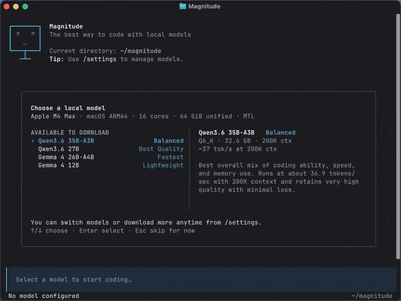

# Magnitude

<a href="https://docs.magnitude.dev" target="_blank"></a>
<a href="https://discord.gg/EHt48pPWdC" target="_blank"></a>
<a href="https://x.com/usemagnitude" target="_blank"></a>

Magnitude is an open source agent with local models built in. Fully private and offline. Works out of the box on any hardware.



## Get started

```sh
npm install -g @magnitudedev/cli
cd your-project
magnitude
```

Magnitude supports macOS and Linux. Windows is supported through WSL.

## Why Magnitude?

- **Fully private and offline** Everything stays on your machine, including the models.
- **Models for every machine** Profiles your hardware and recommends the best models.
- **Works out of the box** No Ollama, model server, or inference setup to configure.
- **Skills** Extend Magnitude to work with Excel, PDFs, Chrome, and more.
- **Free to run** No token costs, API keys, subscriptions, or rate limits.
- **Open source** Apache 2.0 licensed, fully inspectable, and yours to modify.

## Add skills

Skills are reusable capabilities for your agent. A good way to get them is [skills.sh](https://www.skills.sh), a skills directory from Vercel.

Skills we recommend:

```sh
npx skills add vercel-labs/agent-browser   # drive your logged-in Chrome browser
npx skills add anthropics/skills/xlsx      # read and build Excel spreadsheets
npx skills add anthropics/skills/pptx      # build PowerPoint decks
npx skills add anthropics/skills/docx      # read and write Word documents
npx skills add anthropics/skills/pdf       # read, fill, and create PDFs
```

## FAQ

### What is Magnitude?

Magnitude is an open source agent with local models built in. Everything runs directly on your machine.

### How is Magnitude different from Ollama or Hermes?

Ollama runs local models. Hermes is an agent that can use local models. Magnitude combines both in one: it profiles your hardware, recommends and downloads models, then configures and runs them inside the agent. Nothing else to set up.

### What hardware do I need?

There’s no fixed minimum. Magnitude profiles your hardware and recommends the best models for your machine. More memory lets you run larger models.

### Does my data go to the cloud?

No. Your prompts and files stay on your machine.

### Can Magnitude run completely offline?

Yes. Once Magnitude and a model are downloaded, you can use it without an internet connection.

### Can I use models outside the catalog?

Yes. You can [download compatible GGUF models from Hugging Face](https://docs.magnitude.dev/models#download-a-model-outside-the-catalog) and use them in Magnitude.

### Can I use my own inference server?

Yes. You can [connect an OpenAI-compatible endpoint](https://docs.magnitude.dev/custom-endpoints) and use its models in Magnitude.

## Learn more

- [Documentation](https://docs.magnitude.dev)
- [CLI reference](https://docs.magnitude.dev/reference)
- [Discord](https://discord.gg/EHt48pPWdC)
- [Report an issue](https://github.com/magnitudedev/magnitude/issues)

## License

Magnitude is licensed under the [Apache License 2.0](LICENSE).
