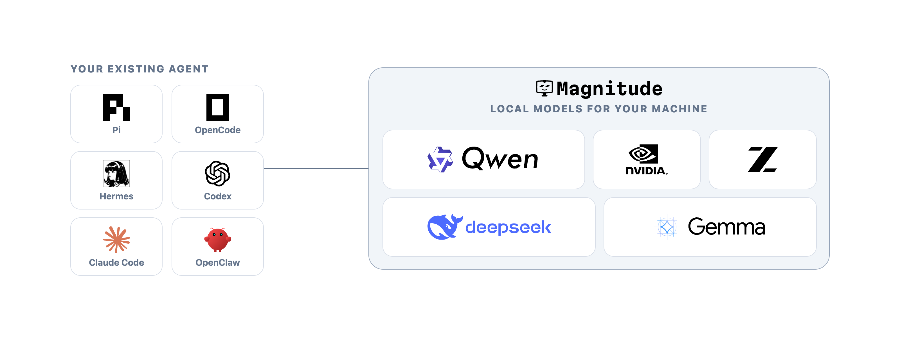

<p align="center">
  <picture>
    <source media="(prefers-color-scheme: dark)" srcset="assets/brand/icon-dark.svg">
    <source media="(prefers-color-scheme: light)" srcset="assets/brand/icon-light.svg">
    
  </picture>
</p>

<h1 align="center">Magnitude</h1>

<p align="center"><strong>Easy local inference for agents</strong></p>

<p align="center">
  <a href="https://docs.magnitude.dev"></a>
  <a href="https://discord.gg/EHt48pPWdC"></a>
  <a href="https://x.com/usemagnitude"></a>
  <a href="https://github.com/magnitudedev/magnitude/stargazers"></a>
  <a href="https://www.npmjs.com/package/@magnitudedev/cli"></a>
</p>

An open source inference server that your agent sets up for you. Magnitude profiles your hardware, helps you choose the best local models for it, then downloads, tunes, and runs them on demand.

⭐ Help us reach more developers and grow the Magnitude community. Star this repo!

<picture>
  <source media="(prefers-color-scheme: dark)" srcset="assets/readme/ecosystem-dark.png">
  <source media="(prefers-color-scheme: light)" srcset="assets/readme/ecosystem-light.png">
  
</picture>

## Get started

### Send this to your agent

```text
Set up local models for me with the Magnitude CLI. Install it with `npm i -g @magnitudedev/cli` (or my package manager), then run `magnitude docs onboarding` and follow the instructions.
```

Your agent will inspect your hardware, compare compatible models with you, download and load your choice, and connect Magnitude to the agent you already use.

Magnitude supports macOS and Linux. Windows is supported through WSL.

<details>
<summary>Want to browse the models directly?</summary>

```sh
npm i -g @magnitudedev/cli
magnitude setup
```

The interactive setup lets you browse the recommended models and choose one yourself.

</details>

## Why Magnitude?

- **Agent-first setup:** one prompt and your agent walks you through the rest
- **Knows your hardware:** profiles your chip, memory, and bandwidth
- **Recommends what fits:** the best models for your machine, with estimated tok/s
- **Tuned end to end:** speculative decoding, concurrency, all set for your machine
- **Models on demand:** loaded on request, unloaded when idle or memory fills
- **Fully private and offline:** models, prompts, and files stay on your machine
- **Free to run:** no token costs, API keys, or rate limits
- **Open source:** Apache 2.0, yours to modify

## FAQ

### What is Magnitude?

An open source inference server your agent sets up and operates through the Magnitude CLI. It profiles your hardware, recommends the best models for it, and runs them tuned to your machine.

### What hardware do I need?

There's no fixed minimum. Magnitude profiles your hardware and recommends the best models for your machine. More memory lets you run larger models.

### Why not just have my agent set up Ollama?

Your agent can install Ollama and pull a model, but it's guessing. It doesn't know your hardware, which quant fits, or how fast it'll run. Magnitude gives it a curated catalog with recommendations computed for your machine. Setup is agent-first, through a headless CLI that connects the model to your harness. Inference is built for agents. Models load just in time, unload when idle or memory gets tight, and concurrency is handled for you.

### Which harnesses work with it?

Pi, OpenCode, Hermes, OpenClaw, Codex, Claude Code, Oh My Pi, and Cline. During setup, your agent connects your harness to the model you pick. Or use Magnitude's built-in harness.

### Do I need to manage Magnitude after setup?

No. It runs in the background, loads models when your agent needs them, and unloads them when idle or memory gets tight. Your agent can install or switch models through the Magnitude CLI anytime.

### Does my data go to the cloud?

No. Prompts, files, and models stay on your machine.

### Can it run completely offline?

Yes. Once Magnitude and a model are downloaded, no internet connection needed.

### Can I use models outside the catalog?

Yes. You can [download compatible GGUF models from Hugging Face](https://docs.magnitude.dev/models#download-a-model-outside-the-catalog) and use them in Magnitude.

## Learn more

- [Documentation](https://docs.magnitude.dev)
- [CLI reference](https://docs.magnitude.dev/reference)
- [Discord](https://discord.gg/EHt48pPWdC)
- [Report an issue](https://github.com/magnitudedev/magnitude/issues)

## License

Magnitude is licensed under the [Apache License 2.0](https://github.com/magnitudedev/magnitude/blob/main/LICENSE).
