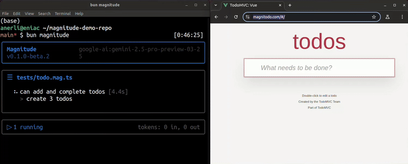

<div>
  <div style="display: flex; align-items: center;">
    
    <h1 style="margin-left: 20px; font-size: 48px;"><b>Magnitude</b></h1>
  </div>

  <h3 align="center">
    Open source AI agent for web automation
  </h3>

  <hr style="height: 1px; border: none; background-color: #e1e4e8; margin: 24px 0;">

  <p>
    <a href="https://docs.magnitude.run/getting-started/introduction" target="_blank"></a>  <a href="https://discord.gg/VcdpMh9tTy" target="_blank"></a> <a href="https://x.com/tgrnwld" target="_blank"></a>
  </p>
</div>

**If it happens in the browser, Magnitude can automate it**

We built Magnitude on 3 core principles:

**1️⃣ Control is critical:** Production-grade automation requires precision, not relying on AI to guess a bunch of intermediate actions based on a high-level task

**2️⃣ Semantics over selectors:** Determinism should be achieved with semantic descriptions of low-level actions, not inherently brittle XPath/CSS selectors

**3️⃣ Vision drives scalability:** Using highly specialized VLMs to locate elements will scale, drawing bounding boxes around elements won’t


### Features of Magnitude:

- **🗣️ Natural language:** automations can be defined as simple natural language commands (e.g. “log in to the app”, “verify the dashboard is visible”)
- **🎮 Fine-grained control:** combine high-level act() syntax to leave more to the AI agent, low-level click(), type(), etc. to have more control, and traditional Playwright code as needed
- **🎨 Fully customizable:** define your own actions/tools alongside our included ones
- **🧪 Native test runner:** built on top of the core web agent but optimized for building UI test automation, and includes powerful visual assertions with check() syntax
- **🔄 Cached automations:** we construct a JSON representation of the actions taken, which can then be executed in the future for cheap, fast, deterministic runs (coming soon!)



↕️ Magnitude test case in action! ↕️
```ts
test('can add and complete todos', { url: 'https://magnitodo.com' }, async ({ ai }) => {
    await ai.step('create 3 todos', {
        data: 'Take out the trash, Buy groceries, Build more test cases with Magnitude'
    });
    await ai.check('should see all 3 todos');
    await ai.step('mark each todo complete');
    await ai.check('says 0 items left');
});
```

## Setup


### Install Magnitude
**1. Install our test runner** in the node project you want to test (or see our [demo repo](https://github.com/magnitudedev/magnitude-demo-repo) if you don't have a project to try it on)
```sh
npm install --save-dev magnitude-test
```

**2. Setup Magnitude** in your project by running:
```sh
npx magnitude init
```
This will create a basic tests directory `tests/magnitude` with:
- `magnitude.config.ts`: Magnitude test configuration file
- `example.mag.ts`: An example test file

### Configure LLMs

Magnitude requires setting up two LLM clients:
1. A strong general multi-modal LLM (the **"planner"**)
2. A fast vision LLM with pixel-precision (the **"executor"**)

For the **planner**, you can use any multi-modal LLM, but we recommend Gemini 2.5 pro. You can use Gemini via Google AI Studio or Vertex AI. If you don't have either set up, you can create an API key in [Google AI Studio](https://aistudio.google.com) (requires billing) and export to `GOOGLE_API_KEY`.


If no `GOOGLE_API_KEY` is found, Magnitude will fallback to other common providers (`ANTHROPIC_API_KEY` / `OPENAI_API_KEY`).

To explicitly select a specific provider and model, see [configuration docs](https://docs.magnitude.run/reference/llm-configuration). Currently we support Google AI Studio, Google Vertex AI, Anthropic, AWS Bedrock, OpenAI, and OpenAI-compatible providers.

#### Configure Moondream

Currently for the **executor** model, we only support [Moondream](https://moondream.ai/), which is a fast vision model that Magnitude uses for precise UI interactions.

To configure Moondream, sign up and create an API with Moondream [here](https://moondream.ai/c/cloud/api-keys), then add to your environment as `MOONDREAM_API_KEY`. This will use the cloud version, which includes 5,000 free requests per day (roughly a few hundred test cases in Magnitude). Moondream is fully open source and self-hostable as well.

🚀 Once you've got your LLMs set up, you're ready to run tests!


## Running tests

**Run your Magnitude tests with:**
```sh
npx magnitude
```

This will run all Magnitude test files discovered with the `*.mag.ts` pattern. If the agent finds a problem with your app, it will tell you what happened and describe the bug!

> To run many tests in parallel, add `-w <workers>`


## Building test cases

Now that you've got Magnitude set up, you can create real test cases for your app. Here's an example for a general idea:
```ts
import { test } from 'magnitude-test';

test('can log in and create company', async ({ ai }) => {
    await ai.step('Log in to the app', {
        data: { username: 'test-user@magnitude.run', password: 'test' }
    });
    await ai.check('Can see dashboard');
    await ai.step('Create a new company', { data: 'Make up the first 2 values and use defaults for the rest' });
    await ai.check('Company added successfully');
});
```

Steps, checks, and data are all natural language. Think of it like you're describing how to test a particular flow to a co-worker - what steps they need to take, what they should check for, and what test data to use.

For more information on how to build test cases see <a href="https://docs.magnitude.run/core-concepts/building-test-cases" target="_blank">our docs.</a>

## Integrating with CI/CD
You can run Magnitude tests in CI anywhere that you could run Playwright tests, just include LLM client credentials. For instructions on running tests cases on GitHub actions, see [here](https://docs.magnitude.run/integrations/github-actions).

## FAQ

### Why not OpenAI Operator / Claude Computer Use?
We use separate planning / execution models in order to plan effective tests while executing them quickly and reliably. OpenAI or Anthropic's Computer Use APIs are better suited to general purpose desktop/web tasks but lack the speed, reliability, and cost-effectiveness for running test cases. Magnitude's agent is designed from the ground up to plan and execute test cases, and provides a native test runner purpose-built for designing and running these tests.

## Contact

To get a personalized demo or see how Magnitude can help your company, feel free to reach out to us at founders@magnitude.run

You can also join our <a href="https://discord.gg/VcdpMh9tTy" target="_blank">Discord community</a> for help or any suggestions!
