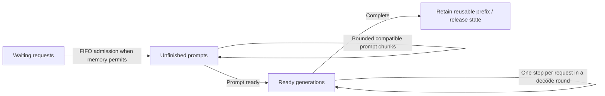
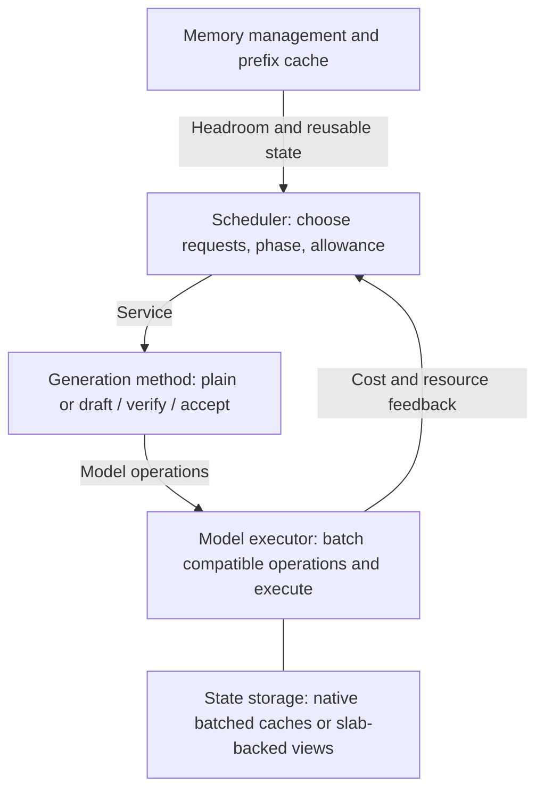
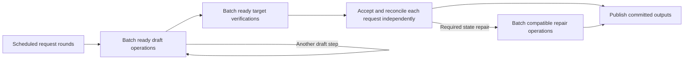

---
applies_to:
  - inference-v2/src/magnitude_engine/engine/**
  - inference-v2/src/magnitude_engine/generation/**
  - inference-v2/src/magnitude_engine/models/**
  - inference-v2/tests/engine/**
  - inference-v2/src/magnitude_engine/worker/**
  - inference-v2/benchmarks/**
---

# Scheduler

**Continuous batching with token-bounded, time-shared prefill and decode.** Batch
compatible work to execute efficiently. Share execution time to keep ongoing
generations responsive while new prompts make progress.

## Request flow



Admission reserves room for state growth and execution, not just existing KV.
Prefix reuse reduces remaining prompt work; reclaimable cached state can make
room for active requests. Output-blocked requests are ineligible until ready
again. Cancellation removes future work, with resource release after in-flight
execution completes.

## Choosing what runs next

The scheduler alternates **decode rounds** and **prompt chunks**, using measured
execution time to decide how many rounds belong between chunks.

- A decode round gives every ready generation one bounded step. Compatible
  operations run together; incompatible groups run separately.
- A prompt service shares one aggregate token allowance across admitted unfinished
  prompts compatible with the oldest admitted prompt, in FIFO order. Compatibility
  comes from the live generation/model contract; an unbatchable prompt keeps the
  whole allowance. Equal-sized chunks expose compatible execution batches;
  shorter tails form separate groups without padding or extending their context.
  Its allowance respects memory headroom and, when explicitly requested, the
  remaining interruption-duration budget. Consecutive prompt services share that
  optional budget; reaching it requires a decode round. One waiting prompt
  receives the whole allowance.
- While both phases are ready, prefill consumes a time budget that decode must
  replenish. Begin with a decode round, allow a chunk, then run enough decode
  rounds to repay that chunk's time debt before another chunk.
- If only one phase is ready, it runs without time-share throttling. Prefill can
  use larger chunks when decode is absent. Reset contention accounting instead
  of accumulating credit during idle periods.

Example: equal time shares, 40 ms prompt chunks, and 10 ms decode rounds:

```text
Time →  [prefill: 40 ms][D: 10][D: 10][D: 10][D: 10][prefill: 40 ms] …
         bounded stall  └──── decode receives 40 ms ────┘

Each D advances all ready generations through compatible execution batches.
```

**Two controls, two purposes:** an optional duration target limits individual interruptions;
the decode share limits sustained prefill interference. For decode share `s`, a
chunk lasting `p` incurs `p × s / (1 − s)` of decode debt. Carry repayment
overshoot forward, capped at one decode round, while contention continues.
The interruption bound takes precedence if indivisible decode rounds prevent
matching the requested share. Equal shares and the example durations are
evaluation choices, not fixed defaults.
The baseline uses bounded token chunks and measured time sharing without a
duration target. A caller choosing a duration target accepts its throughput cost:
small chunks can repeatedly pay model execution overhead. Compare latency and
throughput under the declared policy, rather than equating different interruption
guarantees. The token bound applies with or without a duration target.

Measure completed execution service, not asynchronous submission time or emitted
token counts. Bounds are approximate at indivisible execution boundaries;
bounded submission lookahead must preserve opportunities to reschedule.
Worker idleness follows the absence of execution service, not the absence of
published tokens. Drafting or suspended verification is still forward progress.

## Composition and ownership



The scheduler is an injected engine component. Generation methods define what a
step means; executors expose compatibility, cost, and resource requirements.
Models, kernels, and streaming implementations introduce no scheduler branches.
Prompt processing exposes ordinary causal model operations too. Shared device
completion precedes each request's prompt-feature publication and checkpointing.
Phase feedback counts physical service once; per-request metrics include the
shared work that request participated in, excluding unrelated groups and retention.

**Batch membership is physical; request identity is logical.** The executor
preserves useful batched state between steps and changes membership as requests
join or leave. It does not rebuild the entire KV cache every token. Prefill and
decode initially use separate, interleaved forwards. Slabs determine state
storage, not scheduling policy.

## Batched speculative generation

Speculation is part of ordinary decode service. A scheduled request owns a
bounded, resumable generation round; its method exposes model work instead of
executing an entire private drafting loop. The generation runtime advances these
rounds together and the executor batches compatible operations at each stage.



There is no batch-wide acceptance length or permanent speculative cohort. Plain
requests, different proposal widths, and different acceptance lengths share the
same service and execution contracts. Physical grouping is by executor capability;
state, sampling, constraints, and drafter alignment remain per request. Actual
drafting, verification, and repair time all count as decode service, once per
execution. Prefill/decode fusion remains deferred.

See [Speculative generation](speculative-generation.md) for the round contract,
state boundaries, exceptional cases, and implementation approach. A round can
resume across bounded services; unfinished drafting or repair does not require
holding the scheduler until the entire round completes. A scheduling yield does
not itself synchronize the GPU.

## Trade-offs and qualification

More decode protection increases prompt latency. Sharing prompt work can delay
the oldest prompt's first token while bringing peer prompts to decode sooner.
FIFO admission still lets active long prompts delay queued requests. Larger batches
can improve total throughput while increasing
per-request latency and memory traffic. This policy shares one engine's execution
time; it does not coordinate unrelated GPU processes.

Qualify decode batches at equal and mixed context lengths, then prompt arrivals
during decode. Measure first-token and inter-token latency distributions, prompt
progress, throughput, and time sharing. Separate computation, batch formation,
state movement, and engine overhead. Verify membership changes, cancellation,
backpressure, prefix reuse, and memory pressure preserve request and peer state.
Qualify all four combinations of single/multiple sessions and plain/speculative
composition, plus transitions between session counts. Each must preserve the
efficient execution behavior specified in the
[performance contract](speculative-generation.md#performance-contract).
