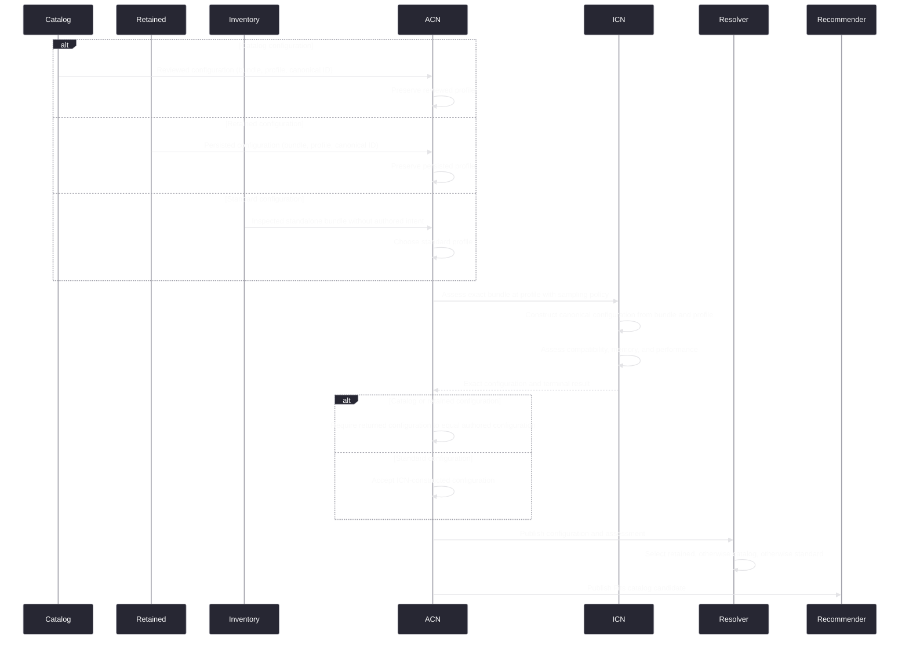

---
applies_to:
  - inference/crates/icn-hardware/**
  - inference/crates/icn-models/**
  - inference/crates/icn-api/**
  - packages/icn/src/hardware/**
  - packages/acn/src/local-model-assessment*.ts
  - packages/acn/src/local-model-assessor.ts
  - packages/acn/src/local-model-recommendations.ts
  - packages/acn/src/local-model-recommendation-policy.ts
  - packages/acn/src/local-models.ts
  - packages/acn-protocol/src/schemas/model-state.ts
  - cli/src/features/model-setup/**
---

# Model assessment and recommendation

Terms follow [Model-management terminology](./terminology.md). Native mechanics follow
[Hardware calibration and model assessment](../icn/calibration-model-assessment.md).

## Ownership

| Concern | Owner |
|---|---|
| Native compatibility, memory, placement, performance | ICN |
| Serving-configuration construction, canonical identity, validation | ICN |
| Profile set, orchestration, recommendation policy | ACN |
| Rendering | Clients |

## Pipeline



ACN always supplies the serving profile used for assessment. For catalog and retained intent it
preserves the existing profile; only standard intent requires ACN to choose one by policy. ICN
always constructs and canonically identifies the exact serving configuration for the supplied
bundle and profile. ACN accepts that returned configuration for standard intent and requires exact
equality with the authored catalog or retained configuration when such intent exists.

The rejection proof compares exact, content-deduplicated tensor storage with aggregate stable
physical capacity. Uncertain bundles proceed. File/download size is not rejection evidence.

## Assessment service

ACN exposes one assessment executor accepting exact bundles and profiles. It owns the
scoped lifecycle, deadline, ICN batching, result decoding, cardinality checks, and finalization.
One ACN local-model assessor owns demand for release-catalog configurations, retained
configurations, and standard profile decisions made only for inspected standalone bundles with no
retained or catalog configuration. ACN supplies the chosen bundle and profile for standard demand;
ICN constructs and identifies the corresponding serving configuration as part of assessment.
Recommendation, provider-offering, and local-model projections consume its state and
never invoke assessment independently. Recommendation policy consumes only release-catalog
candidates. Each release-catalog configuration uses its reviewed catalog profile. A retained
configuration uses its exact persisted profile unchanged. ACN chooses the standard profile bounded
by the package maximum for an inspected standalone package only when no retained or catalog
configuration exists for that bundle. ICN, not ACN, constructs and canonically identifies the
resulting configuration. Package installation origin does not affect this decision.

ICN persists every completed exact profile result, including `DoesNotFit`, and performs
single-flight native work. Repeated reads consume current results and do not trigger native
assessment.

The assessor is a scoped background owner. Constructing ACN services publishes initial
observable state without waiting for assessment; only the admitted operation owner awaits its
bounded native request.

## Demand and invalidation

The assessor reconciles current snapshots rather than treating notifications as semantic
changes:

```text
source invalidation
       |
       v
coalesce -> read snapshots -> compute semantic assessment keys
                                      |
                          +-----------+-----------+
                          |                       |
                       unchanged                changed
                          |                       |
                    retain result          assess exact key
                                                  |
                                      publish only while current
```

One semantic assessment key contains the complete serving configuration, resolved immutable
assessment material, stable topology and capacity identity, native build and enabled backends,
calibration identity, assessment method and policy, and requested performance-depth policy.

Download bytes, transfer speed, attempt identity, package or inventory revision, catalog
presentation, live free memory, provider state, slot state, runtime residency, and client activity
are not assessment inputs. Revisions may require a reread; revision inequality never admits native
assessment by itself.

Reconciliation is serialized and invalidations are coalesced. It assesses only new or changed keys,
preserves terminal results for unchanged keys, and removes state only when catalog, retained, and
installed-package demand no longer includes the configuration. Completion rechecks the semantic key before publication;
a result for a superseded key is discarded and reconciliation continues without overwriting newer
state.

## Publication boundary

A catalog candidate exists only for one completed `Fits` configuration. It contains its exact
bundle, serving configuration, profile, assessment environment, memory, performance, capability,
acquisition, and source evidence.

Candidate performance is an ordered set of samples for the same configuration. Samples above the
configured context are omitted, and the final sample is always the configured context.

Recommendation evidence is present only when the bundle comes from the recommendable catalog.
Retained configurations outside the current catalog remain selectable provider offerings without
fabricated intelligence, fidelity, or quality values when exact assessment and package evidence
make them available.

`DoesNotFit` and `Incompatible` are completed evidence but are not selectable candidates. Missing,
`Assessing`, canceled, or defective work is not published as a successful empty portfolio.
Retained configurations remain durable independently of recommendation publication. Installed
packages remain present in the [local-model product projection](./local-model-product-projection.md)
independently of assessment and offering publication.

## Assessment lifecycle

ACN owns one shared per-configuration assessment coordinator. While admitted work for the current
semantic key is running, its internal state is `Assessing`. Completion publishes `Failed`, `Fits`,
`DoesNotFit`, or `Incompatible` for that key. Serialized reconciliation plus key validation makes
stale completion unrepresentable. Unchanged configurations retain their terminal state while
another configuration is assessed.

The product projection never publishes an absent assessment as a configuration result. An
installed model without a terminal result for its decided configuration has model-level readiness
`Assessing`; an assessed model contains exactly that configuration and its terminal result.

An assessment-operation defect publishes `Failed` with its typed failure. It is not converted into
`DoesNotFit` or `Incompatible`, and it cannot replace the local-model collection with an empty
snapshot.

## Recommendation portfolio

ACN selects at most one configuration for each intent:

| Intent | Objective |
|---|---|
| `balanced` | Overall capability, speed, memory, fidelity, and download utility |
| `best_quality` | Highest useful capability and fidelity within resource guards |
| `fastest` | Highest useful generation speed within capability guards |
| `lightweight` | Highest useful capability within a low-memory tier relative to stable hardware capacity |

Selection is deterministic for identical inputs and uses stable identity as its final tie-breaker.
A recommendation references a candidate; it does not create another model identity.

A catalog candidate is eligible for recommendation only when its full-context expected generation
speed is at least 5 tokens per second. Balanced speed utility uses 5 tokens per second as its zero
point. Ranking, Fastest selection, and relative speed comparisons use the sample at 50K context,
bounded by the configured context for shorter models. Clients present the expected-speed range from
the samples at 25K and 75K, likewise bounded by the configured context, without treating those
samples as separate configurations.

The Lightweight tier admits configurations whose complete predicted loaded memory uses at most
20% of each participating physical memory domain's stable post-reserve capacity. Within that tier,
capability precedes memory, fidelity, speed, and download size. The selected configuration must also
use at least 20% less loaded memory than Balanced. If no distinct configuration satisfies both
boundaries, the portfolio omits Lightweight rather than substituting the absolute smallest model.

Lightweight eligibility is independent of the strongest feasible model's capability. Adding a
high-capability heavyweight candidate therefore cannot disqualify or downshift an otherwise
unchanged Lightweight tier.

## Invalidation

Recommendation reuse requires unchanged catalog content, profiles, stable topology and capacity,
native build and backends, hardware calibration, assessment method, and recommendation policy.
Live memory availability does not invalidate assessment or recommendation.

## Loading

Assessment proves compatibility with stable capacity for one sequence. Loading repeats native
planning, determines execution-plan sequence capacity, and applies fresh availability admission.
Cached assessment never authorizes loading.

## Conformance

- Every release-catalog choice publishes one reviewed configuration whose profile does not exceed
  its exact bundle maximum. Retained configurations are assessed at their exact stored profiles.
- For every inspected independently servable package without a retained or catalog configuration,
  ACN makes one standard profile decision and ICN constructs and assesses its exact configuration.
- All missing profiles for one bundle are submitted together.
- Equivalent concurrent misses perform one native assessment.
- Download progress and semantically equivalent newer source revisions perform no assessment.
- A changed semantic key reassesses only the affected configurations.
- Provider-offering and local-model projection never invoke assessment.
- Assessment completion cannot publish against a superseded semantic key.
- Recommendation generation never replaces a valid portfolio with a defect-derived empty result.
- The recommendation eligibility floor uses full-context performance; ranking and relative
  comparisons use the bounded 50K sample.
- Clients display a bounded 25K-to-75K expected-speed range without context-variant candidates.
- Lightweight is hardware-relative, capability-maximizing within its memory tier, and independent
  of the capability ceiling outside that tier.
- Candidate identity remains the serving-configuration identity.
- Loading never treats cached assessment as admission authority.
- ACN startup and service publication never wait for model assessment.
- Onboarding keeps installed and downloadable model groups at a stable layout height while making
  every presented model reachable by keyboard navigation and pointer scrolling.
