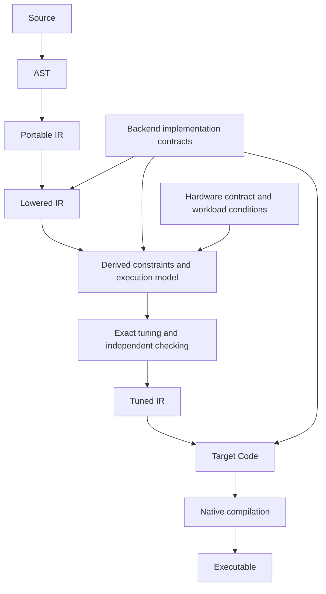

# Seismic compiler

Seismic compiles typed kernel programs into hardware-specific executions on CPU,
CUDA, and Metal. Its defining guarantee is a connected chain: legal computation,
derived resource behavior, exact modeled optimization, and faithful emission.
An implementation conforms only when that chain and its hardware applicability
are established together.

## Principles

1. **Preserve meaning.** Types, representations, observable value versions, numerical
   permissions, effects, and safety obligations survive every transformation.
2. **Define resource behavior by construction.** Every admitted implementation has
   an execution contract and an emission mapping. Composing implementations derives
   the resource model; kernels do not carry companion cost formulas.
3. **Expose decisions.** Performance-relevant implementation, decomposition, layout,
   storage, mapping, synchronization, and launch choices belong to the legal space.
   Emitters do not finish tuning.
4. **Tune from IR and hardware contracts.** Candidate native compilation, native
   resource queries, candidate benchmarks, heuristic scores, device-name rules,
   and compile-and-try fallback are not selection inputs.
5. **Prove the optimization claim.** Legality, feasibility, objective evaluation,
   coverage, and exclusion of better executions require mechanically checked
   evidence. Repeating an asserted cost does not justify it.
6. **Separate mathematical and physical authority.** Model optimality, physical
   lower bounds, model fidelity, and invocation applicability are distinct claims.
   A constructor, identity hash, or passing sample cannot substitute for any of them.
7. **Use one execution description.** Accounting, tuning, emission, inspection, and
   runtime consume compatible views of the same program and selected execution.
8. **Make the system useful.** Compilation and proof checking must be practical;
   resulting executions must be performant. Investigate unexplained discrepancies,
   ineffective fusion, and model errors at their owning layer.
9. **Fix the compiler and tooling.** Natural kernels must not require contortions to
   accommodate implicit compiler behavior or inadequate diagnostics. Contracts and
   constructs may evolve while preserving these principles and rechecking dependents.

## Compilation flow

| Stage | Responsibility and output guarantee |
| --- | --- |
| Parse | Parse kernel source and backend `lower` definitions into AST. |
| Check | Produce Portable IR with resolved types, shapes, semantics, and obligations. |
| Lower | Apply Seismic's `lower` definitions and specialization to expose backend implementations and legal choices. |
| Derive and tune | Construct constraints and resource behavior, solve the declared objective, independently check the result, and produce Tuned IR. |
| Emit | Translate the selected execution through its implementation contracts. |
| Native compile | Compile the selected code once under the declared toolchain contract. |
| Bind and execute | Establish invocation applicability and execute the artifact's selected dependency structure. |

Qualification of hardware and emission contracts happens outside candidate
selection. Qualification failure does not authorize trying native alternatives
inside the tuner.

## Representations

| Representation | Contents |
| --- | --- |
| Portable IR | Checked computation, values, types, symbolic shapes, control flow, numerical permissions, effects, and obligations; construct calls remain. |
| Lowered IR | The shared computation structure with backend implementations, explicit unresolved choices, and their legality constraints. |
| Tuned IR | The selected program with implementation choices, allocations, layouts, lane mappings, checks, synchronization, and launches resolved. |
| Target Code | PTX, Metal source, or CPU code-generation input implementing that execution. |
| Executable | Native code and the associated invocation, identity, and qualification information. |

The IR stages share common node definitions. Lowered IR targets one backend and
extends that vocabulary with backend operations; it is not a duplicated copy of
Portable IR. Stage containers enforce different invariants. Resource and dependency
models are derived views, not independent kernel descriptions.

Tuned IR owns the actual transformed execution. An unresolved tree plus a bag of
settings is insufficient. Runtime values and declared dynamic extents may remain;
compilation decisions may not.

## Architectural ownership

| Component | Authority |
| --- | --- |
| Language | Source semantics, common IR, checking, and Seismic lowering definitions. |
| Execution representation | Legal forms, operation contracts, choices, dependencies, allocations, and selected execution. |
| Accounting | Derived demand and execution models, hardware constraints, exact quantities, proof rules, and checking. |
| Compiler | Semantics-preserving transformations, constraint propagation, search, and Tuned IR production. |
| Backends | Concrete implementation mappings, emission, native interfaces, and mapping qualification. |
| Runtime | Device and artifact ownership, binding applicability, submission, completion, and cache lifecycle. |
| Tooling | Explanations and evidence rendered from those authoritative structures. |

In the workspace these responsibilities map to `seismic-lang`,
`seismic-realization`, `seismic-accounting`, `seismic-compiler`, the backend crates,
and `seismic-runtime`. Shared contracts do not depend on the runtime. Backend
interfaces keep the dependency graph acyclic; the runtime composition root links
concrete backends without acquiring optimization policy.

## System contracts

| Contract | Detailed architecture |
| --- | --- |
| Execution semantics, legal forms, and transformations | [Execution](execution.md) |
| Resource derivation, hardware models, and bounds | [Accounting](accounting.md) |
| Search, objective witnesses, and optimality | [Tuning](tuning.md) |
| CPU, CUDA, Metal, and native mapping fidelity | [Backends](backends.md) |
| Invocation, artifacts, caching, and engine integration | [Runtime](runtime.md) |

[Mechanically checked lower bounds](../../specs/26-09-17/seismic-sound-lower-bounds.md)
is the detailed authority for necessary-demand and lower-bound proofs. The IR-only
selection rule here takes precedence over older measurement-assisted selection
proposals. The component contracts refine these principles without weakening them.

## Conformance

Compiler qualification requires full declared-form coverage, semantic preservation,
complete model construction, checked exact selection, backend mapping fidelity,
applicable hardware/workload contracts, practical tuning cost, and enclosing
performance. A smaller diagnostic form, a supplied-model optimizer, or successful
examples cannot stand in for this conjunction.

Verification includes independent small-instance oracles, adversarial proof and
transformation cases, representative and held-out compositions, and real CPU,
CUDA, and Metal executions. Kernel-specific manual tuning remains outside the
compiler qualification strategy. Performance gaps return to the responsible
contracts, transformations, solver, or backend.
