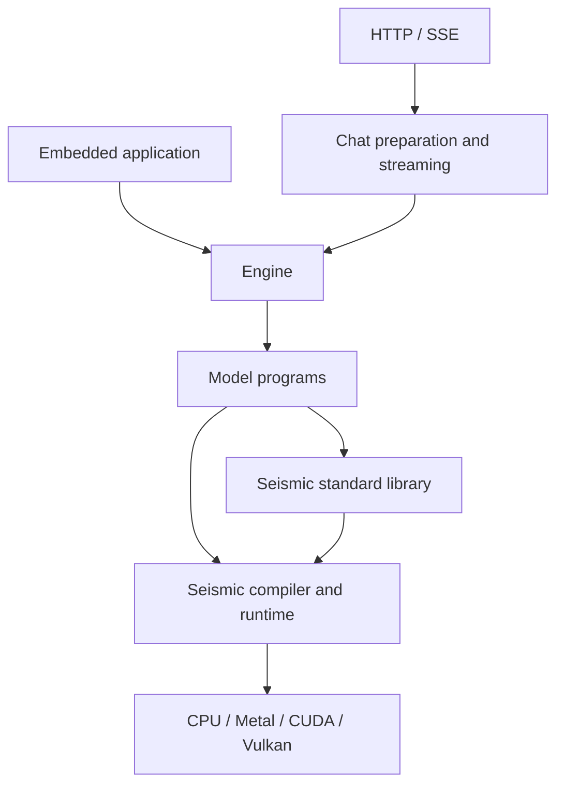

# Inference V4

**A Rust inference engine built on Seismic, with reusable library and serving interfaces.**
The engine owns inference behavior; Seismic owns numerical compilation and physical
execution. Standard and model libraries connect the two through typed programs.

## System structure

| Owner | Responsibility |
| --- | --- |
| Chat and transport | Templates, tokenization, media preparation, semantic parsing, and protocol framing |
| Engine service | Admission, batching, fairness, capacity negotiation, and request lifecycle |
| Generation | Accepted token history, sampling intent, grammar progress, output credit, and recovery |
| Model execution | Artifact interpretation, architecture composition, packed inputs, and tentative sequence advances |
| Logical state | History visibility, sharing, checkpoints, forks, and commitment |
| Seismic libraries | Portable numerical operations, model equations, and backend lowerings |
| Seismic toolchain | Checking, composition, resource analysis, optimization, code generation, and physical execution |

## Governing principles

- **Preserve inference meaning.** Model numerics, state transitions, generation, and
  public behavior survive the move from V3; changing implementation language does
  not change policy.
- **Author computation once.** Numerical programs supply semantics and the inputs
  for checking, bindings, resource analysis, and compilation.
- **Keep hardware below the model.** Model programs express dataflow and precision;
  backend implementations own hardware mechanisms.
- **Separate policy from mechanism.** The engine decides residency, admission, and
  acceptance; Seismic executes explicit work and retains resources safely.
- **Compose without execution barriers.** Library and model boundaries preserve
  meaning while allowing fusion and reusable native submission plans.
- **Treat lifetime as part of correctness.** Submitted work, accepted state, and
  published output have distinct ownership and transition points.
- **Make performance explainable.** Resource accounts, native observations, and
  enclosing service measurements retain their scope and conditions.
- **Support embedding and deployment.** Local library use shares the production
  execution path without implicitly starting a server or scheduler.

## Documentation ownership

| Document | Scope |
| --- | --- |
| [Engine overview](engine/overview.md) | Inference owners, interfaces, and request lifecycle |
| [Seismic overview](seismic/overview.md) | Language, libraries, compiler, and execution architecture |
| [Distribution](distribution.md) | Products, platform composition, and runtime dependencies |

These documents describe intended architecture and own their respective contracts.
Implementation specs describe changes and sequencing; validation records describe
observed capability and evidence. Earlier source specs inform this architecture but
do not override its explicitly reconciled decisions. In particular, Seismic uses
IR-derived selection and integrated resource analysis as defined in its component docs.

V3's design, active implementation, and tests provide the reference for preserved
engine behavior. V3's Ops/TileLang structure is replaced by the Seismic architecture;
its logical behavior and ownership requirements remain. Training, distributed tensor
execution, and new generation policies are outside this architecture.
