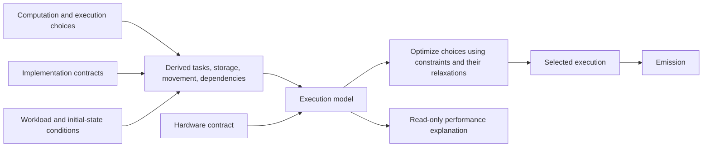

# Seismic resource accounting

Accounting derives resource reasoning from checked computation, execution choices,
implementation contracts, and hardware/workload conditions. It serves both performance
explanation and [tuning](tuning.md). Kernels do not maintain separate handwritten cost
equations.

## Claims and authority

| Result | Meaning |
| --- | --- |
| Algorithm/access account | Semantic operations and logical accesses of a specified computation. |
| Selected-execution account | Resource consumption and dependencies of a particular realization under its mapping contracts. |
| Execution prediction | Completion behavior predicted by a declared machine model and conditions. |
| Sound lower bound | A necessary duration derived by a sound relaxation of the execution constraints over an explicit scope and conditions. |
| Model optimum | No better legal execution exists under the specified execution model and objective. |
| Observation | A measurement of one identified execution under recorded conditions. |
| Applicability/qualification evidence | Support connecting a conditional model or bound to a target, artifact, and invocation. |

These results are not interchangeable. Replaying a prediction does not prove it. An
observed throughput is not a physical service ceiling. An optimum under a supplied model
does not prove that model describes the device.

Flat scheduling exclusively uses the independent solver through the accounting
adapter. A checked upper witness or the sum-of-latencies finite-domain argument
bounds its horizon. Operation dependencies, offset reservations, event lifetimes
and common static orders survive translation, and every returned schedule is
checked against the original model. The adapter does not by itself replace
unresolved implementation-family construction or authorize native execution.

The joint symbolic scheduling boundary collects conditional activities and all
uses of each shared resource in one relation. Whole-duration resource uses retain
the information needed for capacity-incompatibility deductions. Completion is
the exact maximum of active events, rather than a sum of isolated child optima.
Missing analysis and exhausted refinement remain typed obligations, distinct from
solver-work exhaustion and proven infeasibility. The original model relationship
and native qualification requirements remain attached to every result.

## Derivation flow

Resource expressions retain links to their originating operations, values, allocations,
choices, and conditions. Unresolved choices produce symbolic families of expressions and
constraints. Selecting a choice specializes that same model. The execution model is a
derived view of the execution, not a second authored program. Bounds are analysis
results over these constraints, not inputs from a separate proof pipeline. Accounting
accepts the execution and its hardware/workload context; a caller cannot pair an
execution with an independently authored cost model.

Metal's terminal execution walker supplies both scheduling constraints and a
compact invocation account. Both follow the same typed expressions, helper
bodies and parameter conversions, active-lane masks, launches, and workload
bindings. The compact account groups matching primitives, participant counts,
and access patterns instead of retaining every dynamic scheduling node. An
instruction budget bounds traversal; the operation budget bounds retained
account groups or scheduling nodes, according to the consumer.

### Symbolic execution and workload domains

The walk retains per-lane integer intervals and affine relationships over
independent dispatch, loop, and runtime-input coordinates. Arithmetic, supported
quotient/remainder operations, helper arguments and returns, and derived pointers
preserve those relationships when the target's integer widths exclude wrapping.
Compile-time numeric operands retain their original solver identities and defining
equations; a derived count is not treated as independent of its extent and step.
Parameter guards refine only the analysis of their active region. Early-return
continuations retain their arithmetic participation facts, and returned lanes
remain absent through the end of the launch.
Storage alternatives carry the same participant-ownership equations into model
export and local emission. A contradictory conjunction of ownership facts has
no emitted arm; an unfinished proof remains an analysis obligation. Distributed
element ownership follows physical strides and lane coordinates. Independently
captured logical extents still receive their own bounds checks.
Facts preserved by every arm of a local choice survive its join without acquiring
that unrelated choice as a precondition. Removing such a guard requires coverage
of the choice's complete original ordinal domain; matching only some arms is
insufficient. Branch-specific pointers and scalar definitions retain their guards.
Later consumers apply their known guards before checking that coverage, so a fact
defined under `a` or under `!a && b` is available when `b` holds. Conflicting
compatible definitions remain unresolved, and only recorded complete choice
domains can discharge the remaining guards.
Shifts require counts valid for the operand width. Selected integer values retain
the chosen lane facts; subgroup shuffles require a known participating source.
Integer min/max and subgroup extrema retain interval bounds, and retain an affine
operand when its ordering is established over the entire domain. Floating
arithmetic does not acquire host-evaluation semantics to resolve device control.

A workload may constrain integer scalar slots or allocation locations to finite
progressions with an explicit width and signedness. Each domain covers all its
admitted runtime values; its canonical scalar bytes are not a representative
execution. Exact known bytes and variable domains cannot overlap. A completed
execution model must establish the same operations, participants, and resource
constraints throughout the admitted domain. Changing control or transaction
geometry that cannot be represented remains unresolved; it is not replaced by
an average or an arbitrary domain member.

Uniform loop traces retain their visit count and independent induction
coordinates, including nested loops, without enumerating iterations. Admission
requires a finite common trip count, an invariant endpoint that does not read the
loop's own induction variable, and a body whose retained walk establishes the
required control and accesses throughout the coordinate domain. Assigned values,
loop-carried pointer bindings, and mutable local byte state are forgotten before
the retained visit; final induction values are computed separately. This never
substitutes the first visit's values for the loop's final state. Expression facts
are scoped to the current evaluation and statement; helper frames and lexical
restoration cannot retain facts from a shadowed binding. Unsupported recurrences,
varying predicates, and lost address facts require bounded concrete refinement
or remain unresolved.

Complete dispatch groups can likewise share one abstract walk over their entire
group-coordinate interval. Structured derivation retains the result as a parallel
repetition and visits a partial final group concretely. When a region loses
control or transaction facts, it rolls back that region's derived constraints
and subdivides its group interval. Every resulting region still covers its full
coordinate domain, and subdivision does not narrow any runtime-input domain.
Discarded attempts consume the traversal budget. If necessary, derivation retries
concrete groups while retaining loop compression before dropping loop abstraction.
An absent primitive service or resident-capacity mapping cannot be repaired by
coordinate refinement: it remains an explicit gap and suppresses futile retries.
No refinement changes the selected implementation or turns exhaustion into
infeasibility.

Diagnostic demand accounts can multiply the mandatory work of a retained visit
without constructing its dynamic instances. An incomplete account cannot supply
a feasible schedule or finish selection. Automatic selection exports the full
family to the common model; the shared solver owns pruning and proof completion.

### Structured scheduling

Scheduling retains serial and parallel composition, repetition, and resident
scopes. Leaves use the same primitive reservations as the flat scheduling model;
composition owns dependencies, and a scope holds capacity until its entire body
completes. Metal derives this structure directly: launch submission precedes
parallel group bodies, each group holds its resident capacities across its
parallel subgroups, and each subgroup retains terminal source order. Retained
loops preserve their tests, bodies, and increments in order.

Bounds combine dependency duration, service demand, and minimum resident
lifetimes without enumerating repeated instances. Resource demand also retains
necessary dependency margins: if all counted occupancy starts at least `head`
ticks after region entry and ends at least `tail` ticks before completion, the
duration is at least `head + ceil(work / capacity) + tail`. Serial composition
shifts these margins by neighboring duration floors; parallel composition and
repetition retain only margins valid for all counted work. These windows follow
mandatory dependencies, not the timing of a selected feasible schedule.

Structured regions append their constraints to the enclosing model. Serial
boundaries retain completion dependencies; parallel occurrences share the
resource constraints that govern their overlap. Resident capacity is held for
the region's complete lifetime, including nested scopes. Accounting owns no
child searches, scheduling frontiers or initiation-period search.

Finite expansion preserves each occurrence's operations, dependencies and
reservations. Compact repetition requires an equivalent relation supported by
the common model. Reusing a definition does not require copies to choose the
same internal schedule or share one execution cost. Missing compact coverage or
an exhausted expansion budget stays explicit and cannot establish infeasibility.

Checked schedules and compact resource profiles remain useful witnesses and
validators. Waves, common periods and fixed child schedules describe particular
feasible schedules; optimizing them alone cannot prove an optimum over the
unrestricted family. Native authorization requires the compiler session's
global optimal outcome, original-model validation and checked reconstruction.

### Memory accesses and knowledge

Scalar device reads and writes, and selected packed-vector reads, retain the
union of active-lane byte ranges from their actual pointer bindings and index
expressions. Checked helper calls preserve those bindings. Accounts normalize
away allocation-aligned whole prefixes while retaining binding offsets and the
remaining alignment residue. Equivalent patterns can therefore share one count
across different absolute tensor positions.

A symbolic access can reuse one such union when every active lane has the same
affine translation coefficients and coordinate domains, and all resulting
addresses stay within their backing bounds. Transaction counts must be invariant
over every base residue allowed by the allocation alignment and translation
coefficients. Divisible alignment establishes that directly; otherwise the
interval endpoints define a finite set of residue boundaries on which to check
the exact block union. This covers the entire coordinate domain without sampling
its values. Differing lane translations, varying transaction counts, or unsupported
expressions require refinement or leave the access unmapped.

A declared hardware service may charge per distinct aligned transaction block
intersected by one operation. Its resource names the modeled memory boundary,
and its granularity is an explicit power of two. Schedule construction,
completed demand, and pruning use the same service expansion. This contract
models request coalescing within one operation; it does not assert cache hits,
cross-operation reuse, native vectorization, or DRAM traffic. For pruning only,
an unresolved address still requires enough blocks to contain one participating
lane's complete scalar or vector payload. That floor permits broadcast and any
base-address residue. Exact scheduling continues to require admitted transaction
geometry. Matrix and other address spaces retain their separate mappings.

Immutable known bytes and typed integer domains can establish values read at
indirect addresses. A bounded enumeration must cover every address in a finite
strided superset of the possible locations with compatible domain facts or exact
bytes. A single location preserves its input coordinate; multiple locations may
produce a weaker value range. Repeated reads from the same immutable backing and
symbolic address retain their value relationship. Missing bytes, incompatible
types, or an exhausted address enumeration supply no invented value.

Before using either external known bytes or integer domains, the terminal
write-effect scan excludes every allocation that may be published anywhere in
the invocation, preserving actual binding aliases. Unknown effects exclude all
external backings. This prevents traversal order from inventing knowledge of
concurrent publications, though it can leave an in-place or multi-launch
invocation unresolved. Private arrays retain separate lane backings; shared
arrays retain their selected byte layout. Writes retain known bytes and typed
symbolic integer values through derived pointer aliases. Partial, conflicting,
or unknown writes invalidate the affected facts and cached reads. Loop
abstraction forgets mutable local state whose final value is not established,
while retaining admitted immutable external facts.

Counts describe selected terminal operations and requested memory bytes, not
native instructions, cache transactions, or measured traffic. Unknown control
and exhausted budgets leave explicitly incomplete accounts. CLI diagnostics use
separate parameter backings and unknown tensor contents and report those
assumptions. Local byte state and symbolic facts remain analyses of the selected
implementation, not a second source interpreter or an independently authored
accounting program.

## Units and resource boundaries

| Quantity | Required distinction |
| --- | --- |
| Stored bytes | Address space, allocation granularity, lifetime, and resource scope. |
| Transferred bytes/transactions | Named boundary, direction, access geometry, and transfer granularity. |
| Instruction service | Admitted implementation, operation/type, participating execution units, and service pool. |
| Dependency latency | Applicable producer/consumer relation and machine timing semantics. |
| Concurrency | Independent work, participants, resident limits, and resource sharing. |
| Time | Exact time unit and objective boundary; model ticks and seconds are explicitly related. |

Private arrays are not physical register counts. Requested bytes are not cache or DRAM
transactions. Declared storage is not necessarily simultaneous live storage. A semantic
multiply plus add is not necessarily two physical instructions.

Bound and exact objective arithmetic use exact integers/rationals with checked overflow
or arbitrary precision. Physical duration floors round down when converted to ticks
unless a checked discrete-time rule permits a stronger rounding. Prediction and
observation formats cannot silently supply bound arithmetic.

## Complete execution modeling

The execution model composes operation contracts with:

- Instruction implementations, issue/service constraints, and value dependencies.
- Address geometry, coalescing/transactions, memory hierarchy, reuse, and contention.
- Allocation lifetimes, storage granularity, register behavior, and spills within
  the admitted native mapping.
- Lane/worker mappings, resident work, occupancy constraints, and latency coverage.
- Barriers, required serialization, launch dependencies, and runtime coordination
  included in the objective.

The model must represent interactions, not just sum independent operation prices. Shared
resources compete for capacity; dependency chains limit attainable service; parallel
work and memory latency interact through residency and available work.

Dynamic counts and branches retain their predicates and domains. A selected-route
workload does not justify charging every possible expert. An assumed distribution is an
explicit model assumption, not a universal per-invocation fact.

Implementation admission requires a total resource derivation for its supported form. A
missing mapping is a compiler implementation gap, not permission to assign zero or
select a fallback. Unavailable external physical facts remain explicit; they do not
acquire authority through a required Rust field.

## Hardware contracts

A hardware contract identifies resource topology, capacities, service behavior,
latencies, operating conditions, and the backend/compiler mappings to which they apply.
Relevant properties include allocation granularities, concurrency limits, shared service
pools, memory cuts, and burst behavior over the objective interval.

Device-query facts, architectural axioms, calibrated model parameters, and observations
have distinct admission paths. Provenance explains an input; it does not establish its
meaning or correctness. Synthetic profiles describe hypothetical machines and remain
labeled as such.

A throughput ceiling used in a physical lower bound must be defensible for the stated
interval and operating domain. Some resources require a burst-plus-rate constraint; a
long-run rate alone is insufficient. Minimum-latency axioms similarly need their own
authority. Core counts, shared-memory limits, and architecture names alone do not define
a timing model.

Qualification establishes which execution predictions and mappings are supported by
evidence. Physical bounds retain their hardware assumptions explicitly. Tests and
calibration do not establish universal physical truth by themselves.

## Necessary demand and physical lower bounds

[Sound lower bounds](../../../specs/26-09-17/seismic-sound-lower-bounds.md) provides implementation detail
for sound relaxations within this execution/resource model. The governing subject is computation, execution form, workload
domain, hardware contract, objective, and optional search region. Its assumptions must
be satisfiable.

Necessary input demand requires semantic/form evidence. Backwards slicing and source
counts are analysis aids, not proofs of necessity. Regions retain canonical allocation
identity, value version, representation, and predicate. Alias uncertainty cannot become
distinct mandatory backings.

Physical movement requires a checked memory cut and allowed supply paths. Residency,
retained preprocessing, recomputation, alternate representations, shared metadata, and
output publication requirements affect that demand. Kernel completion does not imply
that dirty output has reached DRAM.

Bounds compose through sound analysis operations: maximum of compatible floors, minimum
over a complete alternative cover, and sums only where mandatory non-overlap or a valid
joint constraint supports them. Omitted legal alternatives retain a trivial floor;
analysis failure does not establish infeasibility.

Primitive service equations have concrete and symbolic interpretations of the same
backend definition. Lane counts, transaction counts, service ceilings, offsets and
storage quantities can remain variables. Conditional resource uses retain their
operation's presence and join the same cumulative resource boundary; an absent
alternative consumes no capacity. Symbolic arithmetic rejects unrepresentable
ranges explicitly rather than clipping the execution family.

Fixed scheduling fragments use the same equations as standalone scheduling and
can join this shared boundary under an explicit complete activation condition.
They retain result/issue dependencies, offset services, event lifetimes and
common static orders. Reconstruction checks each active fragment against its
original model; the enclosing model checks interactions between fragments. No
fragment supplies a separately optimized cost to replace those interactions.

For an unresolved execution family, necessary demand must hold for every admitted
member under its conditions. One candidate's expanded representation, retained
intermediate or reduction tree is not universal demand. Choice-dependent quantities
remain symbolic or use a sound envelope over the whole region. Do not prune away a
compact representation or fused execution by charging work that exists only in an
unfused alternative.

Asynchronous overlap retains both resource reservations and completion-aware live
storage. Compiler-controlled ordering and hardware scheduling are distinct. An
optimistic interleaving supplies no feasible upper bound for the actual execution
unless the relevant model establishes its achievability; native qualification is
still required for physical claims. See [Tuning](tuning.md#lower-bounds-and-feasible-schedules).

## Construction and validation

Resource analyses reference existing operations, value versions, allocations, decisions,
and hardware resources. Do not translate the computation into a parallel semantic graph,
create a proof DAG or rule registry, or introduce a certificate checker. Derived
constraint structures contain only the information needed for resource reasoning and
retain their relationship to the authoritative execution.

Types and private construction enforce units, scope, and valid relationships. Analysis
implementations establish mathematical prerequisites before applying a relaxation; stage
validation checks global constraints. These algorithms require soundness arguments and
adversarial tests: private constructors alone do not make an incorrect formula sound.
Explanatory strings, callback booleans, deserialization, and caller-supplied costs
cannot bypass derivation.

Cached analyses bind to the exact execution/form, region, workload, hardware contract,
and analysis version. Changed dependencies invalidate them; persisted data re-enters
through the same validation/recomputation boundaries. A useful partial bound, an
unavailable stronger bound, an inapplicable condition, and an analysis failure remain
distinct. A zero bound does not mean zero execution cost.

## Explanations

Reports expose the subject, units, limiting constraints, derivation, assumptions,
coverage, and applicability. Prediction, observation, physical floor, and derived model
gap are displayed separately. Ratios require compatible boundaries and a positive
denominator.

Disagreement with a qualified measurement is retained and investigated at the owning
resource or mapping relationship; the system does not hide it by retuning a ceiling.
