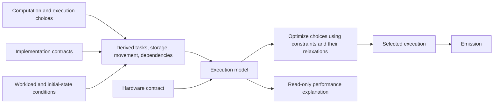

# Seismic resource accounting

Accounting derives resource reasoning from checked computation, execution choices,
implementation contracts, and hardware/workload conditions. It serves both performance
explanation and [tuning](tuning.md). Kernels do not maintain separate handwritten cost
equations.

## Claims and authority

| Result | Meaning |
| --- | --- |
| Algorithm/access account | Semantic operations and logical accesses of a specified computation. |
| Selected-execution account | Resource consumption and dependencies of a particular realization under its mapping contracts. |
| Execution prediction | Completion behavior predicted by a declared machine model and conditions. |
| Sound lower bound | A necessary duration derived by a sound relaxation of the execution constraints over an explicit scope and conditions. |
| Model optimum | No better legal execution exists under the specified execution model and objective. |
| Observation | A measurement of one identified execution under recorded conditions. |
| Applicability/qualification evidence | Support connecting a conditional model or bound to a target, artifact, and invocation. |

These results are not interchangeable. Replaying a prediction does not prove it. An
observed throughput is not a physical service ceiling. An optimum under a supplied model
does not prove that model describes the device.

## Derivation flow

Resource expressions retain links to their originating operations, values, allocations,
choices, and conditions. Unresolved choices produce symbolic families of expressions and
constraints. Selecting a choice specializes that same model. The execution model is a
derived view of the execution, not a second authored program. Bounds are analysis
results over these constraints, not inputs from a separate proof pipeline. Accounting
accepts the execution and its hardware/workload context; a caller cannot pair an
execution with an independently authored cost model.

## Units and resource boundaries

| Quantity | Required distinction |
| --- | --- |
| Stored bytes | Address space, allocation granularity, lifetime, and resource scope. |
| Transferred bytes/transactions | Named boundary, direction, access geometry, and transfer granularity. |
| Instruction service | Admitted implementation, operation/type, participating execution units, and service pool. |
| Dependency latency | Applicable producer/consumer relation and machine timing semantics. |
| Concurrency | Independent work, participants, resident limits, and resource sharing. |
| Time | Exact time unit and objective boundary; model ticks and seconds are explicitly related. |

Private arrays are not physical register counts. Requested bytes are not cache or DRAM
transactions. Declared storage is not necessarily simultaneous live storage. A semantic
multiply plus add is not necessarily two physical instructions.

Bound and exact objective arithmetic use exact integers/rationals with checked overflow
or arbitrary precision. Physical duration floors round down when converted to ticks
unless a checked discrete-time rule permits a stronger rounding. Prediction and
observation formats cannot silently supply bound arithmetic.

## Complete execution modeling

The execution model composes operation contracts with:

- Instruction implementations, issue/service constraints, and value dependencies.
- Address geometry, coalescing/transactions, memory hierarchy, reuse, and contention.
- Allocation lifetimes, storage granularity, register behavior, and spills within
  the admitted native mapping.
- Lane/worker mappings, resident work, occupancy constraints, and latency coverage.
- Barriers, required serialization, launch dependencies, and runtime coordination
  included in the objective.

The model must represent interactions, not just sum independent operation prices. Shared
resources compete for capacity; dependency chains limit attainable service; parallel
work and memory latency interact through residency and available work.

Dynamic counts and branches retain their predicates and domains. A selected-route
workload does not justify charging every possible expert. An assumed distribution is an
explicit model assumption, not a universal per-invocation fact.

Implementation admission requires a total resource derivation for its supported form. A
missing mapping is a compiler implementation gap, not permission to assign zero or
select a fallback. Unavailable external physical facts remain explicit; they do not
acquire authority through a required Rust field.

## Hardware contracts

A hardware contract identifies resource topology, capacities, service behavior,
latencies, operating conditions, and the backend/compiler mappings to which they apply.
Relevant properties include allocation granularities, concurrency limits, shared service
pools, memory cuts, and burst behavior over the objective interval.

Device-query facts, architectural axioms, calibrated model parameters, and observations
have distinct admission paths. Provenance explains an input; it does not establish its
meaning or correctness. Synthetic profiles describe hypothetical machines and remain
labeled as such.

A throughput ceiling used in a physical lower bound must be defensible for the stated
interval and operating domain. Some resources require a burst-plus-rate constraint; a
long-run rate alone is insufficient. Minimum-latency axioms similarly need their own
authority. Core counts, shared-memory limits, and architecture names alone do not define
a timing model.

Qualification establishes which execution predictions and mappings are supported by
evidence. Physical bounds retain their hardware assumptions explicitly. Tests and
calibration do not establish universal physical truth by themselves.

## Necessary demand and physical lower bounds

[Sound lower bounds](../../../specs/26-09-17/seismic-sound-lower-bounds.md) provides implementation detail
for sound relaxations within this execution/resource model. The governing subject is computation, execution form, workload
domain, hardware contract, objective, and optional search region. Its assumptions must
be satisfiable.

Necessary input demand requires semantic/form evidence. Backwards slicing and source
counts are analysis aids, not proofs of necessity. Regions retain canonical allocation
identity, value version, representation, and predicate. Alias uncertainty cannot become
distinct mandatory backings.

Physical movement requires a checked memory cut and allowed supply paths. Residency,
retained preprocessing, recomputation, alternate representations, shared metadata, and
output publication requirements affect that demand. Kernel completion does not imply
that dirty output has reached DRAM.

Bounds compose through sound analysis operations: maximum of compatible floors, minimum
over a complete alternative cover, and sums only where mandatory non-overlap or a valid
joint constraint supports them. Omitted legal alternatives retain a trivial floor;
analysis failure does not establish infeasibility.

## Construction and validation

Resource analyses reference existing operations, value versions, allocations, decisions,
and hardware resources. Do not translate the computation into a parallel semantic graph,
create a proof DAG or rule registry, or introduce a certificate checker. Derived
constraint structures contain only the information needed for resource reasoning and
retain their relationship to the authoritative execution.

Types and private construction enforce units, scope, and valid relationships. Analysis
implementations establish mathematical prerequisites before applying a relaxation; stage
validation checks global constraints. These algorithms require soundness arguments and
adversarial tests: private constructors alone do not make an incorrect formula sound.
Explanatory strings, callback booleans, deserialization, and caller-supplied costs
cannot bypass derivation.

Cached analyses bind to the exact execution/form, region, workload, hardware contract,
and analysis version. Changed dependencies invalidate them; persisted data re-enters
through the same validation/recomputation boundaries. A useful partial bound, an
unavailable stronger bound, an inapplicable condition, and an analysis failure remain
distinct. A zero bound does not mean zero execution cost.

## Explanations

Reports expose the subject, units, limiting constraints, derivation, assumptions,
coverage, and applicability. Prediction, observation, physical floor, and derived model
gap are displayed separately. Ratios require compatible boundaries and a positive
denominator.

Disagreement with a qualified measurement is retained and investigated at the owning
resource or mapping relationship; the system does not hide it by retuning a ceiling.
