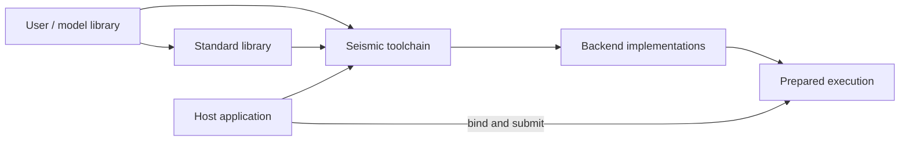

# Seismic

**Seismic is a kernel language, compiler, and runtime packaged as a Rust library.**
It turns portable numerical programs into hardware-specific executions, with
resource accounting and automatic optimization built into compilation.

## Architecture

| Layer | Responsibility |
| --- | --- |
| **Toolchain — `seismic`** | Language, checking, canonicalization, lowering, resource analysis, optimization, backends, runtime, and CLI. Understands primitives and implementation contracts; remains independent of model families. |
| **Standard library — `seismic-std`** | Reusable constructs, backend lowerings, and portable numerical kernels, authored in Seismic. |
| **User libraries** | Application-owned numerical programs composed from the standard library and user-defined operations. Model topology belongs here. |
| **Host application** | Model artifacts, I/O, residency policy, logical state, scheduling, and serving. Embeds Seismic and supplies programs, bindings, and a device. |



## Portable authoring

- **Express computation and precision.** Kernels describe dataflow, logical shapes,
  representations, independent work, and numerical requirements.
- **Keep hardware in backend scope.** Thread and lane geometry, instruction choices,
  physical placement, and hardware capabilities belong to lowerings and backend
  definitions.
- **Derive implementation sizes.** Authors express a decomposition such as streaming
  an axis; the compiler chooses piece sizes, grouping, and placement jointly.
  Logical problem dimensions and fixed instruction geometry retain their own meaning.
- **Derive what the program establishes.** Shapes, access regions, dependencies,
  lowering preconditions, resource requirements, and host bindings follow from
  signatures and bodies. Hardware facts and runtime conditions remain explicit inputs.
- **Serve the kernel author.** When a natural algorithm requires compiler workarounds,
  improve the language, lowering, analysis, or tooling at the responsible layer.

## Language and vocabulary

| Concept | Meaning |
| --- | --- |
| **Primitive** | Fundamental operation or decomposition with language-defined semantics and backend implementations. |
| **Function / kernel** | Portable composition of existing operations; its body defines its computation. |
| **Construct** | General semantic operation with a portable definition and specialized backend lowerings where needed. |
| **Lowering** | Backend-scope implementation of a construct, with applicability derived from its types and constraints. |
| **Intrinsic** | Backend operation defining instruction semantics, participation, hardware requirements, and emission. |

**Keep the vocabulary small and compositional.** Admit a construct when existing
composition cannot cleanly express a required performant implementation or
work decomposition. Give it general semantics and coverage across supported backends.
Revisit constructs when improved composition makes them redundant.

The language provides typed tensors, logical tiles, scalars, views, bounded control
flow, parallel and owned iteration, streaming movement, reductions, and atomic
effects. Matrix multiplication and scan are reusable constructs; attention, norms,
routing, and sampling are library compositions rather than model-specific compiler cases.

## Semantics and correctness

| Property | Architectural treatment |
| --- | --- |
| Shapes and access | Symbolic dimensions, view relationships, bounds, and initialization are checked. |
| Precision | Operand and accumulation types, rounding/publication boundaries, and reassociation permissions are explicit. |
| Packed representations | Storage, decoding, metadata, alignment, and coefficient precision share one definition. |
| Ownership and effects | Aliasing, value versions, parallel independence, synchronization, and mutation survive transformations. |
| Backend coverage | Lowering domains cover the supported construct domain; applicability and capability requirements are explicit. |
| Runtime conditions | Binding-dependent requirements are validated at binding or represented as checks in the execution. |

Types and construction enforce local invariants; compiler analyses and stage
validation establish global properties. The portable interpreter defines reference
execution. Backend implementations must preserve those semantics, including
finite-precision behavior.

## Composition and compilation

```text
Source + libraries
    → checked portable IR
    → canonicalization and composition
    → backend lowering with legal implementation choices
    → joint resource analysis and optimization
    → resolved execution
    → target emission and native compilation
```

- **Canonicalization:** Normalize equivalent expressions through deterministic,
  semantics-preserving rewrites and recognize reusable operations.
- **Fusion and decomposition:** Optimize across operation boundaries while preserving
  precision, effects, and publication. Account for intermediate storage and generated merges.
- **Joint selection:** Choose implementations, sizes, layouts, storage, and schedules
  for the enclosing execution. Independently optimal children need not compose optimally.
- **Shared execution structure:** Accounting, optimization, emission, and inspection
  consume the same implementation definitions and derived views across IR stages.

## Resource accounting and optimization

**Performance is a consequence of work, movement, dependencies, and finite resources.**

| Information | Role |
| --- | --- |
| Computation semantics | Derive logical work, accessed regions, reuse opportunities, and necessary dependencies. |
| Selected implementation | Derive instructions, transfers, live storage, synchronization, and launch structure. |
| Hardware contract | Supply resource topology, capabilities, capacities, service behavior, and operating conditions. |
| Resource constraints | Describe feasibility, contention, concurrency, and timing relationships. |
| Sound relaxations | Bound the best possible duration across remaining legal implementations. |

The optimizer resolves typed choices using these relationships. Its goal is exact
optimization over the declared execution form and model, with practical symbolic
analysis and search. Candidate benchmarks and heuristic scores do not drive selection.

Performance reports expose the same analysis: work, bottlenecks, selected choices,
bounds, predictions, observations, and remaining uncertainty. A physical lower bound,
a model optimum, and measured performance have distinct meanings. Hardware and native
mapping qualification connect the model to actual execution.

## Backends

| Backend | Execution route |
| --- | --- |
| **Metal** | Metal source compiled through OS facilities. |
| **CUDA** | PTX compiled through the CUDA driver. |
| **CPU** | Cranelift-generated code and admitted native microkernels, with feature-aware vector and worker execution. |
| **Vulkan** | SPIR-V through the Vulkan runtime. |

One portable library serves these targets. Backend definitions own instruction
mappings and hardware mechanisms; lowerings express implementation strategies.
CPU is a production execution target. Native compilation behavior, including
allocation and spills, belongs in the backend's execution model and mapping contract.

## Embedding and runtime

| Boundary | Behavior |
| --- | --- |
| **Build** | Check and embed standard and application libraries; generate typed Rust bindings from program signatures. |
| **Compile** | Specialize and optimize for the selected device, then emit and compile its execution. |
| **Bind** | Validate shapes, representations, and allocation relationships; prepare immutable bindings. |
| **Submit** | Bind dynamic inputs and reuse prepared storage and native submission plans. |
| **Complete** | Preserve dependencies and retain resources through every submitted use; expose completion and failure accurately. |
| **Cache** | Reuse analyses and executables under compatible program, workload, hardware, and compiler identities. |

The runtime owns physical execution and allocation lifetimes. The host owns policy:
what to load, which values remain resident, which requests run, and how logical state
is published. Numerical model computation stays in Seismic programs.

## Development and distribution

- **Independent development:** Check, interpret, lower, run, and inspect a library
  without building or linking an inference engine.
- **Fast iteration:** Source overrides and targeted invalidation let kernel and
  lowering edits affect only the relevant artifacts.
- **Useful diagnostics:** Expose source locations, constraints, resolved IR, choices,
  generated code, resource accounts, and bounded reproductions.
- **Lightweight deployment:** Embed programs and use shipped code plus OS/driver
  facilities. Customers do not need Python, LLVM, a runtime linker toolchain,
  vendor compiler SDKs, or a repository checkout.
- **Prepared warm execution:** Reuse compiled programs and bindings rather than
  repeating compilation, optimization, or application-level graph traversal.

## Further reading

| Document | Focus |
| --- | --- |
| [Language](language.md) | Authoring scopes, vocabulary, and library semantics |
| [Compiler](compiler.md) | Compilation stages and ownership |
| [Execution](execution.md) | Semantics, transformations, and legal execution forms |
| [Accounting](accounting.md) | Resource relationships and hardware models |
| [Tuning](tuning.md) | Optimization and search semantics |
| [Backends](backends.md) | Emission and native mapping contracts |
| [Runtime](runtime.md) | Artifacts, bindings, memory, and submission |
| [Inference V4](../overview.md) | Enclosing inference-engine architecture |
