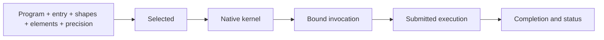

# Seismic runtime

**The runtime owns devices, buffers, native compilation of a selected execution,
binding, invocation validation, submission, and completion.** It applies the
compiler's result. It has no tuning policy and cannot reinterpret a witness.

Device kinds are Metal (`Device::metal()`, macOS only), the host CPU (`Device::cpu()`: one
worker thread per unit of host parallelism, buffers in host memory) and CUDA
(`Device::cuda()`: device zero through a private thread-affine driver context; the driver
library is loaded at run time, so on a host without one opening fails with the driver's
reason). `Device::open("metal"|"cpu"|"cuda")` selects by target name. Device, facts, buffer,
executable, and selected execution are closed sums, so a backend joins by adding one variant
to each. A buffer or a selection of one backend bound to a kernel or device of another is an
error.

## Executable boundary

**The only input to native compilation is a checked feasible `Selected`:** the
realized execution together with its family, witness, seed, estimates, proof
status, estimate model identity, numerical assessment and qualification identity,
proved lower bound, and unresolved obligations.

- `Device::compile_selected` emits and natively compiles exactly that execution,
  once. It does not select, re-lower, or replace any part of the witness.
- There is no entry point that compiles an unselected candidate, a prepared
  execution, a partial witness, or a diagnostic variant.
- A feasible witness is executable. A model proof is not a prerequisite, and neither
  is a hardware profile.
- Native compilation failure is a failure of that request. It does not trigger
  compilation of another candidate.
- **No fallback kernels.** No interpreter path, scalar path, default implementation,
  or previously compiled neighbor substitutes for a failed selection or
  compilation.

Every kernel retains what selection decided: entry, witness, seed, both estimates,
proof status, estimate model, numerical assessment, selected qualification identity,
lower bound, unresolved obligations
(`Kernel::selection`). Estimates are in the units of the named model and are not
measurements.

## Lifecycle

## Plan compiler and reuse

The plan compiler holds one closed checked program and one device.

- **Identity is `(entry, shapes, elements, precision policy, qualification catalog)`.** Requests with equal identity
  share one compilation. Buffer contents, scalar values, and bounded index arguments
  are never identity, so changing control inputs or the decode position reuses the
  compiled kernel and never retunes.
- An unknown linked function is an error when requested as an entry.
- Selection and native compilation run during `compile_entry`, before any invocation bindings
  are accepted, under
  the search budget in the compiler's settings, with the backend of the plan's device
  (`Device::select`) built from the device's queried facts. The budget is the only tuning
  input a host supplies. `Settings.precision` is a hard numerical contract and
  `Settings.qualifications` is the immutable whole-witness evidence catalog.
  `Settings.strategy` (`Exact` by default, `Greedy` as a
  diagnostic; see [Tuning](tuning.md)) replaces the budget's strategy for every entry.
- Every kernel retains a `Selection` record (`Kernel::selection`): witness, seed,
  estimates, proof status, numerical assessment and qualification identity, the specialization's shapes and elements, the selection
  phase timings and search statistics, and the wall time of `emit` (Metal; the CPU and
  CUDA backends do not separate emission) and `native_compile` measured in
  `Device::compile_selected`.
- A failed selection or compilation is an error from `compile_entry`. Nothing is retained
  and nothing else is substituted; a later compilation request retries the same identity.
- Reuse is per plan compiler, in memory. There is no persisted selection or native
  artifact cache. A persisted witness is deployed by replay ([Tuning](tuning.md)),
  which re-audits it against the current program, workload, and backend.

Anything that changes the family — a source edit, an added overload or lowering, a
different target or workload — or the backend's limits or estimate model is a
different compilation. Display names and timestamps are not identity.

## Binding

An entry's ABI derives from ownership-qualified parameters and owned results: one or more buffer
planes per tensor (a packed representation has several), one scalar per scalar or bounded
index/range value, and any compiler-generated hidden destinations for owned results.

- **By name.** A host supplies a resolver from `(parameter, plane)` to a buffer and
  from a scalar name to a value. An unbound tensor plane or scalar is an error.
  Each bound buffer is viewed at exactly the byte length the ABI requires.
- **Positional.** Buffers and scalars in ABI order; the counts must match.

Typed Rust bindings for an entry are generated from its signature (`bindings`
command). Preparation binds and pins; it executes no numerical work.

## Invocation validation

Before every submission:

- Binding counts equal the retained ABI.
- A buffer the execution requires to be independent shares its allocation with no
  other argument.
- Every ownership requirement holds: an exclusive mutable borrow overlaps no other live borrow,
  while shared borrows may overlap. Moved owned inputs are uniquely consumed for the invocation.
  Checks use allocation identity and allocation-relative offsets, not parameter names or exposed
  addresses.
- Byte sizes and typed alignment are checked by the native binding path.
- A batched submission validates every invocation before encoding any.

Data-dependent conditions stay in the selected execution: bounded indices and
data-dependent point indices are checked at run time with defined failure. The
runtime inserts no second per-access policy.

## Memory ownership

A device and its clones share one resource domain. Every allocation is charged once;
views and clones keep the charge alive until the last owner releases it. An operator
may bound the domain's charged bytes. Denial reports required and available bytes as
a typed capacity error that survives propagation to engine admission. A native
allocator failure remains a failure, not an invented capacity measurement. Charged
bytes exclude driver overhead and do not measure system-wide free memory. The limit
cannot be set below retained charges.

Allocation identity survives cloning and byte views and is distinct from a view's
logical size. Reclaimable bytes count an allocation only when every live handle to
it is in the set being released.

Kernel-internal storage — tiles, region results, cross-launch handoff — follows the
realized execution's allocation plan and is hidden from the binding ABI.

## Submission and completion

- Execution is synchronous: a call returns after physical completion and status
  validation. No asynchronous work escapes a call, including on failure.
- A submission preserves source order. Sequential execution completes each
  invocation in turn; batched execution encodes all invocations into one command
  buffer and completes once on Metal, and runs them in order on the CPU and on CUDA.
- A CPU kernel runs its phases in order; the pieces of one phase run on the device's
  worker threads and the call returns after the last phase.
- The launches of one kernel execute in their realized order.
- A kernel shared by several plans cannot be executed re-entrantly.
- A failure may follow earlier observable writes. Failure never implies rollback.
- Observed execution reports host time (binding, submission, completion, status)
  and device time (the Metal command buffer interval, the wall time of a CPU kernel's
  phases, or the sum of a CUDA kernel's launch event intervals) separately. Only Metal has a
  per-dispatch profile. Neither is an estimate
  and neither feeds selection.

## Failures

| Outcome | Interpretation |
| --- | --- |
| Invalid source or request | No execution guarantee. |
| Selection outcome other than selected | Reported with its classification ([Tuning](tuning.md)); no kernel exists. |
| Native compilation failure | Toolchain or mapping defect for this witness; not evidence about other candidates. A limit the mapping should have exported is a missing constraint. |
| Capacity denial | Typed; required and available bytes. |
| Inapplicable binding | Invocation conditions do not hold; nothing was submitted. |
| Execution failure | Completion and status reported accurately; partial effects possible. |

None authorizes heuristic selection, candidate benchmarking, altered numerics, or an
interpreter fallback.

## Engine boundary

| Seismic runtime owns | Engine owns |
| --- | --- |
| Allocations, views, and submitted resource lifetime | Residency priorities and logical history |
| Selection, native compilation, bound invocations | Model composition, entry choice, shapes and elements per step |
| Completion and physical failure information | Request acceptance, cancellation, publication |
| Charged physical capacity | Admission, eviction, recovery |

Numerical model computation stays in Seismic programs. Runtime completion does not
by itself accept a sequence advance or publish a token. The engine's
[state](../engine/state.md), [models](../engine/models.md), and
[scheduling](../engine/scheduling.md) contracts define logical policy.

## Acceptance

- Warm steps perform no selection and no native compilation.
- Two requests with equal `(entry, shapes, elements, precision policy, qualification catalog)` share one compilation.
- An aliasing violation is rejected before submission.
- Every compiled kernel reports the witness, status, and estimate model it was
  compiled from.
