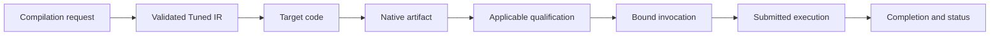

# Seismic compilation and execution runtime

The runtime owns devices, artifacts, memory bindings, submission, and completion. It
applies the results of the [compiler](compiler.md); it does not acquire an independent
tuning policy or reinterpret selected execution decisions.

## Compilation request

A request binds a semantic program, entry point, target backend, workload domain,
execution form, hardware/model contract, objective, and compiler configuration. Shapes,
representations, layouts, alias conditions, and relevant runtime predicates are explicit
inputs or retained invocation conditions.

Device discovery supplies facts with the meaning guaranteed by its API. It does not
promote architecture names, thread limits, or storage capacities into a complete
throughput profile. Hardware/model admission follows [Accounting](accounting.md).

Executable compilation requires completed automatic selection. The public runtime
accepts only compiler-produced `TunedIr`; it has no candidate, prepared-execution,
or diagnostic compilation entry point. Every native kernel retains its selection
artifact and validates the artifact's workload conditions before execution.
Model compositions and numerical weight imports use the same automatic path.
Incomplete search returns an error and retained progress; it never yields an
executable incumbent or a default implementation.

The runtime composition root supplies concrete backend implementations to the compiler
through shared interfaces. Candidate construction, model derivation, and selection have
no dependency on native compilation or device execution.

## Artifact lifecycle

This is the only supported executable lifecycle. Internal backend construction and
compiler analysis are not alternative runtime compilation interfaces.

| Artifact | Retained information |
| --- | --- |
| Tuned artifact | Actual selected execution, model/account, derived objective and completed search status, conditions, and semantic identities. |
| Native artifact | Generated code identity, native code, ABI, target/toolchain settings, and correspondence to Tuned IR. |
| Qualification | Mapping/model claims supported for that target, compiler configuration, and condition domain. |
| Invocation | Concrete bindings and checked evidence that relevant artifact conditions hold. |

Modeled optimality, physical lower bounds, qualification, and current applicability
remain separately represented. A native executable can exist without possessing all of
those claims. Production policy must not silently equate existence with qualification.

Native compilation consumes the selected execution once. Failure does not trigger trial
compilation of other candidates. A changed compilation request is an explicit new
request, not an invisible fallback.

## Invocation applicability

Before relying on an artifact, establish its required conditions:

- Shape, dtype, representation, layout, strides, offsets, and alignment.
- Buffer sizes, canonical allocation relationships, and required disjointness.
- Scalar domains, predicates, and relevant content/version conditions.
- Target capabilities, compiler/mapping assumptions, and operating domain.
- Any enforced residency or initial-state conditions and the objective boundary.

Checks use actual allocation identity, not parameter names or exposed pointer
coincidence. Aliased views remain views of the same allocation. Reused addresses do not
establish content identity. Mutation invalidates assumptions tied to prior content
versions.

Source alias requirements survive execution regrouping. Admission checks the used
byte ranges of all relevant storage planes, with checked offset arithmetic; exact
overlap is permitted only by the retained source access proof. Resident backend
entry points and model input validation enforce the same conditions as the shared
runtime before executing or relying on the conditional account.

Static validation eliminates checks only when its retained conditions hold. Invocation
checks establish binding properties. Necessary data-dependent checks remain in the
selected execution with defined failure behavior and accounted costs. The runtime does
not insert a second per-access policy behind the compiler's model.

Residency claims require an enforced state or conservative envelope. If residency is
only an unverified condition, a corresponding bound remains conditional rather than
certified applicable to the current invocation.

## Memory and execution ownership

Buffers and views retain their allocations for every operation that can access them.
Invocation scratch follows the selected allocation and lifetime plan. Aliasing, retained
views, asynchronous work, and cross-launch handoffs prevent premature reuse or
deallocation.

A device and its cloned handles share one resource domain. An operator may bound
the domain's charged storage bytes; every retained allocation is charged once,
and views and completion pins keep that charge live until the final owner releases
it. Failed allocation and failed preparation unwind tentative charges. Budget
denial reports typed required and available bytes at the failed allocation, which
must survive propagation to engine admission. A native allocator failure remains
a failure unless its API supplies reliable capacity facts. Charged storage bytes
exclude driver/allocator overhead and are not a measurement of system-wide free
memory. Engine compositions require weights, scratch, and invocation buffers from
their owning resource domain.

Submission preserves the selected launch and dependency graph. Fusion, batching, command
grouping, or overlap introduced by the runtime must either be represented in that
graph/model or be proven irrelevant to the declared objective and semantics. Runtime
policy cannot silently serialize or overlap work behind the compiler's account.

Completion establishes both physical completion and the required status/result
visibility. A submission error does not prove that already submitted work stopped. A
dynamic kernel failure may follow earlier observable writes; failure results must not
imply transaction rollback. Resources remain retained until safe release is established.

## Cache identity and invalidation

Cached execution analyses and selections belong to the compilation lifecycle and share
its explicit dependency identities with native artifacts and qualification. There is no
separate proof cache or certificate lifecycle. Relevant keys include:

- Semantic program, entry, legal execution form, and implementation definitions.
- Workload domain and retained conditions.
- Hardware/model and native mapping contracts.
- Objective, timing boundary, units, and analysis versions.
- Compiler configuration, backend features, toolchain, and artifact ABI.

Display names and timestamps are not semantic identities. Hashes establish identity, not
correctness. Persisted analyses and selections must pass the same dependency and
validity checks as their in-memory equivalents; recompute when those cannot be
established. Deserialization cannot admit arbitrary costs or bypass execution
validation.

A hardware, mapping, or analysis update invalidates affected cached results. Reuse under
different conditions requires establishing compatibility through the owning analysis.
Native-code compatibility alone does not establish that cached resource constraints or a
previous selection remain applicable.

Within a fixed enclosing compilation identity, a completed artifact may serve an
invocation that establishes all of its workload facts. Additional captured bytes
and stronger power-of-two alignment do not invalidate an artifact compiled under
weaker facts. Exact scalar fields, allocation/view geometry and alias relationships
must still match, and every originally captured byte must be established unchanged.
The artifact retains its original workload and objective; lookup does not relabel
it as a newly specialized optimum. Submission continues to validate the original
conditions. Unfinished search resumption still requires exact input identity.

Bindings may declare finite integer domains for scalar inputs and fields of
immutable control buffers. Each domain gives a storage width, signedness, inclusive
range, and stride. Preparation checks the current input and canonically retains
the domain; it does not retain that invocation's value as a specialization. The
terminal derivation must establish the same execution model across every admitted
value, including its bounds checks and transaction geometry. Varying branch
outcomes, loop counts, or unsupported symbolic accesses remain unresolved.
Completed selection may then serve any invocation or narrower domain establishing
the original conditions, without changing its objective or selected artifact.
Native submission rechecks range and residue, and batched execution rejects writes
to any allocation whose integer fields condition another invocation. Backends
without domain analysis reject these requests rather than using canonical minimum
values as exact data. Domains do not automatically generalize changing sequence
lengths or claim optimality under a different amount of work.
CUDA retains affine integer values and allocation-relative addresses over checked
input domains. Bounds, alignment, branch outcomes and memory dependencies must be
uniform across the domain. Varying addresses are supported for hardware services
that do not require sector coverage; sector-dependent services remain unresolved
until their uniform coverage is established. Unrepresentable address arithmetic,
varying predicates and varying alias conflicts retain explicit unsupported-analysis
regions. Canonical domain bytes are never treated as exact inputs. Missing realization or hardware analyses
likewise retain their choice paths and sound inherited lower bounds, so they can
only disappear after a bound proves they cannot improve the incumbent.

Ordered GPU phases publish cross-phase scalars and dense tiles into invocation
storage. These allocations are hidden from the source binding ABI, shared by all
phases of that invocation, and carry writes through physical phase completion.
Host compositions query the selected form's domain-analysis capability. A host
may retain checked exact control bytes on other backends, while still enforcing
the same input range. This changes analysis precision; it does not execute an
unfinished selection or attach domain-wide optimality to an exact specialization.

## Failures and result classification

| Outcome | Required interpretation |
| --- | --- |
| Invalid source/request | A semantic or request violation; no execution guarantee. |
| Proven infeasible form | Checked absence of a legal feasible realization under the stated conditions. |
| Incomplete tuning/checking | Retained progress and unresolved coverage; no exact-optimality claim. |
| Compiler or native compilation failure | Implementation/toolchain failure, not evidence that all alternatives are illegal. |
| Inapplicable binding | Invocation conditions do not hold; do not use the conditional claim. |
| Qualification mismatch | Withhold affected claims and preserve diagnostic evidence. |
| Execution failure | Report completion/status and possible partial effects accurately. |

An incomplete or failed path does not authorize heuristic selection, candidate
benchmarks, altered numerical semantics, or hidden interpreter fallback.

## Engine boundary

| Seismic runtime owns | Engine owns |
| --- | --- |
| Allocations, views, transfers, and submitted resource lifetime | Residency priorities and logical history claims |
| Prepared bindings, temporary storage, and native submission | Model composition and packed request inputs |
| Completion and physical failure information | Per-request acceptance, cancellation policy, and publication |
| Charged physical capacity and release of unused resources | Admission, victim selection, and recovery |

A compiled execution retains immutable bindings and planned temporary storage.
Warm submission validates dynamic operands and reuses prepared native execution;
it does not repeat graph traversal, tuning, static binding, or per-layer host dispatch.
One logical completion covers all required constituent work.

Typed engine bindings derive from program signatures. Equal program/shape identities
may share compiled code while bound artifacts remain distinct resources. Source I/O,
staging, conversion, and transfer have explicit ownership and completion relationships;
asynchronous transfers retain source and destination through completion.

The engine's [state](../engine/state.md), [models](../engine/models.md), and
[scheduling](../engine/scheduling.md) contracts define logical policy. Runtime
completion does not itself accept a sequence advance or publish a generated token.
