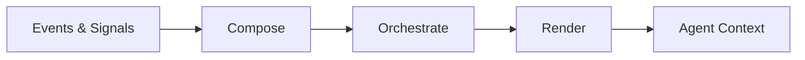
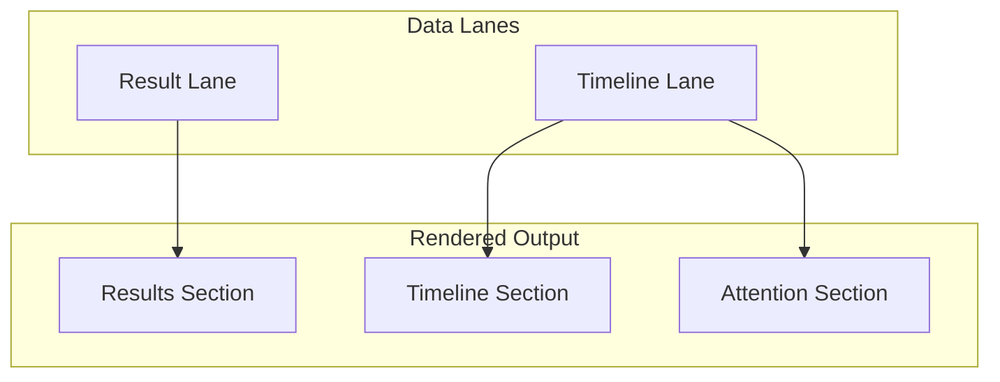

# Context Architecture

## Overview

Between each of the agent's turns, things happen: tools return results, users send messages, subagents report activity, files change, workflow phases advance. The agent needs to see all of this when it next speaks.

The **inbox** is the system that collects these events, queues them, and renders them into the agent's conversation history. It is the primary interface between the outside world and the agent's context window.

## Pipeline

The inbox operates as a three-stage pipeline:



**Compose** — Pure functions that map raw events into typed intermediate representation (IR) entries. No side effects, no XML, no formatting. Just structured data.

**Orchestrate** — The memory projection manages the queue of IR entries, handles ordering, and flushes the queue into inbox messages.

**Render** — Takes the structured IR entries and produces the final text and image content that the agent sees. Handles time markers, attention synthesis, and layout.

## Two Data Lanes

Events are classified into two data lanes when they enter the queue:

**Result lane** — Direct feedback from the agent's last turn: tool outputs, errors, interrupts, and noop nudges. These are responses to the agent's own actions.

**Timeline lane** — Everything else that happened in the world: user messages, subagent activity, file changes, workflow events, reminders. These are chronological context about what changed while the agent wasn't looking.

## Three Rendered Sections

When the inbox is rendered for the agent, the two data lanes produce three output sections:



**Results section** — Appears first. Tool outputs, error messages, interrupt notices. The agent's most immediate context — what happened as a direct consequence of its last actions.

**Timeline section** — Chronological feed of world events, grouped by minute with timestamp headers. User messages, agent activity blocks, file changes, workflow transitions, reminders.

**Attention section** — Synthesized from the timeline. When important events (user messages, agent errors, agents going idle) are buried under later timeline entries, they're highlighted here so the agent doesn't miss them. This section only appears when there are buried high-priority items.

## Queue and Flush

All events go through the queue — there are no bypass paths. The queue uses a two-key ordering scheme:

- **Timestamp** — when the event occurred
- **Sequence number** — monotonic counter for deterministic ordering of same-timestamp events

Some entries support **coalesce keys** for deduplication. For example, repeated file update notifications for the same path replace each other rather than accumulating — the agent only needs to see the latest state.

The queue is flushed through a single canonical mechanism that sorts entries, partitions them into lanes, appends inbox messages, and clears the queue. Flush happens at the start of each turn, and on-demand when mid-turn events (like observations) or terminal errors need to be visible immediately.

Consecutive agent activity entries for the same agent are merged in the queue — multiple atoms (messages, status changes) collapse into a single agent block rather than appearing as separate entries.

## Inbox in Context

The inbox message is one of several message types in the agent's conversation history:

| Message Type | Purpose |
|---|---|
| **Session context** | Initial setup: project info, tools, system prompt |
| **Assistant turn** | The agent's own previous response |
| **Compacted** | Summary replacing older messages after compaction |
| **Fork context** | Spawn context for subagents |
| **Inbox** | Everything between turns (this system) |

The other message types are simple — they store pre-baked content at creation time. The inbox is the only message type where content is composed from multiple event sources and rendered at read time.

## Examples

### Simple user message

When a user sends a message and nothing else is pending, the agent sees:

```
<message from="user">Can you fix the login bug?</message>
```

No time markers, no sections — progressive activation keeps the common case clean.

### After a tool call with concurrent activity

The agent ran a shell command, a user sent a follow-up, and a subagent went idle. The rendered inbox:

```
<shell observe=".">
<stdout>Tests passed: 41/41</stdout>
</shell>

--- 2024-03-28 16:05 ---
<message from="user">Also check the edge cases</message>
<agent id="builder-auth" role="builder" status="idle">
<idle/>
</agent>

<attention>
- user message at 16:05
- builder-auth went idle at 16:05
</attention>
```

The results section comes first (shell output), then the timeline with time markers, then attention highlighting the buried user message and idle agent.

### Subagent activity between turns

While the lead agent was thinking, two subagents made progress:

```
--- 2024-03-28 16:12 ---
<agent id="builder-api" role="builder" status="working">
Implementing the REST endpoint for user authentication
<shell command="grep -r 'auth' src/"/>
</agent>
<agent id="explorer-docs" role="explorer" status="idle">
<message to="lead">Found 3 relevant documentation files</message>
<idle/>
</agent>

<attention>
- explorer-docs went idle at 16:12
</attention>
```

### Queue coalescing

If a file is updated three times while the agent is mid-turn, only the latest notification survives in the queue. The agent sees one file update entry, not three.

## Rendering

The renderer transforms IR entries into the text the agent reads. Key behaviors:

- **Time markers** — Entries are grouped by minute with timestamp headers. Full date-time is shown on the first marker and whenever the date changes. Subsequent markers on the same date show only the time.
- **Progressive activation** — A single user message with no results skips the full timeline machinery and renders as a simple message tag. This keeps the common case clean.
- **Attention synthesis** — Described above in the rendered sections.
- **Observation passthrough** — Image content from observations is passed through as native image parts rather than converted to text, preserving multimodal content.
