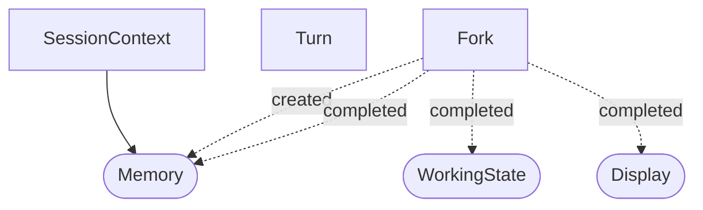

# CodingAgent Projection Dependency Graph

## Legend

- `[Name]` - Standard projection
- `([Name])` - Forked projection (per-fork state)
- `A --> B` - B reads from A
- `A -.->|signal| B` - B subscribes to signal from A
