# Event-Core Architecture

A comprehensive guide to the event-core system - an event-sourced, Effect-based reactive framework for building agents with deterministic state management.

## Table of Contents

1. [Core Concepts](#core-concepts)
2. [System Architecture](#system-architecture)
3. [Component Deep Dive](#component-deep-dive)
4. [Event Processing Mechanics](#event-processing-mechanics)
5. [Signal Processing Mechanics](#signal-processing-mechanics)
6. [Two-Phase Processing Model](#two-phase-processing-model)
7. [Ordering Guarantees](#ordering-guarantees)
8. [Race Condition Analysis](#race-condition-analysis)
9. [Hydration and Replay](#hydration-and-replay)
10. [Layer Composition](#layer-composition)

---

## Core Concepts

### Events vs Signals

| Aspect | Events | Signals |
|--------|--------|---------|
| **Persistence** | Persisted to EventSink | Ephemeral, never persisted |
| **Replay** | Replayed during hydration | Not replayed |
| **Source** | Workers (async), external | Projections only (sync) |
| **Consumers** | Projections and Workers | Projections and Workers |
| **Purpose** | Facts that happened | Derived notifications |

### Projections vs Workers

| Aspect | Projections | Workers |
|--------|-------------|---------|
| **State** | Stateful (SubscriptionRef) | Stateless |
| **Execution** | Synchronous | Asynchronous (forked fibers) |
| **Can Publish Events** | No | Yes |
| **Can Emit Signals** | Yes | No |
| **Runs During Hydration** | Yes (rebuilds state) | No (skipped) |

---

## System Architecture

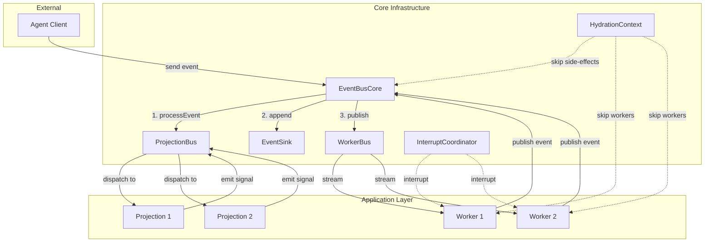

### Component Relationships

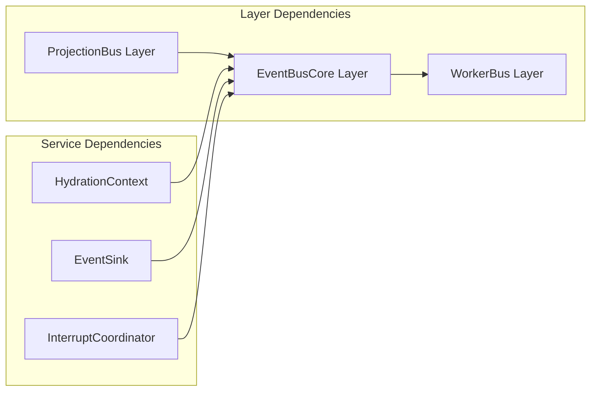

---

## Component Deep Dive

### EventBusCore

**Location:** `src/core/event-bus-core.ts`

The central coordinator that orchestrates all event publishing:

```typescript
interface EventBusCoreService<E extends BaseEvent> {
  publish: (event: E) => Effect.Effect<void>
  subscribeToTypes: <T extends E['type']>(types: readonly T[]) => Stream.Stream<Extract<E, { type: T }>>
  stream: Stream.Stream<E>
}
```

**Responsibilities:**
1. Delegates projection handling to ProjectionBus (synchronous, two-phase)
2. Persists events to EventSink (skipped during hydration)
3. Broadcasts events to workers via PubSub (skipped during hydration)
4. Handles interrupt signal broadcasting

**Critical Implementation Detail:**
```typescript
publish: (event: E) => Effect.gen(function* () {
  // Phase 1 & 2: Synchronous projection processing
  yield* projectionBus.processEvent(event)

  // Skip side-effects during hydration
  if (yield* hydration.isHydrating()) {
    return
  }

  // Broadcast interrupt before persistence
  if (event.type === 'interrupt') {
    yield* PubSub.publish(interruptCoordinator, undefined)
  }

  // Persist and broadcast
  yield* sink.append(event)
  yield* PubSub.publish(pubsub, event)
})
```

### ProjectionBus

**Location:** `src/core/projection-bus.ts`

Handles **all** synchronous projection communication:

```typescript
interface ProjectionBusService<E extends BaseEvent> {
  register: (handler, eventTypes, name) => Effect.Effect<void>
  registerSignalHandler: (signalName, handler, projectionName) => Effect.Effect<void>
  queueSignal: (signalName, value, sourceState) => Effect.Effect<void>
  processEvent: (event: E) => Effect.Effect<void>
}
```

**Key Data Structures:**

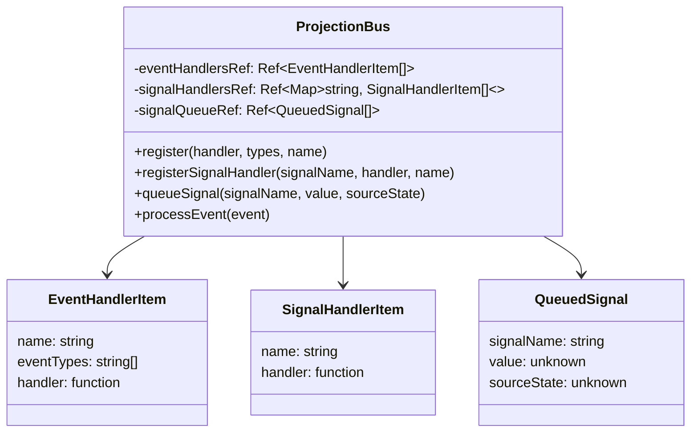

### WorkerBus

**Location:** `src/core/worker-bus.ts`

A facade over EventBusCore that provides the worker-appropriate API:

```typescript
interface WorkerBusService<E extends BaseEvent> {
  publish: (event: E) => Effect.Effect<void>
  subscribeToTypes: <T extends E['type']>(types: readonly T[]) => Stream.Stream<Extract<E, { type: T }>>
  stream: Stream.Stream<E>
}
```

Workers cannot register synchronous handlers - they only publish events and subscribe to streams.

### EventSink

**Location:** `src/core/event-sink.ts`

Pending events buffer for persistence:

```typescript
interface EventSinkService {
  append: (event: BaseEvent) => Effect.Effect<void>
  readPending: () => Effect.Effect<BaseEvent[]>
  drainPending: () => Effect.Effect<BaseEvent[]>
  prependEvents: (events: BaseEvent[]) => Effect.Effect<void>
}
```

Used for:
- Accumulating new events since last persistence
- Providing batches to persistence workers

### HydrationContext

**Location:** `src/core/hydration-context.ts`

Tracks whether the system is in hydration (replay) mode:

```typescript
interface HydrationContextService {
  isHydrating: () => Effect.Effect<boolean>
  setHydrating: (value: boolean) => Effect.Effect<void>
}
```

When `isHydrating = true`:
- Events are NOT appended to EventSink
- Events are NOT broadcast to PubSub
- Workers are NOT started
- Projections still process events (to rebuild state)

### InterruptCoordinator

**Location:** `src/core/interrupt-coordinator.ts`

Broadcast channel for interrupt signals:

```typescript
const InterruptCoordinator = Context.GenericTag<PubSub.PubSub<void>>('InterruptCoordinator')
```

Workers race their handlers against this signal for automatic interruption.

---

## Event Processing Mechanics

### Event Flow Diagram

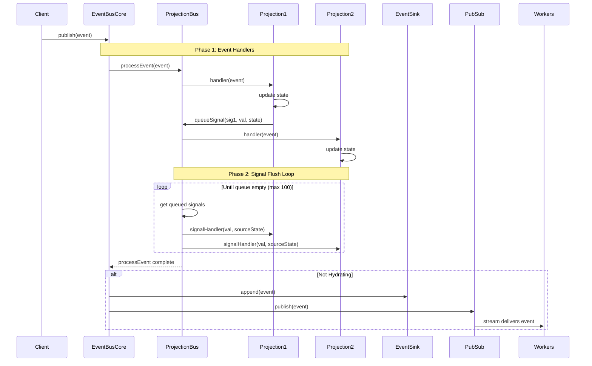

### Event Handler Registration

Projections register their event handlers during layer construction:

```typescript
// In Projection.define() Layer construction
yield* bus.register(eventHandler, eventTypes, serviceName)
```

**Registration Order:**
- Handlers are stored in an array in **registration order**
- Registration order follows **Effect's layer build order**
- Layer dependencies ensure correct ordering: if Projection B subscribes to Projection A's signal, A's layer is built first, so A's handlers run first

### Event Handler Execution

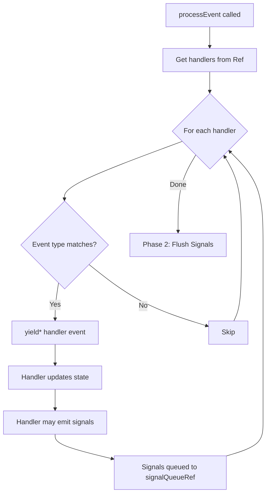

---

## Signal Processing Mechanics

### Signal Architecture

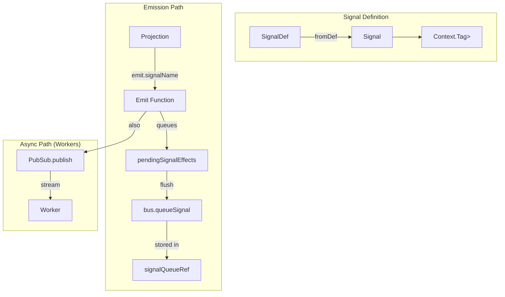

### Signal Flow - Synchronous Path (Projections)

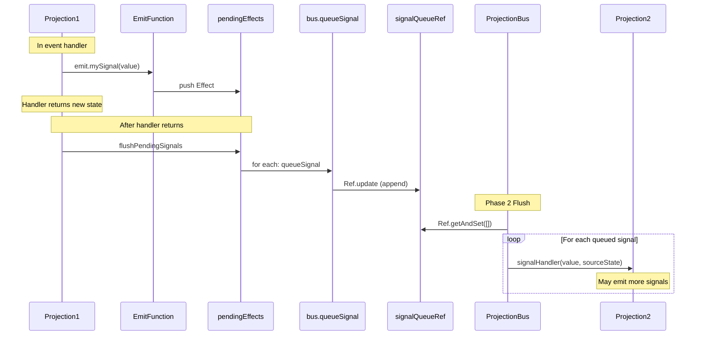

### Signal Flow - Asynchronous Path (Workers)

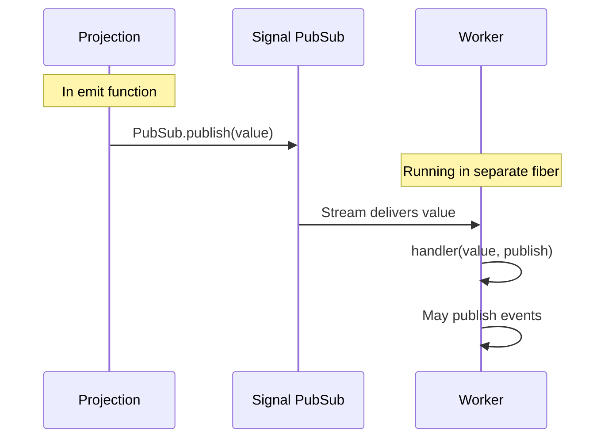

### Signal Handler Registration

Signal handlers are registered during projection layer construction:

```typescript
yield* bus.registerSignalHandler(
  signal.name,
  (value, sourceState) => Effect.gen(function* () {
    yield* SubscriptionRef.update(stateRef, (currentState) =>
      handler({ value, source: sourceState, state: currentState, emit: typedEmitters })
    )
    yield* flushPendingSignals
  }),
  serviceName
)
```

**Key Points:**
- Signal handlers receive the **source projection's state** at emission time
- Handlers can emit additional signals (cascading)
- All signal handling is synchronous within the event processing

---

## Two-Phase Processing Model

This is the **critical architectural decision** that prevents race conditions:

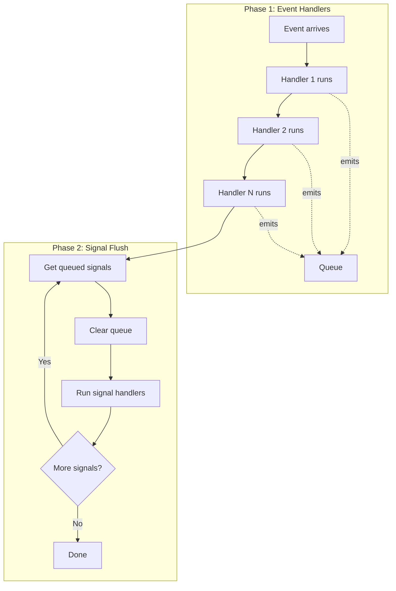

### Why Two Phases?

**Problem with immediate dispatch:**
```
Event E arrives
  → Projection A handles E, emits Signal S, updates state to A1
  → Signal S dispatched immediately
    → Projection B handles S, sees A1
  → Projection B handles E, updates state to B1
    → But B already handled S based on A1!
```

**Solution with two phases:**
```
Event E arrives
  Phase 1:
    → Projection A handles E, emits Signal S (queued), updates to A1
    → Projection B handles E, updates to B1

  Phase 2:
    → Signal S dispatched
    → All projections see final state (A1, B1)
    → Signal handlers have consistent view
```

### Iteration Safety

The flush loop has a safety limit:

```typescript
let iterations = 0
const maxIterations = 100

while (true) {
  const queue = yield* Ref.getAndSet(signalQueueRef, [])
  if (queue.length === 0) break

  if (iterations++ >= maxIterations) {
    yield* Effect.logWarning(`Signal flush exceeded ${maxIterations} iterations`)
    break
  }
  // ... process signals
}
```

This prevents infinite loops from circular signal cascades.

---

## Ordering Guarantees

### Event Handler Ordering

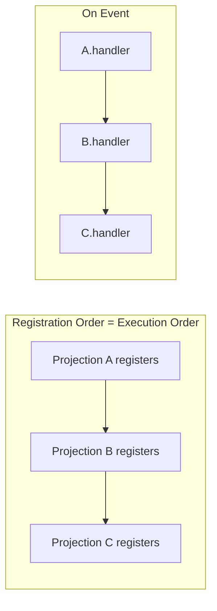

**Guarantee:** Event handlers execute in registration order, which follows Effect's layer build order.

**Layer Dependencies Control Order:**
```typescript
// If B depends on A's signal:
const B = Projection.define<Event, State>()({
  signalHandlers: [
    Signal.projectOn(A.signals.changed, handler)
  ]
})

// A's Layer builds before B's Layer
// Therefore A registers handlers before B
// Therefore A's event handlers run before B's
```

### Signal Handler Ordering

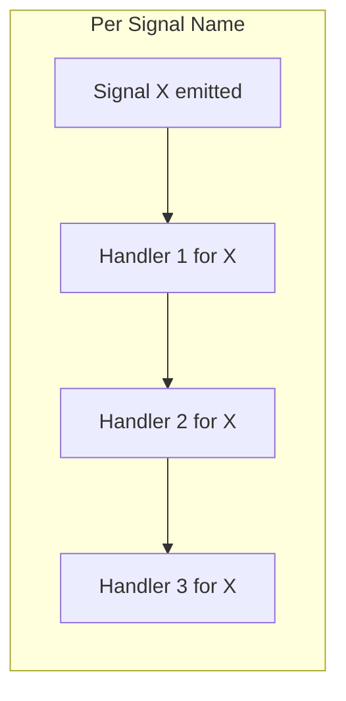

**Guarantee:** Signal handlers for the same signal execute in registration order.

### Cross-Event Ordering

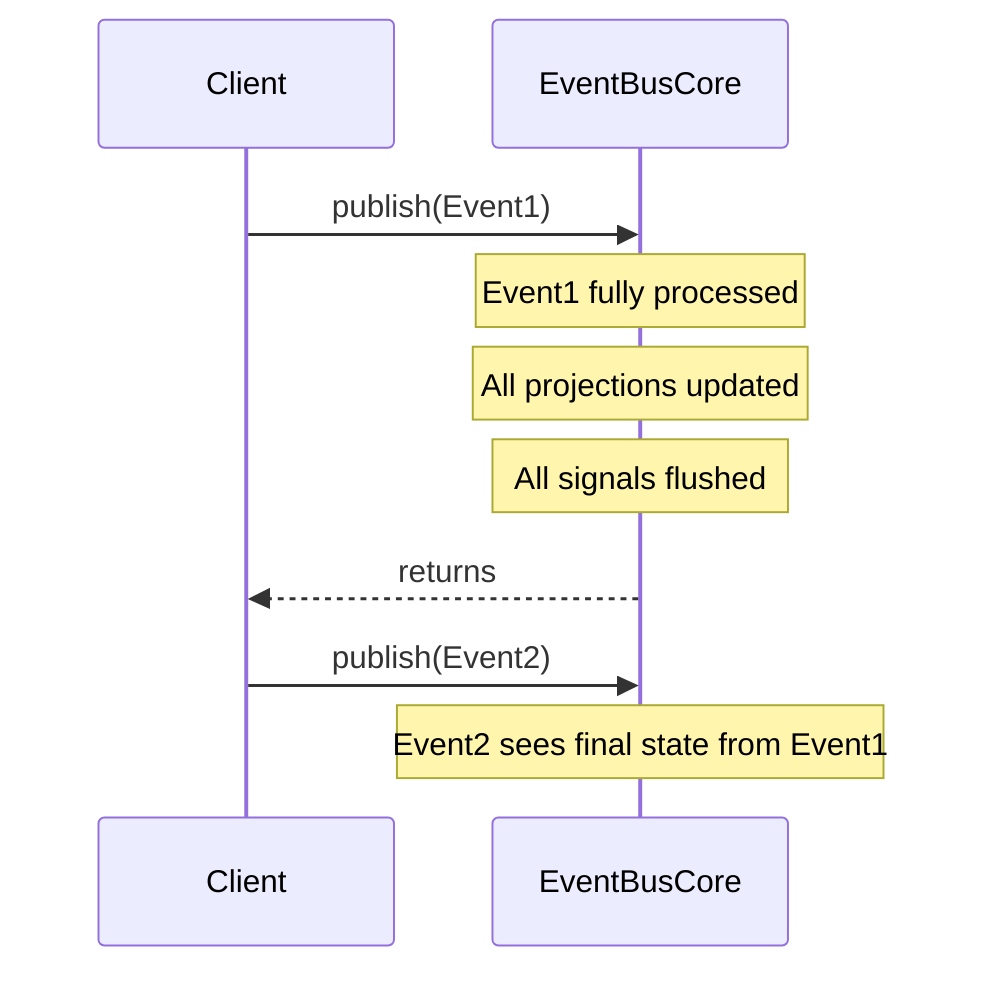

**Guarantee:** Each event is fully processed (including all signal cascades) before `publish` returns.

---

## Race Condition Analysis

### Can Race Conditions Occur?

#### Signal Handler vs Signal Handler: **NO**

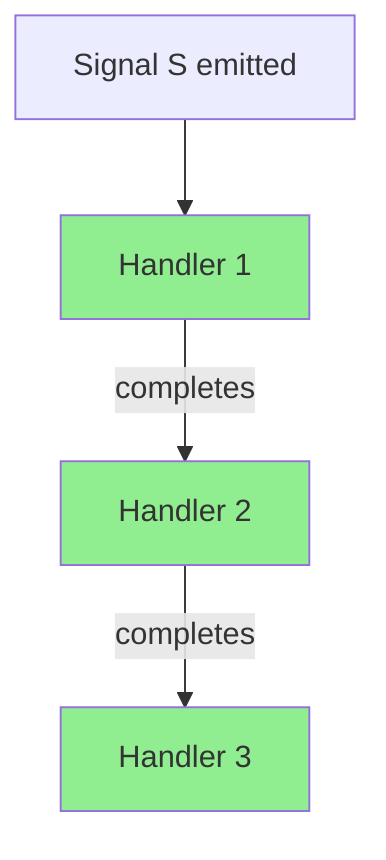

**Why:** All signal handlers run sequentially within the same Effect fiber. Each `yield*` completes before the next handler starts.

#### Event Handler vs Event Handler: **NO**

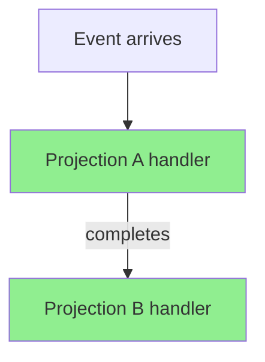

**Why:** Event handlers run in a synchronous `for` loop with `yield*`:

```typescript
for (const { eventTypes, handler } of handlers) {
  if (eventTypes.includes(event.type)) {
    yield* handler(event)  // Waits for completion
  }
}
```

#### Signal Handler vs Event Handler: **NO**

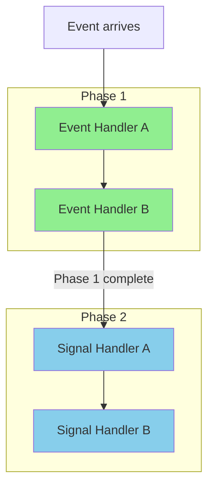

**Why:** The two-phase model completely separates event and signal processing. Phase 1 (event handlers) must complete entirely before Phase 2 (signal handlers) begins.

#### Worker vs Worker: **CONCURRENT (By Design)**

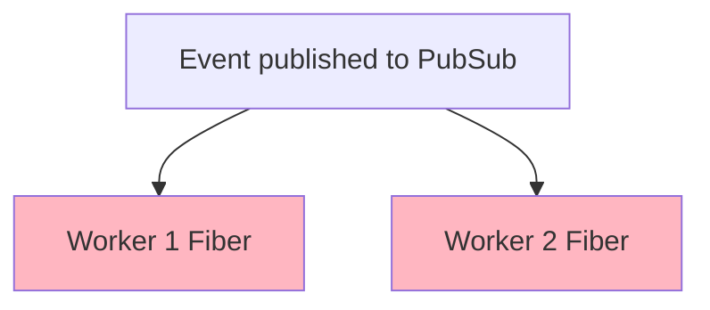

**Why:** Workers run in separate forked fibers. This is intentional - workers are async and can run concurrently.

**Mitigations:**
1. Workers should be stateless
2. Workers publish events, which are processed synchronously by projections
3. Event ordering provides serialization point

#### Worker vs Projection: **SAFE**

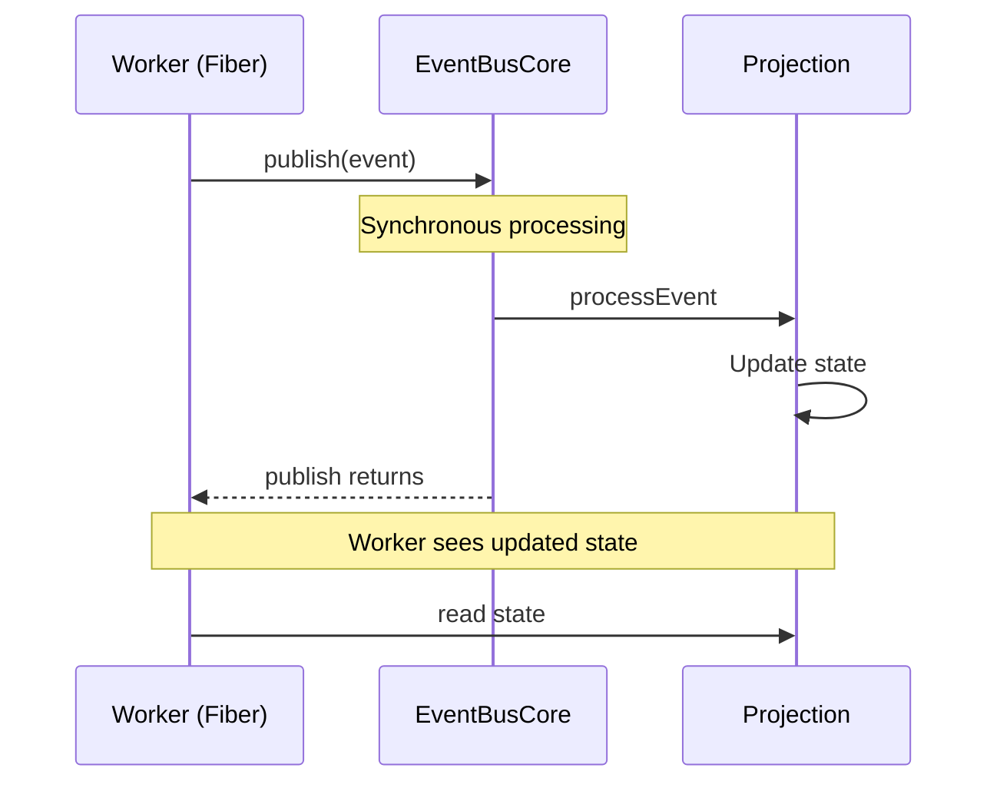

**Why:** When a worker publishes an event, it waits for `publish` to return. By that time, all projections have processed the event synchronously.

### The Synchronous Guarantee

**The fundamental invariant:**

> All projection state updates from an event (including signal cascades) complete synchronously before the `publish` call returns.

This means:
- Any code that awaits `publish` can immediately read consistent projection state
- Workers reading projection state always see the result of all events they've published
- There's no "eventual consistency" delay within a single publish call

### Potential Race: Worker PubSub Subscription

**Scenario:**
```typescript
// Worker subscribes to signal
yield* Effect.forkScoped(
  Stream.runForEach(
    Stream.fromPubSub(pubsub),
    (value) => handler(value, publish)
  )
)
```

**The PubSub subscription happens at layer construction time.** If a signal is emitted before the worker's stream loop starts processing, it could be missed.

**Mitigation in practice:**
1. Layers are built in dependency order
2. Workers depend on projections (to subscribe to their signals)
3. By the time events flow, workers are subscribed

---

## Hydration and Replay

### Hydration Flow

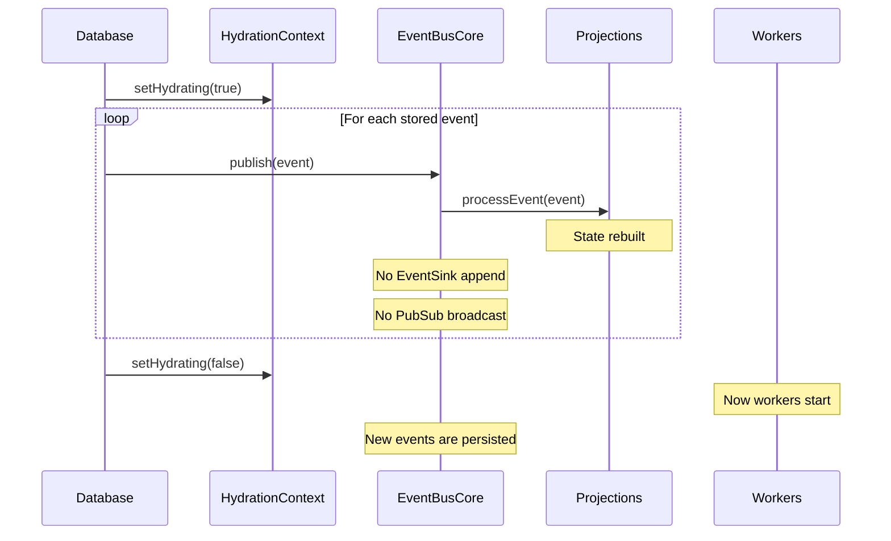

### What Happens During Hydration

| Component | Behavior |
|-----------|----------|
| **Event Handlers** | Run normally, rebuild state |
| **Signal Handlers** | Run normally (part of event processing) |
| **EventSink.append** | Skipped |
| **PubSub.publish** | Skipped |
| **Worker startup** | Skipped (check `isHydrating` in Layer) |
| **Interrupt broadcast** | Skipped |

### Worker Hydration Guard

```typescript
const WorkerLayer = Layer.scoped(Tag, Effect.gen(function* () {
  const hydration = yield* HydrationContext

  if (yield* hydration.isHydrating()) {
    return  // Don't start worker during hydration
  }

  // ... normal worker setup
}))
```

---

## Layer Composition

### The Agent Layer Stack

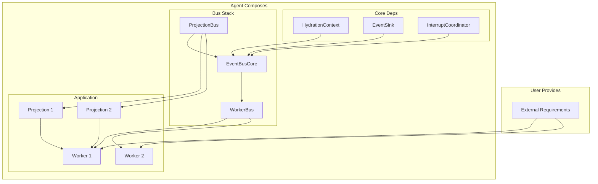

### Layer Build Order

Effect builds layers based on dependencies:

```typescript
const AppLayer = Layer.provideMerge(
  WorkersLayer,
  Layer.provideMerge(ProjectionsLayer, BaseLayer)
)
```

**Build order:**
1. CoreDeps (HydrationContext, EventSink, InterruptCoordinator)
2. ProjectionBus
3. EventBusCore (depends on ProjectionBus + CoreDeps)
4. WorkerBus (depends on EventBusCore)
5. Projections (in dependency order based on signal subscriptions)
6. Workers (depend on projections for signal PubSubs)

### Signal PubSub Layers

Each projection creates PubSub layers for its signals:

```typescript
// In Projection.define()
for (const [, signal] of signalEntries) {
  const signalLayer = Layer.scoped(signal.tag, PubSub.unbounded<unknown>())
  SignalPubSubLayers = Layer.merge(SignalPubSubLayers, signalLayer)
}

const FullLayer = Layer.provideMerge(LogicLayer, SignalPubSubLayers)
```

This ensures:
- Each signal has exactly one PubSub instance
- Workers can subscribe to these PubSubs
- The PubSub is scoped to the agent's lifetime

---

## Summary: Key Architectural Invariants

1. **Synchronous Projection Processing**: All event handlers and signal handlers run synchronously within `processEvent`. No concurrency within projection logic.

2. **Two-Phase Separation**: Event handlers (Phase 1) complete entirely before signal handlers (Phase 2) run. This prevents seeing inconsistent intermediate states.

3. **Registration Order = Execution Order**: Handlers run in the order they were registered, which follows Effect's deterministic layer build order.

4. **Hydration Isolation**: During replay, only projection state is rebuilt. Side effects (persistence, worker execution) are skipped.

5. **Worker Concurrency is Intentional**: Workers run in separate fibers and can be concurrent. This is safe because:
   - Workers are stateless
   - Workers serialize through event publishing
   - Each `publish` call is synchronous for projections

6. **Signal Cascade Safety**: Signal handlers can emit more signals, which are processed in the same flush cycle. A maximum iteration limit prevents infinite loops.

7. **Source State Capture**: Signals capture the emitting projection's state at emission time, ensuring signal handlers have consistent context even if the source projection updates later in the same event.

---

## Advanced Components

### FSM (Finite State Machine)

**Location:** `src/fsm/define.ts`

Type-safe state machines using Effect's `Data.TaggedClass`:

```typescript
const ResponseFSM = FSM.define({
  transitions: {
    pending: ['streaming'],
    streaming: ['completed'],
    completed: []
  } as const,
  states: [Pending, Streaming, Completed]
})
```

**Key Features:**
- Compile-time transition validation
- `transition()` - move to new state with required fields
- `hold()` - stay in current state with updated data
- `isTerminal()` - check if state has no outgoing transitions

### Forked Projections

**Location:** `src/projection/defineForked.ts`

Projections with per-fork state partitioning:

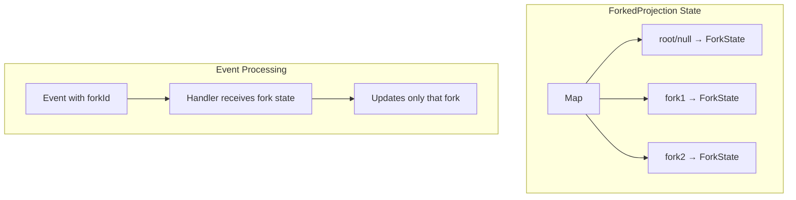

**Use Case:** Agent forking where each fork needs independent state (e.g., conversation memory).

```typescript
const MemoryProjection = Projection.defineForked<MyEvent, ForkMemoryState>()({
  name: 'Memory',
  initialFork: { messages: [] },

  eventHandlers: {
    user_message: ({ event, fork }) => ({
      ...fork,
      messages: [...fork.messages, event.message]
    })
  }
})
```

### Flow System

**Location:** `src/flow/define.ts`, `src/flow/types.ts`

Imperative orchestration for complex workflows:

```mermaid
sequenceDiagram
    participant C as Client
    participant W as FlowWorker
    participant P as FlowProjection
    participant Ctx as FlowContext

    C->>W: flow_started event
    W->>P: updateState(initial)
    W->>W: fork fiber for run()

    loop Flow Execution
        W->>Ctx: ctx.effect(sideEffect)
        Ctx->>Ctx: Check history
        alt First run
            Ctx->>Ctx: Execute effect
            Ctx->>C: Emit result event
        else Replay
            Ctx->>Ctx: Return cached result
        end

        W->>Ctx: ctx.transition(state, target, data)
        Ctx->>P: updateState(newState)

        W->>Ctx: ctx.waitFor(['event_type'])
        Ctx->>Ctx: Check history or subscribe
    end
```

**Key Concepts:**

1. **ctx.effect()** - Wrap side effects for deterministic replay
2. **ctx.spawn()** - Create child flows
3. **ctx.waitFor()** - Wait for external events
4. **ctx.transition()** - FSM state transitions with signals

**Replay Safety:** All side effects are recorded as events. On replay:
- `ctx.effect()` returns cached results
- `ctx.spawn()` reconnects to existing children
- `ctx.waitFor()` checks event history first

### Display System

**Location:** `src/display/define.ts`

Derived UI state from projections:

```typescript
const MyDisplay = Display.define({
  name: 'Status',
  source: MyProjection.Tag,
  derive: (projection) => Effect.gen(function* () {
    const state = yield* projection.get
    return { isLoading: state.status === 'pending' }
  }),
  options: {
    debounce: '100 millis'  // Optional debouncing
  }
})
```

**Use Case:** Transform projection state into UI-friendly format with optional debouncing.

### Interrupt System

**Location:** `src/core/interrupt-coordinator.ts`, `src/worker/define.ts`

```mermaid
sequenceDiagram
    participant C as Client
    participant EBC as EventBusCore
    participant IPS as InterruptCoordinator
    participant W1 as Worker1 Handler
    participant W2 as Worker2 Handler

    C->>EBC: publish({type: 'interrupt'})
    EBC->>IPS: PubSub.publish(void)

    par Racing
        IPS->>W1: interrupt signal
        W1->>W1: Effect.interrupt
    and
        IPS->>W2: interrupt signal
        W2->>W2: Effect.interrupt
    end

    Note over W1,W2: Handlers interrupted
    Note over W1,W2: Stream loops continue
```

**Worker Implementation:**
```typescript
const withInterrupt = <A, RH>(handler: Effect.Effect<A, never, RH>) =>
  Effect.scoped(
    Effect.gen(function* () {
      const queue = yield* PubSub.subscribe(interruptCoordinator)
      return yield* Effect.raceFirst(
        handler,
        Stream.fromQueue(queue).pipe(
          Stream.take(1),
          Stream.runDrain,
          Effect.flatMap(() => Effect.interrupt)
        )
      )
    })
  )
```

**Key Points:**
- Each handler gets a fresh subscription (only sees interrupts after it starts)
- Interruption is caught so the stream loop continues
- Some event types can opt out via `ignoreInterrupt` config

---

## Appendix: Complete Event Lifecycle

```mermaid
sequenceDiagram
    participant Client
    participant EBC as EventBusCore
    participant PB as ProjectionBus
    participant P as Projections
    participant ES as EventSink
    participant PS as Event PubSub
    participant SPS as Signal PubSubs
    participant W as Workers

    Client->>EBC: publish(event)

    Note over EBC,P: SYNCHRONOUS PHASE

    EBC->>PB: processEvent(event)

    rect rgb(200, 230, 200)
        Note over PB,P: Phase 1: Event Handlers
        loop Each registered handler
            PB->>P: handler(event)
            P->>P: Update SubscriptionRef
            P->>P: Queue signals (pendingEffects)
            P->>PB: flushPendingSignals → queueSignal
        end
    end

    rect rgb(200, 200, 230)
        Note over PB,P: Phase 2: Signal Flush
        loop Until signal queue empty
            PB->>PB: getAndSet queue to []
            loop Each queued signal
                PB->>P: signalHandler(value, sourceState)
                P->>P: Update state
                P->>P: May queue more signals
                P->>SPS: PubSub.publish(value)
            end
        end
    end

    PB-->>EBC: processEvent returns

    Note over EBC,W: ASYNC PHASE (if not hydrating)

    alt Not Hydrating
        EBC->>ES: append(event)
        EBC->>PS: PubSub.publish(event)

        par Worker Delivery
            PS->>W: Stream delivers event
            W->>W: Handler runs in fiber
            W->>EBC: May publish more events
        and
            SPS->>W: Stream delivers signals
            W->>W: Signal handler runs
        end
    end

    EBC-->>Client: publish returns
```

---

## Appendix: Type System

### Generic Event Bus Tags

The system uses generic tag factories to maintain type safety:

```typescript
// Each creates a unique tag for the specific event type
const EventBusCoreTag = <E extends BaseEvent>() =>
  Context.GenericTag<EventBusCoreService<E>>('EventBusCore')

const ProjectionBusTag = <E extends BaseEvent>() =>
  Context.GenericTag<ProjectionBusService<E>>('ProjectionBus')

const WorkerBusTag = <E extends BaseEvent>() =>
  Context.GenericTag<WorkerBusService<E>>('WorkerBus')
```

### Signal Type Flow

```
SignalDef<T>           // Input: just name + phantom type
    ↓ fromDef()
Signal<T, TSourceState> // Output: includes source projection's state type
    ↓ .tag
Context.Tag<PubSub<T>> // Runtime: identifies the PubSub
```

### Projection Type Extraction

```typescript
// From config
ProjectionConfig<TName, TState, TEvent, TSignalDefs, TSignalHandlers>

// To result
ProjectionResult<...> {
  Tag: Context.Tag<ProjectionInstance<TState>>
  Layer: Layer.Layer<
    ProjectionInstance<TState> | SignalPubSubs<...>,
    never,
    ProjectionBusService<TEvent> | SignalRequirements<...>
  >
  signals: AttachSourceState<TSignalDefs, TState>
}
```

---

## Appendix: Common Patterns

### Projection → Signal → Worker Flow

```typescript
// 1. Projection emits signal when state changes
const TaskProjection = Projection.define<Event, TaskState>()({
  name: 'Task',
  signals: { completed: Signal.create<Task>('Task/completed') },
  eventHandlers: {
    task_finished: ({ event, state, emit }) => {
      const task = state.tasks.get(event.id)
      emit.completed(task)
      return { ...state, tasks: new Map(state.tasks).set(event.id, { ...task, done: true }) }
    }
  }
})

// 2. Worker reacts to signal
const NotifyWorker = Worker.define<Event>()({
  name: 'Notify',
  signalHandlers: [
    Signal.workOn(TaskProjection.signals.completed, (task, publish) =>
      Effect.gen(function* () {
        yield* sendNotification(task)
        yield* publish({ type: 'notification_sent', taskId: task.id })
      })
    )
  ]
})
```

### Projection → Signal → Projection Flow

```typescript
// 1. Source projection emits signal
const SourceProjection = Projection.define<Event, SourceState>()({
  signals: { dataReady: Signal.create<Data>('Source/dataReady') },
  // ...
})

// 2. Derived projection subscribes to signal
const DerivedProjection = Projection.define<Event, DerivedState>()({
  signalHandlers: [
    Signal.projectOn(SourceProjection.signals.dataReady, ({ value, source, state, emit }) => ({
      ...state,
      derivedData: computeDerived(value, source)
    }))
  ]
})
```

### Event Sourcing Pattern

```typescript
// Events are the source of truth
type MyEvent =
  | { type: 'item_added'; id: string; data: ItemData }
  | { type: 'item_removed'; id: string }

// Projections derive state from events
const ItemsProjection = Projection.define<MyEvent, ItemsState>()({
  eventHandlers: {
    item_added: ({ event, state }) => ({
      items: new Map(state.items).set(event.id, event.data)
    }),
    item_removed: ({ event, state }) => {
      const items = new Map(state.items)
      items.delete(event.id)
      return { items }
    }
  }
})

// Hydration replays events to rebuild state
// Workers only run after hydration completes
```
