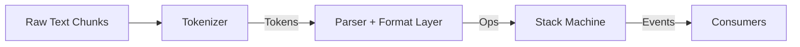
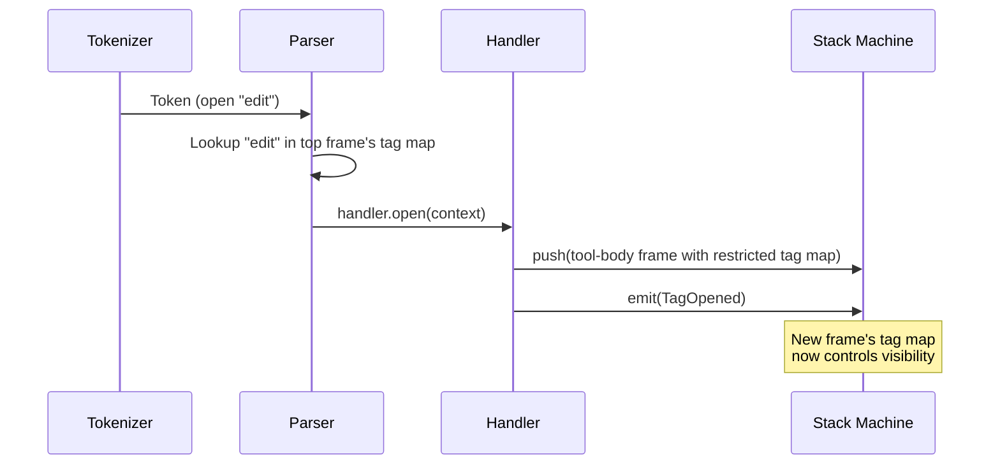

# Parser Architecture

## Overview

The xml-act parser is a **context-sensitive streaming XML parser**. It processes a protocol where the same tag name can be structural or literal text depending on context. Designed for streaming LLM output.

## Pipeline

- **Tokenizer** — pure XML syntax. Emits tokens (open, close, selfClose, content). No semantic awareness.
- **Parser + Format** — semantic layer. Determines which tags are structural vs literal text based on context. Produces stack ops.
- **Stack Machine** — generic state manager. Applies ops (push/pop/replace/emit) to a frame stack.

## Context-Sensitive Resolution

The core problem: the same tag name means different things in different contexts. "actions" is a real structural tag at the top level, but literal text inside a tool body.

Every frame on the stack carries a **tag map** — a `ReadonlyMap` of tag names to handlers. This map defines what tags are "real" in that context. Resolution is a single map lookup: found → handle structurally, not found → literal text.

This is **correct by construction**: a frame can only handle tags in its map. A child-body frame's map has one entry (its own tag). It physically cannot resolve structural tags.

### Tag Visibility by Context

| Context | Visible tags | Everything else |
|---------|-------------|-----------------|
| Prose / Container | All structural + tool tags | — |
| Tool body | Child tags + self-tag | Literal text |
| Child body | Own tag only | Literal text |
| Body capture | Nothing | Literal text |
| Message | "message" only | Literal text |
| Think (plain) | Self-tag only | Literal text |
| Lenses (inside lens) | Lens + self-tag | Literal text |
| Lenses (between lenses) | All structural + tool tags | — |

## Handler Lifecycle

When a handler pushes a new frame, it constructs it with the appropriate tag map. Visibility is determined at push time, not at resolution time.

## Safety Properties

- **Correct by construction** — Tag maps are the sole source of truth. Tags not in the map cannot be resolved. No central dispatch, no fallthrough.
- **Safe by default** — Empty map = all tags are passthrough. New frame types are safe without any code changes.
- **Pure data** — Tag maps are immutable `ReadonlyMap`. No functions or closures on frames. Inspectable and testable.
- **Streaming-safe** — Tokenizer handles partial chunks and reassembles tags split across boundaries.
