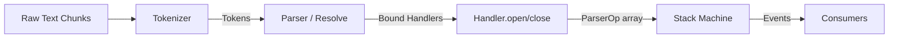
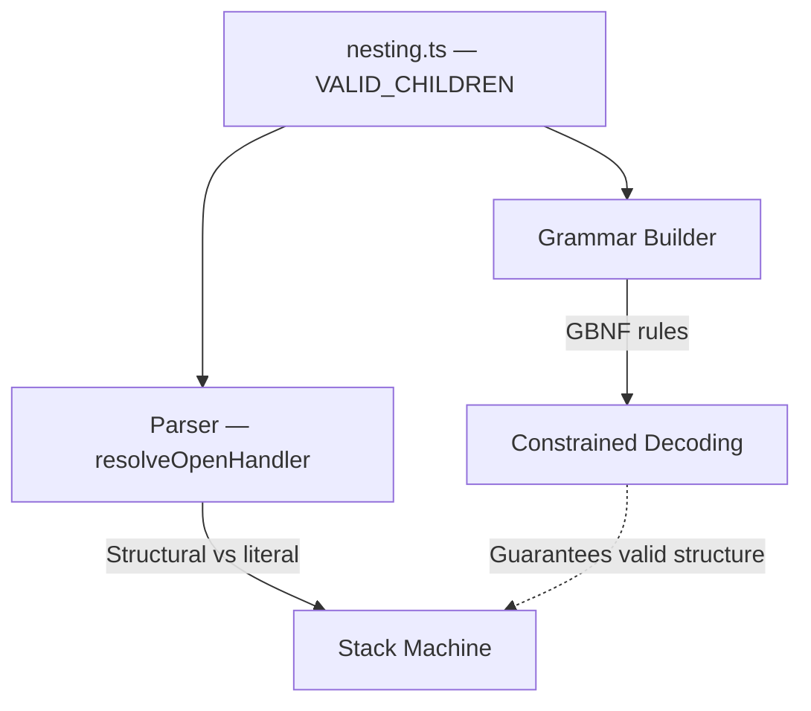
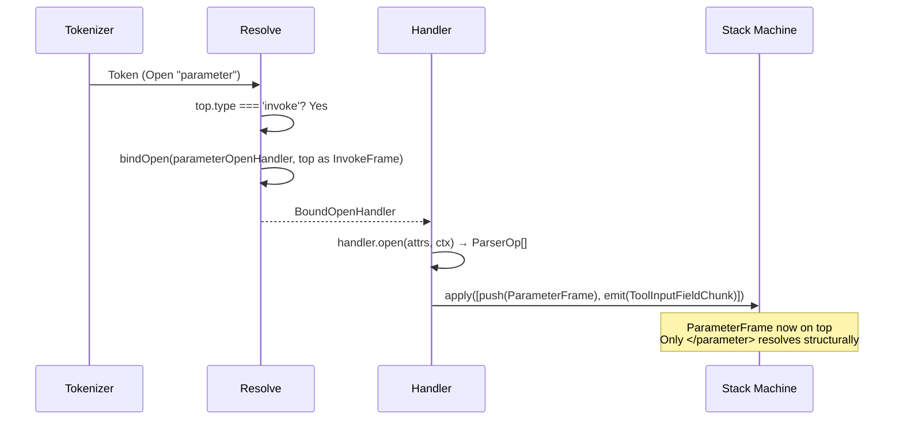

# Parser Architecture

## Overview

The xml-act parser is a **context-sensitive streaming XML parser**. It processes a protocol where the same tag name can be structural or literal text depending on context. Designed for streaming LLM output.

## Pipeline



- **Tokenizer** — pure XML syntax. Emits tokens (Open, Close, SelfClose, Content). No semantic awareness. Close tokens for known structural tag names are emitted immediately — the tokenizer does not buffer or confirm them.
- **Resolve** — context-sensitive layer. Determines which tags are structural vs literal text based on the current stack frame. Returns a typed bound handler, or `undefined` (literal text).
- **Handlers** — pure functions. Receive the narrowed parent frame and attributes, return `ParserOp[]` describing stack changes and events.
- **Stack Machine** — generic state manager. Applies ops (push/pop/replace/emit/observe/done) to a frame stack.

## Context-Sensitive Resolution

The core problem: the same tag name means different things in different contexts. `<parameter>` is structural inside an invoke, but literal text inside a reason block or prose.

Resolution is split into three functions that check the current top frame:

- **`resolveOpenHandler(tagName, top)`** — switches on `tagName`, then checks `top.type`. Returns a `BoundOpenHandler` or `undefined`.
- **`resolveCloseHandler(tagName, top)`** — switches on `top.type`, then verifies `tagName` matches. Returns a `BoundCloseHandler` or `undefined`.
- **`resolveSelfCloseHandler(tagName, top)`** — handles yield tags in prose context only.

This is **correct by construction**: resolution checks the frame type before returning a handler. A `<parameter>` token can only resolve as structural when `top.type === 'invoke'`. In any other context, it returns `undefined` → literal text.

### Tag Visibility by Context

| Context (top frame) | Structural tags | Everything else |
|---------------------|----------------|-----------------|
| Prose | reason, message, invoke, yield_* | Literal text |
| Reason | — | Literal text |
| Message | — | Literal text |
| Invoke | parameter, filter | Literal text |
| Parameter | — | Literal text |
| Filter | — | Literal text |

This table is encoded as `VALID_CHILDREN` in `nesting.ts` — a single constant shared by both the grammar builder and the parser.

## Grammar–Parser Lockstep

The grammar (GBNF for constrained decoding) and the parser must agree on what tags are valid in what contexts. Both import `VALID_CHILDREN` from `nesting.ts` as their single source of truth.



The grammar constrains the model during inference so it can only produce structurally valid output. The parser then interprets that output using the same nesting rules. Because both derive from the same constant:

- Adding a new tag to `VALID_CHILDREN` automatically generates grammar rules for it AND makes the parser resolve it structurally in the right context.
- Removing a tag removes it from both layers simultaneously.
- Compile-time type assertions catch any divergence between `VALID_CHILDREN` and the handler implementations.

## Handler Lifecycle



When resolution binds a handler, it captures the narrowed parent frame in a closure. The handler receives it as a typed parameter — TypeScript enforces the parent/child relationship at compile time via `OpenHandler<InvokeFrame, ParameterFrame>`.

## Type Safety

The handler pattern provides compile-time guarantees:

- **Generic handlers** — `OpenHandler<TParent, TChild>` enforces that a parameter handler can only be called with an InvokeFrame parent and can only push a ParameterFrame. TypeScript errors at definition time if the types don't match.
- **Bound handlers** — `bindOpen`/`bindClose` capture the narrowed frame from resolution. The parser loop calls `handler.open(attrs, ctx)` without knowing frame types — the binding is localized to resolution.
- **Zero unsafe casts** — no `as InvokeFrame`, `as ParameterFrame`, etc. in the dispatch path. TypeScript narrows through discriminant checks in resolution.
- **Exhaustive content dispatch** — a `ContentHandlers` mapped type ensures every frame type has a content handler. Adding a new frame type without one is a compile error.

## Pure Handlers

All handlers return `ParserOp[]` — an array of stack machine operations. No side effects. Events, errors, and stack changes are all expressed as ops:

```
push(frame) | pop | replace(frame) | emit(event) | observe | done
```

Helper constructors (`emitEvent`, `emitStructuralError`, `emitToolError`) produce emit ops. The parser loop applies the returned ops to the machine.

## Stack Machine Modes

The machine has three modes:

- **`active`** — normal parsing. Ops are applied to the frame stack.
- **`observing`** — entered when a yield tag fires. Tracks whether non-whitespace content appears after the yield (runaway detection). No ops applied.
- **`done`** — terminal. Emits `TurnEnd` with termination reason (`natural` vs `runaway`).

## Tentative Close

Close tokens from the tokenizer are not immediately acted on. When dispatch receives a `Close` token that resolves to a handler for the current frame, it pushes a **tentative close entry** onto `pendingCloseStack` rather than executing the handler right away.

```typescript
interface PendingClose {
  tagName: string;
  handler: BoundCloseHandler;
  frame: StackFrame;
}
```

The stack is resolved when the **next token** arrives:

| Next token | Action |
|---|---|
| Whitespace-only Content | Buffer; stay tentative |
| Non-whitespace Content (not starting with `<`) | **Reject** — close tag becomes literal text; buffered whitespace is prepended |
| Non-whitespace Content starting with `<` | **Confirm** (top-level frames only) — unknown open tags are tokenized as Content; `<` is still a valid structural signal |
| Matching Close for the same frame | **Replace** — greedy last-match: discard the earlier tentative close, push a new one |
| Cascading Close for the parent frame | **Cascade** — push a second entry; both must be confirmed together |
| Valid structural Open or SelfClose | **Confirm** — execute all pending close handlers in order |
| EOF | **Confirm all** — execute every pending close handler |

### Greedy Last-Match

For content frames (parameter, filter, reason, message), the grammar uses a recursive greedy body:

```
body ::= buc (close buc)* close continuation
```

This means a close tag is only real if followed by a valid continuation — not by more content. When the parser sees `</parameter>` and then more text, it rejects the close (the text is part of the parameter value). When it later sees another `</parameter>`, it replaces the old tentative entry. The close that ultimately confirms is the **last** one before a valid structural continuation.

### Cascade

When `</parameter></invoke>` appears together (as with the last parameter of an invoke), the `</invoke>` close arrives while `</parameter>` is already tentative. The parser pushes a second entry onto `pendingCloseStack`. Both entries are then confirmed or rejected together when the next token arrives. If the chain is broken (e.g. `</parameter></invoke>then some text`), the entire stack is rejected and all close tags become literal text.

### Schema-Aware Continuation Validation

`isValidContinuation` checks whether an incoming Open token constitutes a valid structural continuation for the top pending close:

- For **invoke frames**: any `<parameter>` or `<filter>` open confirms.
- For **parameter/filter frames**: `<parameter>` or `<filter>` (next sibling) confirms, as does `</invoke>` (cascade).
- For **top-level frames** (reason, message): any Open tag confirms, since the grammar confirms on `<`.

For parameter frames, `isValidContinuation` additionally validates that the incoming parameter name is present in the tool's schema. An unrecognized param name does not confirm — it is treated as content. This prevents false confirmation from self-referential LLM output that happens to contain a valid-looking open tag with a nonsense name.

### EOF Confirmation

When `end()` is called, all entries in `pendingCloseStack` are confirmed unconditionally. A model that stops generating mid-response has implicitly closed all open frames.

## Frame Mutability

Most frame fields are `readonly`. Three exceptions are mutable by design:

- `ParameterFrame.rawValue` — accumulated character-by-character during streaming
- `FilterFrame.query` — same
- `InvokeFrame.seenParams` / `fieldStates` — mutable Set and Map

These are mutated in-place rather than through `replace` ops because they accumulate per-character content where cloning would be O(n) allocations for O(n) content with no benefit — these frames are never snapshotted or replayed.

Parameter and filter frames store a reference to their parent `InvokeFrame` at open time, eliminating stack traversal in close handlers.
