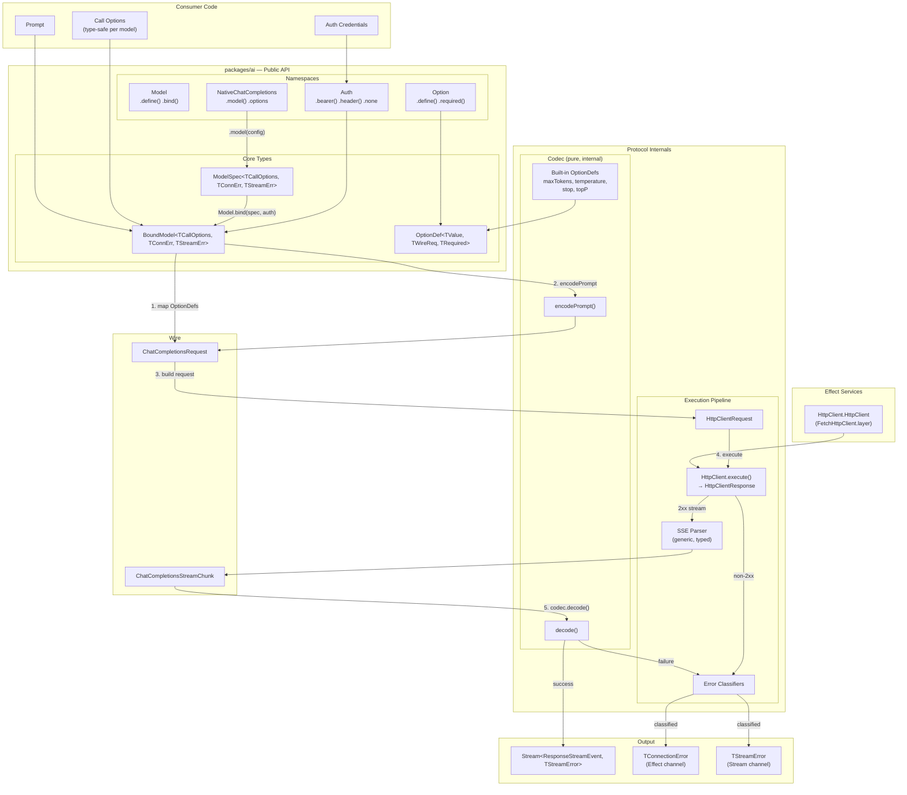
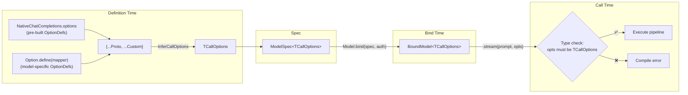

# `packages/ai` — Specification

## Overview

`packages/ai` is a type-safe pipeline for calling AI models over known wire formats. It has no built-in providers, no catalogues, no model lists. It provides:

1. Normalized prompt, message, and tool types for representing conversations
2. Normalized response stream events for consuming model output
3. Wire format codecs for known API formats (chat completions)
4. A typed, extensible option system where every option — common or model-specific — uses the same mechanism
5. Model definition and binding that threads types end-to-end with full inference
6. Error types separated by phase (connection vs stream) with typed classification envelopes
7. HTTP transport via Effect's `HttpClient.HttpClient` service — no raw fetch, fully testable via layer substitution
8. Streaming JSON parser for incremental tool call argument parsing

The package builds on substantial existing infrastructure that is already well-built and stays intact: prompt types, message types, tool definitions, response stream events, wire type schemas, the chat completions codec (encode and decode), the streaming JSON parser, and the SSE framing parser.

---

## Architecture



---

## Execution Flow

```mermaid
sequenceDiagram
    participant C as Consumer
    participant BM as BoundModel
    participant OD as OptionDefs
    participant CO as Codec
    participant HC as HttpClient
    participant SSE as SSE Parser
    participant CL as Classifiers
    participant API as Remote API

    C->>BM: .stream(prompt, options)
    BM->>BM: Merge defaults with call options

    loop For each OptionDef
        BM->>OD: optionDef.map(value)
        OD-->>BM: Partial wire fragments
    end

    BM->>BM: Merge: static → mapped → compose()
    BM->>CO: encodePrompt(modelId, prompt, tools)
    CO-->>BM: Wire prompt fragments
    BM->>BM: Merge prompt + options → full wire request
    BM->>BM: Build HttpClientRequest (endpoint, auth, JSON body)

    BM->>HC: httpClient.execute(request)
    HC->>API: HTTP POST
    API-->>HC: HTTP Response

    alt HTTP non-2xx
        HC-->>BM: HttpClientResponse (status, headers, body)
        BM->>BM: Read response body as text
        BM->>CL: classifyConnectionError({status, headers, body})
        CL-->>BM: TConnectionError
        BM-->>C: Effect.fail(TConnectionError)
    else HTTP 2xx
        HC-->>BM: HttpClientResponse (streaming body)
        BM->>SSE: HttpClientResponse.stream() → byte stream → SSE framing → decodePayload(string) → typed chunks
        SSE-->>BM: Stream of typed wire chunks

        BM->>CO: decode(typedChunkStream)

        loop For each chunk
            alt Valid chunk
                CO-->>BM: ResponseStreamEvent
                BM-->>C: Stream.emit(event)
            else Read/parse/decode failure
                CO-->>BM: StreamFailure envelope
                BM->>CL: classifyStreamError(failure)
                CL-->>BM: TStreamError
                BM-->>C: Stream.fail(TStreamError)
            end
        end
    end
```



### Execution Steps (concrete)

When a consumer calls `boundModel.stream(prompt, { maxTokens: 4000, temperature: 0.7 })`:

**Step 1 — Merge defaults:**
```
callOptions = { ...defaults, ...providedOptions }
```

**Step 2 — Map options to wire fragments:**
```
For each (key, value) in callOptions where optionDefs[key] exists:
  fragment = optionDefs[key].map(value)
  // e.g. maxTokens.map(4000) → { max_tokens: 4000 }
  // e.g. temperature.map(0.7) → { temperature: 0.7 }
```

**Step 3 — Encode prompt:**
```
promptFragment = codec.encodePrompt(modelId, prompt, tools)
// Returns { model, messages, tools?, tool_choice? }
// Uses existing encode.ts logic (message encoding, tool schema encoding, image encoding)
```

**Step 4 — Merge everything:**
```
wireRequest = {
  ...staticWireOptions,        // e.g. { stream: true, stream_options: { include_usage: true } }
  ...mergedOptionFragments,    // e.g. { max_tokens: 4000, temperature: 0.7 }
  ...promptFragment,           // e.g. { model: "gpt-5", messages: [...], tools: [...] }
}
```

**Step 5 — Apply compose (if provided):**
```
wireRequest = compose(wireRequest, callOptions)
// e.g. DeepSeek: if thinking enabled, delete temperature
```

**Step 6 — Execute HTTP via Effect HttpClient:**
```
Build HttpClientRequest.post(endpoint + "/chat/completions")
Apply auth headers via AuthApplicator
Set Content-Type: application/json, Accept: text/event-stream
Set JSON body
Execute via HttpClient.HttpClient service
```

**Step 7 — Handle response:**
- Non-2xx: read body text → construct `HttpConnectionFailure { status, headers, body }` → `classifyConnectionError(failure)` → `Effect.fail(TConnectionError)`
- 2xx: `HttpClientResponse.stream()` → byte stream → SSE parser with typed decode → `Stream<TWireChunk>`

**Step 8 — Decode chunks:**
```
codec.decode(chunkStream) → Stream<ResponseStreamEvent, StreamError>
// Uses existing decode.ts logic (chunk delta processing, tool call streaming, jsonish parser)
```

---

## Type Flow



---

## Concepts

### Option

An option is the atom of the system. It has a name, a value type, and a mapping function that converts the value into wire format fragments. Every option works the same way regardless of whether it's a common option like `maxTokens` or a model-specific option like `thinking`.

### Protocol

A protocol is a complete wire format implementation. It knows how to encode prompts and tools into a specific wire format, how to receive streaming responses, and how to decode those responses into normalized events. It also provides pre-built options for things that are normalizable across models using that format.

Internally, a protocol owns a **codec** (pure encode/decode) and a generic **SSE-over-HTTP execution pipeline** that uses Effect's `HttpClient.HttpClient` service for transport. The codec is internal to the protocol — consumers never see or configure it. `HttpClient` is the only Effect service dependency.

```
Protocol (consumer-facing namespace)
├── .model(config)  →  ModelSpec (codec is used internally)
├── .options        →  pre-built OptionDefs
│
│  Internals (not exposed to consumers):
├── codec           →  pure encode/decode
└── SSE pipeline    →  uses HttpClient.HttpClient from Effect environment
```

### Model Spec

A model spec is the complete typed contract for calling a specific model. It's formed by combining a protocol with model-specific options, an endpoint, and metadata. The spec's type parameters determine what call options are available and what errors can occur. Error types are fully inferred from classifier return types.

### Bound Model

A bound model is a model spec that has been given concrete authentication and optional default options. It's ready to execute — call `.stream(prompt, options)` to get a typed Effect/Stream pipeline.

---

## Existing Infrastructure (unchanged)

These modules are already well-built and remain intact:

### Prompt Types (`lib/prompt/`)

```ts
// Prompt is a Schema.Class — both a type and a runtime constructor
class Prompt extends Schema.Class<Prompt>("Prompt")({
  system: Schema.String,
  messages: Schema.Array(MessageSchema),
}) {
  static empty(): Prompt
  static from(system: string, messages: readonly Message[]): Prompt
}

class Prompt extends Schema.Class<Prompt>("Prompt")({
  system: Schema.String,
  messages: Schema.Array(MessageSchema),
}) {
  static empty(): Prompt
  static from(system: string, messages: readonly Message[]): Prompt
}

type Message = UserMessage | AssistantMessage | ToolResultMessage

interface UserMessage {
  readonly _tag: "UserMessage"
  readonly parts: readonly (TextPart | ImagePart)[]
}

interface AssistantMessage {
  readonly _tag: "AssistantMessage"
  readonly reasoning?: string
  readonly text?: string
  readonly toolCalls?: readonly ToolCallPart[]
}

interface ToolResultMessage {
  readonly _tag: "ToolResultMessage"
  readonly toolCallId: ToolCallId
  readonly toolName: string
  readonly parts: readonly (TextPart | ImagePart)[]
}
```

All message types have Effect Schema definitions for serialization.

### Tool Definitions (`lib/tools/`)

`ToolDefinition` uses never-switching. The erased form (`ToolDefinition`) is used in acceptance positions. The concrete form carries full input/output schema types.

```ts
// Erased — for acceptance in collections
interface ToolDefinitionErased {
  readonly name: string
  readonly description: string
  readonly inputSchema: Schema.Schema.Any
  readonly outputSchema: Schema.Schema.Any
}

// Concrete — full type safety
interface ToolDefinitionConcrete<TInput, TOutput, TInputEncoded, TOutputEncoded> {
  readonly name: string
  readonly description: string
  readonly inputSchema: Schema.Schema<TInput, TInputEncoded, never>
  readonly outputSchema: Schema.Schema<TOutput, TOutputEncoded, never>
}

// Never-switched
type ToolDefinition<
  TInput = never,
  TOutput = never,
  TInputEncoded = TInput,
  TOutputEncoded = TOutput,
> = [TInput] extends [never]
  ? ToolDefinitionErased
  : ToolDefinitionConcrete<TInput, TOutput, TInputEncoded, TOutputEncoded>

function defineTool<TInput, TOutput, TInputEncoded = TInput, TOutputEncoded = TOutput>(
  definition: ToolDefinitionConcrete<TInput, TOutput, TInputEncoded, TOutputEncoded>,
): ToolDefinitionConcrete<TInput, TOutput, TInputEncoded, TOutputEncoded>
```

### Response Stream Events (`lib/response/`)

```ts
type ResponseStreamEvent =
  | { readonly _tag: "thought_start"; readonly level: "low" | "medium" | "high" }
  | { readonly _tag: "thought_delta"; readonly text: string }
  | { readonly _tag: "thought_end" }
  | { readonly _tag: "message_start" }
  | { readonly _tag: "message_delta"; readonly text: string }
  | { readonly _tag: "message_end" }
  | { readonly _tag: "tool_call_start"; readonly toolCallId: ToolCallId; readonly toolName: string }
  | { readonly _tag: "tool_call_field_start"; readonly toolCallId: ToolCallId; readonly path: readonly string[] }
  | { readonly _tag: "tool_call_field_delta"; readonly toolCallId: ToolCallId; readonly path: readonly string[]; readonly delta: string }
  | { readonly _tag: "tool_call_field_end"; readonly toolCallId: ToolCallId; readonly path: readonly string[]; readonly value: JsonValue }
  | { readonly _tag: "tool_call_end"; readonly toolCallId: ToolCallId }
  | { readonly _tag: "response_done"; readonly reason: string; readonly usage?: ResponseUsage }

interface ResponseUsage {
  readonly inputTokens: number
  readonly outputTokens: number
  readonly cacheReadTokens: number
}
```

### Wire Types (`lib/wire/`)

Effect Schema definitions for the OpenAI chat completions wire format:
- `ChatCompletionsRequest` — the full request body schema
- `ChatCompletionsStreamChunk` — a single SSE chunk schema
- `ChatMessage`, `ChatTool`, `ChatToolCall`, `ChatContentPart` — sub-schemas

### Chat Completions Codec (`lib/codec/native-chat-completions/`)

**Encode** (`encode.ts`): Converts `Prompt` + tools into `ChatCompletionsRequest`:
- System prompt → `{ role: "system", content }` (if non-empty)
- User messages → `{ role: "user", content }` with text/image part encoding
- Assistant messages → `{ role: "assistant", content, reasoning_content?, tool_calls? }`
- Tool results → `{ role: "tool", tool_call_id, content }`
- Tools → `{ type: "function", function: { name, description, parameters: JSONSchema } }`
- Image parts → base64 data URLs

Currently also maps `EncodeOptions` fields to wire keys — this option-mapping responsibility moves to OptionDefs in the new design. The prompt/tool encoding logic stays exactly as-is.

**Decode** (`decode.ts`): Converts `Stream<ChatCompletionsStreamChunk>` into `Stream<ResponseStreamEvent>`:
- Tracks thought/message/tool-call lifecycle state
- Streams tool call arguments through the jsonish streaming JSON parser
- Emits field-level events (`tool_call_field_start/delta/end`) for incremental tool call parsing
- Maps finish reasons and usage

This entire decode pipeline stays unchanged.

### Streaming JSON Parser (`lib/jsonish/`)

Incremental JSON parser that produces partial parse trees as data arrives. Used by the decode pipeline to stream tool call arguments field-by-field. Stays unchanged.

### SSE Parser (`lib/driver/sse.ts` → moves to `lib/transport/sse.ts`)

Parses Server-Sent Events from a byte stream. In the new design, this becomes **generic over the output type** — it takes a typed decode function and returns fully typed output. No `unknown` anywhere in the pipeline.

```ts
function sseStream<T, E>(
  byteStream: Stream.Stream<Uint8Array, E>,
  decodePayload: (raw: string) => Effect.Effect<T, ParseError>,
): Stream.Stream<T, E | ParseError>
```

The pipeline:
1. UTF-8 decode
2. Line splitting
3. Filter comments and blanks
4. Extract `data:` payloads
5. Stop at `[DONE]`
6. `decodePayload(raw)` → `T`

For chat completions, the decode function is:
```ts
const decodeChatCompletionsPayload = (raw: string): Effect.Effect<ChatCompletionsStreamChunk, ParseError> =>
  pipe(
    Effect.try({ try: () => JSON.parse(raw), catch: () => new ParseError({ sourceId, message: `Invalid JSON: ${raw}` }) }),
    Effect.flatMap(Schema.decode(ChatCompletionsStreamChunk)),
    Effect.mapError((e) => new ParseError({ sourceId, message: String(e) })),
  )
```

`JSON.parse` returns `any` internally, but it's immediately piped into `Schema.decode` which validates and returns a typed `ChatCompletionsStreamChunk`. The `any` never escapes the function boundary.

---

## New and Refactored Types

### Option

`OptionDef` uses never-switching for type safety. The erased form (`OptionDef`) is used in acceptance positions like `Record<string, OptionDef>`. The concrete form carries full type information.

```ts
// Erased — for acceptance in collections and conditional type matching
interface OptionDefErased {
  readonly _tag: "OptionDef"
  readonly required: boolean
  readonly map: (value: never) => Record<string, unknown>
}

// Concrete — full type safety
interface OptionDefConcrete<TValue, TWireReq, TRequired extends boolean> {
  readonly _tag: "OptionDef"
  readonly required: TRequired
  readonly map: (value: TValue) => Partial<TWireReq>
}

// Never-switched
type OptionDef<TValue = never, TWireReq = never, TRequired extends boolean = false> =
  [TValue] extends [never] ? OptionDefErased : OptionDefConcrete<TValue, TWireReq, TRequired>
```

Type extraction uses `infer` — the `any` never escapes:

```ts
type ExtractValue<T> = T extends OptionDefConcrete<infer V, infer _W, infer _R> ? V : never
type ExtractRequired<T> = T extends OptionDefConcrete<infer _V, infer _W, infer R> ? R : false

type RequiredKeys<T extends Record<string, OptionDef>> = {
  [K in keyof T]: ExtractRequired<T[K]> extends true ? K : never
}[keyof T]

type OptionalKeys<T extends Record<string, OptionDef>> = {
  [K in keyof T]: ExtractRequired<T[K]> extends true ? never : K
}[keyof T]

type InferCallOptions<T extends Record<string, OptionDef>> =
  & { readonly [K in RequiredKeys<T>]: ExtractValue<T[K]> }
  & { readonly [K in OptionalKeys<T>]?: ExtractValue<T[K]> }
```

### Codec (internal)

The codec interface is simplified — it no longer takes an options bag. Prompt encoding produces wire fragments. Option mapping is handled separately by the option system.

```ts
interface Codec<TWireReq, TWireChunk> {
  readonly id: string

  readonly encodePrompt: (
    model: string,
    prompt: Prompt,
    tools: readonly ToolDefinition[],
  ) => Partial<TWireReq>

  readonly decode: (
    chunks: Stream.Stream<TWireChunk, StreamError>,
  ) => Stream.Stream<ResponseStreamEvent, StreamError>
}
```

The codec also provides pre-built option defs for normalizable options. These are exposed through the protocol namespace, not the codec directly.

### Transport

There is no `Driver` interface. Transport uses Effect's `HttpClient.HttpClient` service from `@effect/platform`.

- **Prod**: `FetchHttpClient.layer` (Bun ships native fetch)
- **Tests**: `HttpClient.make(...)` to build a mock client (already proven in `packages/drivers` tests)

The execution function:

```ts
function executeHttpStream<TWireReq, TWireChunk>(config: {
  readonly url: string
  readonly body: TWireReq
  readonly auth: AuthApplicator
  readonly extraHeaders?: Record<string, string>
  readonly decodePayload: (raw: string) => Effect.Effect<TWireChunk, ParseError>
  readonly sourceId: string
  readonly doneSignal?: string  // default "[DONE]"
}): Effect.Effect<
  Stream.Stream<TWireChunk, StreamFailure>,
  HttpConnectionFailure,
  HttpClient.HttpClient
>
```

Implementation:
1. Build `HttpClientRequest.post(url)` with auth headers, Accept: text/event-stream, JSON body
2. Execute via `HttpClient.HttpClient` service
3. On non-2xx: read body text → return `HttpConnectionFailure { status, headers, body }`
4. On 2xx: `HttpClientResponse.stream()` → `sseStream(byteStream, decodePayload)` → `Stream<TWireChunk>`
5. Stream transport errors wrapped as `StreamFailure.ReadFailure`
6. SSE parse errors wrapped as `StreamFailure.SseParseFailure`
7. Chunk decode errors wrapped as `StreamFailure.ChunkDecodeFailure`

This function returns raw failure envelopes — classification happens in the model layer.

### Auth

```ts
type AuthApplicator = (headers: Headers) => void

const Auth = {
  bearer: (token: string): AuthApplicator => (headers) => {
    headers.set("Authorization", `Bearer ${token}`)
  },
  header: (name: string, value: string): AuthApplicator => (headers) => {
    headers.set(name, value)
  },
  none: (() => {}) as AuthApplicator,
}
```

Replaces the existing `ResolvedAuth` / `AuthMethod` / `AuthStorage` / `ModelAuth` system. Those are provider-level concerns that belong in `packages/providers`.

### Errors

Errors are separated into two phases that map to the Effect/Stream boundary.

**Connection errors** — occur during the initial HTTP request, before any streaming begins. These are the Effect's error channel.

```ts
type ConnectionError =
  | AuthFailed
  | RateLimited
  | UsageLimitExceeded
  | ContextLimitExceeded
  | InvalidRequest
  | TransportError
```

**Stream errors** — occur while reading or decoding the response stream. These are the Stream's error channel.

```ts
type StreamError =
  | TransportError
  | ParseError
```

Each error type uses Effect's `Data.TaggedError`:

```ts
class AuthFailed extends Data.TaggedError("AuthFailed")<{
  readonly sourceId: string
  readonly status: number
  readonly message: string
}> {}

class RateLimited extends Data.TaggedError("RateLimited")<{
  readonly sourceId: string
  readonly status: number
  readonly message: string
  readonly retryAfterMs: number | null
}> {}

class UsageLimitExceeded extends Data.TaggedError("UsageLimitExceeded")<{
  readonly sourceId: string
  readonly status: number
  readonly message: string
}> {}

class ContextLimitExceeded extends Data.TaggedError("ContextLimitExceeded")<{
  readonly sourceId: string
  readonly status: number
  readonly message: string
}> {}

class InvalidRequest extends Data.TaggedError("InvalidRequest")<{
  readonly sourceId: string
  readonly status: number
  readonly message: string
}> {}

class TransportError extends Data.TaggedError("TransportError")<{
  readonly sourceId: string
  readonly status: number | null
  readonly message: string
  readonly retryable: boolean
}> {}

class ParseError extends Data.TaggedError("ParseError")<{
  readonly sourceId: string
  readonly message: string
}> {}
```

### Error Classification

Error classification is how providers map raw HTTP/stream failures into typed, actionable errors. The framework handles the mechanics (HTTP execution, SSE parsing) and hands typed failure envelopes to provider-defined classifier functions.

#### How it works

1. The execution pipeline encounters a failure
2. The pipeline constructs a typed failure envelope with all available information at that point
3. The pipeline calls the provider's classifier function with the envelope
4. The classifier returns a provider-defined error type
5. The error propagates through the appropriate channel (Effect error for connection, Stream error for stream)

#### Connection failure envelope

When the HTTP response is non-2xx, the pipeline reads the full response and constructs:

```ts
interface HttpConnectionFailure {
  readonly status: number       // HTTP status code (e.g. 429, 401, 400)
  readonly headers: Headers     // Full response headers — retry-after, x-ratelimit-*, etc.
  readonly body: string         // Raw response body text — classifier parses JSON if it wants
}
```

The classifier receives this and returns whatever error type the provider defines:

```ts
classifyConnectionError: (failure: HttpConnectionFailure) => TConnectionError
```

**What's available to classifiers — concretely:**
- `failure.status` — HTTP status code. Use for coarse classification (401 = auth, 429 = rate limit, 400 = invalid request).
- `failure.headers` — Full `Headers` object. Use `.get("retry-after")` for rate limit backoff, `.get("x-ratelimit-remaining")` for quota info.
- `failure.body` — Raw response body as string. The classifier does its own `JSON.parse()` if it wants structured data. This is intentional — different providers have different error body shapes:
  - OpenAI: `{"error": {"message": "...", "type": "...", "code": "..."}}`
  - Anthropic: `{"type": "error", "error": {"type": "rate_limit_error", "message": "..."}}`
  - DeepSeek: `{"error": {"message": "...", "type": "...", "code": "..."}}`
  - Fireworks: `{"fault": {"faultstring": "...", "detail": {...}}}`

#### Stream failure envelope

When a failure occurs during streaming, the pipeline constructs a discriminated union:

```ts
type StreamFailure =
  | { readonly _tag: "ReadFailure"; readonly cause: Error }
  | { readonly _tag: "SseParseFailure"; readonly payload: string }
  | { readonly _tag: "ChunkDecodeFailure"; readonly payload: string; readonly cause: Error }
```

The classifier receives this and returns whatever stream error type the provider defines:

```ts
classifyStreamError: (failure: StreamFailure) => TStreamError
```

**What each phase means:**
- `ReadFailure` — the byte stream broke mid-read. `cause` is the transport error.
- `SseParseFailure` — received bytes but couldn't parse as valid SSE data line. `payload` is the raw line.
- `ChunkDecodeFailure` — SSE payload parsed fine but schema validation of the JSON chunk failed. `payload` is the raw SSE data string, `cause` is the decode error.

#### Default classifiers

The package ships default classifiers that handle common cases. The default connection classifier reuses the existing pattern-matching logic (context limit patterns, auth signal patterns, usage limit patterns, retry-after parsing, nested JSON extraction) from the current `classify.ts`:

```ts
function defaultClassifyConnectionError(sourceId: string, failure: HttpConnectionFailure): ConnectionError {
  const body = failure.body
  const lower = body.toLowerCase()

  // Context limit detection (existing patterns)
  if (hasPattern(lower, CONTEXT_LIMIT_PATTERNS))
    return new ContextLimitExceeded({ sourceId, status: failure.status, message: extractMessage(body) })

  // Auth detection
  if (failure.status === 401 || failure.status === 403 || hasPattern(lower, AUTH_SIGNAL_PATTERNS))
    return new AuthFailed({ sourceId, status: failure.status, message: extractMessage(body) })

  // Rate limit vs usage limit
  if (failure.status === 429) {
    if (hasPattern(lower, USAGE_LIMIT_PATTERNS))
      return new UsageLimitExceeded({ sourceId, status: failure.status, message: extractMessage(body) })
    return new RateLimited({
      sourceId, status: failure.status,
      message: extractMessage(body),
      retryAfterMs: parseRetryAfter(failure.headers),
    })
  }

  // Client errors
  if (failure.status >= 400 && failure.status < 500)
    return new InvalidRequest({ sourceId, status: failure.status, message: extractMessage(body) })

  // Server errors
  return new TransportError({
    sourceId, status: failure.status,
    message: extractMessage(body), retryable: failure.status >= 500,
  })
}

function defaultClassifyStreamError(sourceId: string, failure: StreamFailure): StreamError {
  switch (failure._tag) {
    case "ReadFailure":
      return new TransportError({ sourceId, status: null, message: String(failure.cause), retryable: true })
    case "SseParseFailure":
      return new ParseError({ sourceId, message: `SSE parse failure: ${failure.payload}` })
    case "ChunkDecodeFailure":
      return new ParseError({ sourceId, message: `Chunk decode failure: ${String(failure.cause)}` })
  }
}
```

#### Provider-defined custom errors

Providers can define their own error types with additional fields. The error type parameters on `ModelSpec` are fully generic — no `extends` constraints:

```ts
class FireworksRateLimited extends Data.TaggedError("FireworksRateLimited")<{
  readonly sourceId: string
  readonly status: number
  readonly message: string
  readonly retryAfterMs: number
  readonly quotaTier: string
  readonly faultString: string
}> {}

type FireworksConnectionError = FireworksRateLimited | AuthFailed | TransportError

const fireworksModel = NativeChatCompletions.model({
  // ...
  classifyConnectionError: (failure): FireworksConnectionError => {
    if (failure.status === 429) {
      const parsed = JSON.parse(failure.body)
      return new FireworksRateLimited({
        sourceId: "fireworks",
        status: failure.status,
        message: parsed.fault?.faultstring ?? "Rate limited",
        retryAfterMs: Number(failure.headers.get("retry-after") ?? 0) * 1000,
        quotaTier: parsed.fault?.detail?.tier ?? "unknown",
        faultString: parsed.fault?.faultstring ?? "",
      })
    }
    return defaultClassifyConnectionError(failure)
  },
})

// Consumer gets typed errors
pipe(
  model.stream(prompt, opts),
  Effect.catchTag("FireworksRateLimited", (e) => {
    console.log(e.quotaTier, e.faultString)  // fully typed
  }),
)
```

#### If no classifiers are provided

Both `classifyConnectionError` and `classifyStreamError` are optional. When omitted, the default classifiers are used, and the error types default to `ConnectionError` and `StreamError` respectively.

### ModelSpec

The complete typed contract for a model. Three type parameters: call options, connection error, stream error. Error types default to the standard types so most consumers only specify call options.

```ts
interface ModelSpec<
  TCallOptions,
  TConnectionError = ConnectionError,
  TStreamError = StreamError,
> {
  readonly id: string
  readonly modelId: string
  readonly endpoint: string
  readonly contextWindow: number
  readonly maxOutputTokens: number

  /** @internal — closed over codec, options, transport config, classifiers */
  readonly _execute: (
    auth: AuthApplicator,
    prompt: Prompt,
    tools: readonly ToolDefinition[],
    options: TCallOptions,
  ) => Effect.Effect<
    Stream.Stream<ResponseStreamEvent, TStreamError>,
    TConnectionError,
    HttpClient.HttpClient
  >
}
```

### BoundModel

An authenticated model spec with optional defaults. Ready to call.

```ts
interface BoundModel<
  TCallOptions,
  TConnectionError = ConnectionError,
  TStreamError = StreamError,
> {
  readonly spec: ModelSpec<TCallOptions, TConnectionError, TStreamError>

  readonly stream: (
    prompt: Prompt,
    tools: readonly ToolDefinition[],
    options?: TCallOptions,
  ) => Effect.Effect<
    Stream.Stream<ResponseStreamEvent, TStreamError>,
    TConnectionError,
    HttpClient.HttpClient
  >
}
```


---

## Public API

### `Option` namespace

```ts
const Option = {
  define: <TValue, TWireReq>(map: (value: TValue) => Partial<TWireReq>): OptionDef<TValue, TWireReq, false>
  required: <TValue, TWireReq>(map: (value: TValue) => Partial<TWireReq>): OptionDef<TValue, TWireReq, true>
}
```

### `Auth` namespace

```ts
const Auth = {
  bearer: (token: string) => AuthApplicator
  header: (name: string, value: string) => AuthApplicator
  none: AuthApplicator
}
```

### `Model` namespace

`Model.define` is internal — consumers use protocol namespaces like `NativeChatCompletions.model()`. `Model.bind` is the public binding API.

```ts
const Model = {
  bind: <TCallOptions, TConnectionError, TStreamError>(
    spec: ModelSpec<TCallOptions, TConnectionError, TStreamError>,
    auth: AuthApplicator,
    defaults?: Partial<TCallOptions>,
  ) => BoundModel<TCallOptions, TConnectionError, TStreamError>
}
```

### `NativeChatCompletions` namespace

The protocol namespace for OpenAI-compatible chat completions format.

```ts
const NativeChatCompletions = {
  model: <TOptions, TConnectionError, TStreamError>(config: {
    id: string
    modelId: string
    endpoint: string
    contextWindow: number
    maxOutputTokens: number
    options: TOptions
    staticWireOptions?: Partial<ChatCompletionsRequest>
    compose?: (wire: Partial<ChatCompletionsRequest>, callOpts: InferCallOptions<TOptions>) => Partial<ChatCompletionsRequest>
    classifyConnectionError?: (failure: HttpConnectionFailure) => TConnectionError
    classifyStreamError?: (failure: StreamFailure) => TStreamError
  }) => ModelSpec<InferCallOptions<TOptions>, TConnectionError, TStreamError>

  options: {
    maxTokens: OptionDef<number, ChatCompletionsRequest>        // (v) => ({ max_tokens: v })
    temperature: OptionDef<number, ChatCompletionsRequest>      // (v) => ({ temperature: v })
    stop: OptionDef<readonly string[], ChatCompletionsRequest>  // (v) => ({ stop: [...v] })
    topP: OptionDef<number, ChatCompletionsRequest>             // (v) => ({ top_p: v })
  }
}
```

`NativeChatCompletions.model()` internally calls `Model.define()` with:
- The native chat completions codec (encodePrompt + decode)
- Transport config: URL path `/chat/completions`, `decodePayload` = JSON.parse + Schema.decode(ChatCompletionsStreamChunk)

---

## Retry

Retry logic wraps the transport stream with exponential backoff + jitter. Same logic as existing `lib/retry/retry.ts`:
- Retries `RateLimited` (honors `retryAfterMs` if present)
- Retries `TransportError` where `retryable === true`
- Max 5 attempts by default
- Exponential backoff capped at 30s with jitter

Updated to work with the new error types (`ConnectionError` instead of `ModelError`).

## Tracing

Same `AiTracer` Effect service pattern as today. Updated to use `sourceId` instead of `providerId`. Traces request, response events, and errors. Optional — if `AiTracer` is not in the environment, tracing is a no-op.

---

## Examples

### Fireworks — MiniMax with reasoning effort

```ts
import { Model, NativeChatCompletions, Auth, Option } from "@magnitude/ai"

const minimaxM27 = NativeChatCompletions.model({
  id: "fireworks/minimax-m2.7",
  modelId: "accounts/fireworks/models/minimax-m2.7",
  endpoint: "https://api.fireworks.ai/inference/v1",
  contextWindow: 196_000,
  maxOutputTokens: 196_000,

  options: {
    ...NativeChatCompletions.options,
    reasoningEffort: Option.define(
      (val: "none" | "low" | "medium") => ({ reasoning_effort: val })
    ),
  },

  staticWireOptions: {
    stream: true,
    stream_options: { include_usage: true },
    temperature: 1.0,
  },
})

const model = Model.bind(minimaxM27, Auth.bearer(process.env.FIREWORKS_API_KEY!))

model.stream(prompt, tools, {
  maxTokens: 4000,
  reasoningEffort: "low",
})
```

### Magnitude gateway — Kimi K2.6 with grammar

```ts
const kimiK26 = NativeChatCompletions.model({
  id: "magnitude/kimi-k2.6",
  modelId: "kimi-k2.6",
  endpoint: "https://app.magnitude.dev/api/v1",
  contextWindow: 262_000,
  maxOutputTokens: 262_000,

  options: {
    ...NativeChatCompletions.options,
    grammar: Option.define(
      (g: string) => ({ response_format: { type: "grammar", grammar: g } })
    ),
  },

  staticWireOptions: {
    stream: true,
    stream_options: { include_usage: true },
    temperature: 1.0,
  },
})

const model = Model.bind(kimiK26, Auth.bearer(process.env.MAGNITUDE_API_KEY!))

model.stream(prompt, myTools, {
  maxTokens: 8000,
  grammar: "<some-grammar>",
})
```

### DeepSeek — thinking toggle with cross-cutting

```ts
type DeepSeekThinking = { type: "enabled" } | { type: "disabled" }

const deepseekV4 = NativeChatCompletions.model({
  id: "deepseek/deepseek-v4-pro",
  modelId: "deepseek-v4-pro",
  endpoint: "https://api.deepseek.com/v1",
  contextWindow: 262_144,
  maxOutputTokens: 131_072,

  options: {
    ...NativeChatCompletions.options,
    thinking: Option.define(
      (val: DeepSeekThinking) => ({ thinking: val })
    ),
  },

  compose: (wire, callOpts) => {
    if (callOpts.thinking?.type === "enabled") {
      return { ...wire, temperature: undefined }
    }
    return wire
  },

  staticWireOptions: {
    stream: true,
    stream_options: { include_usage: true },
  },
})
```

### Required option

```ts
const deepseekReasoner = NativeChatCompletions.model({
  id: "deepseek/deepseek-reasoner",
  modelId: "deepseek-reasoner",
  endpoint: "https://api.deepseek.com/v1",
  contextWindow: 262_144,
  maxOutputTokens: 131_072,

  options: {
    ...NativeChatCompletions.options,
    thinking: Option.required(
      (val: { type: "enabled" }) => ({ thinking: val })
    ),
  },

  staticWireOptions: {
    stream: true,
    stream_options: { include_usage: true },
  },
})

const model = Model.bind(deepseekReasoner, Auth.bearer(key))

// ❌ compile error: thinking is required
model.stream(prompt, [], { maxTokens: 4000 })

// ✅
model.stream(prompt, [], { maxTokens: 4000, thinking: { type: "enabled" } })
```

### Custom error classification

```ts
class MyRateLimitError extends Data.TaggedError("MyRateLimitError")<{
  readonly sourceId: string
  readonly status: number
  readonly message: string
  readonly retryAfterMs: number
  readonly quotaRemaining: number
}> {}

const myModel = NativeChatCompletions.model({
  id: "custom/model",
  modelId: "model-v1",
  endpoint: "https://api.custom.com/v1",
  contextWindow: 100_000,
  maxOutputTokens: 50_000,

  options: { ...NativeChatCompletions.options },

  classifyConnectionError: (failure) => {
    if (failure.status === 429) {
      const parsed = JSON.parse(failure.body)
      return new MyRateLimitError({
        sourceId: "custom",
        status: failure.status,
        message: parsed.message,
        retryAfterMs: parsed.retry_after_ms,
        quotaRemaining: parsed.quota_remaining,
      })
    }
    return defaultClassifyConnectionError(failure)
  },

  staticWireOptions: { stream: true },
})
```

### Testing with mock HttpClient

```ts
import { Model, NativeChatCompletions } from "@magnitude/ai"
import { HttpClient, HttpClientResponse } from "@effect/platform"
import { Effect, Layer } from "effect"

const spec = NativeChatCompletions.model({
  id: "test/model",
  modelId: "test-model",
  endpoint: "http://localhost:8080",
  contextWindow: 100_000,
  maxOutputTokens: 50_000,
  options: { ...NativeChatCompletions.options },
  staticWireOptions: { stream: true },
})

// Mock HttpClient that returns canned SSE responses
const mockHttpClient = HttpClient.make((req) =>
  Effect.succeed(
    HttpClientResponse.fromWeb(
      req,
      new Response(ssePayload, { status: 200, headers: { "content-type": "text/event-stream" } })
    )
  )
)
const MockHttpClientLayer = Layer.succeed(HttpClient.HttpClient, mockHttpClient)

const model = Model.bind(spec, Auth.bearer("test-token"))

// Run with mock transport
const result = pipe(
  model.stream(prompt, [], { maxTokens: 100 }),
  Effect.provide(MockHttpClientLayer),
)
```

---

## Module Structure

```
packages/ai/src/
├── index.ts                          # public barrel
│
├── lib/
│   ├── prompt/                       # UNCHANGED
│   │   ├── prompt.ts                 # Prompt class
│   │   ├── messages.ts               # Message types (User, Assistant, ToolResult)
│   │   ├── parts.ts                  # TextPart, ImagePart, ToolCallPart
│   │   ├── ids.ts                    # ToolCallId
│   │   └── prompt-builder.ts         # PromptBuilder
│   │
│   ├── tools/                        # UNCHANGED
│   │   └── tool-definition.ts        # ToolDefinition, defineTool
│   │
│   ├── response/                     # UNCHANGED
│   │   ├── events.ts                 # ResponseStreamEvent
│   │   └── usage.ts                  # ResponseUsage
│   │
│   ├── wire/                         # UNCHANGED
│   │   └── chat-completions.ts       # ChatCompletionsRequest, ChatCompletionsStreamChunk
│   │
│   ├── jsonish/                      # UNCHANGED
│   │   ├── parser.ts                 # Streaming JSON parser
│   │   └── types.ts                  # ParsedValue types
│   │
│   ├── options/                      # NEW
│   │   └── option.ts                 # OptionDef, Option namespace, InferCallOptions
│   │
│   ├── errors/                       # REFACTORED
│   │   ├── model-error.ts            # Error classes (sourceId), ConnectionError, StreamError unions
│   │   ├── classify.ts               # Default classifiers (reuses existing pattern-matching logic)
│   │   └── failure.ts                # HttpConnectionFailure, StreamFailure envelope types
│   │
│   ├── codec/                        # SIMPLIFIED
│   │   ├── codec.ts                  # Codec interface (no EncodeOptions)
│   │   └── native-chat-completions/
│   │       ├── index.ts
│   │       ├── encode.ts             # Prompt/tool encoding (option mapping removed)
│   │       └── decode.ts             # UNCHANGED — chunk→event transformation
│   │
│   ├── transport/                    # NEW (replaces lib/driver/)
│   │   ├── sse.ts                    # Generic typed SSE parser (moved from lib/driver/sse.ts)
│   │   └── stream.ts                 # executeHttpStream — SSE-over-HTTP via HttpClient
│   │
│   ├── model/                        # NEW (replaces lib/execution/)
│   │   ├── model-spec.ts             # ModelSpec type
│   │   ├── bound-model.ts            # BoundModel type + stream() method
│   │   └── define.ts                 # Model.define, Model.bind
│   │
│   ├── protocol/                     # NEW
│   │   └── native-chat-completions.ts # NativeChatCompletions namespace
│   │
│   ├── auth/                         # SIMPLIFIED
│   │   └── auth.ts                   # Auth namespace (bearer, header, none), AuthApplicator
│   │
│   ├── retry/                        # MINOR REFACTOR
│   │   └── retry.ts                  # Exponential backoff (updated error types)
│   │
│   └── tracing/                      # MINOR REFACTOR
│       └── tracer.ts                 # AiTracer service (updated to sourceId)
```

**Deleted:**
- `catalogues/` — moves to `packages/providers`
- `providers/` — moves to `packages/providers`
- `lib/auth/storage.ts`, `lib/auth/env.ts`, `lib/auth/service.ts` — provider-level concerns
- `lib/model/canonical-model.ts`, `lib/model/provider-model.ts` — catalogue concepts
- `lib/execution/provider-definition.ts`, `lib/execution/bind.ts`, `lib/execution/execute.ts` — replaced by `lib/model/`
- `lib/driver/driver.ts`, `lib/driver/openai-chat-completions.ts` — replaced by `lib/transport/`
- `lib/driver/index.ts`

---

## Public Exports

| Category | Exports |
|----------|---------|
| **Namespaces** | `Model`, `NativeChatCompletions`, `Auth`, `Option` |
| **Core types** | `ModelSpec`, `BoundModel`, `OptionDef`, `InferCallOptions`, `AuthApplicator` |
| **Prompt** | `Prompt`, `PromptBuilder`, `Message`, `UserMessage`, `AssistantMessage`, `ToolResultMessage`, `TerminalMessage`, `TextPart`, `ImagePart`, `ToolCallPart`, `ToolCallId`, `JsonValue` |
| **Tools** | `ToolDefinition`, `defineTool` |
| **Response** | `ResponseStreamEvent`, `ResponseUsage` |
| **Errors** | `ConnectionError`, `StreamError`, `AuthFailed`, `RateLimited`, `UsageLimitExceeded`, `ContextLimitExceeded`, `InvalidRequest`, `TransportError`, `ParseError` |
| **Failure envelopes** | `HttpConnectionFailure`, `StreamFailure` |
| **Default classifiers** | `defaultClassifyConnectionError`, `defaultClassifyStreamError` |
| **Wire types** | `ChatCompletionsRequest`, `ChatCompletionsStreamChunk` (for advanced use) |
| **Codec** | `Codec` type (for custom protocol implementations) |
| **Tracing** | `AiTracer`, `NoopAiTracer`, `NoopAiTracerLive` |
| **Jsonish** | Streaming JSON parser types and functions |

---

## What Moves Out

- All provider definitions, model lists, endpoints → `packages/providers`
- All catalogues and discovery → `packages/providers`
- Provider registry → `packages/providers`
- Complex auth system (AuthStorage, ModelAuth, resolveEnvAuth) → `packages/providers`
- ProviderDefinition, ProviderModel, ModelCosts, ModelDiscovery types → `packages/providers`
- NotConfigured error → `packages/providers`

## Future Additions (same system, no new mechanisms)

- `AnthropicMessages` protocol namespace
- `Gemini` protocol namespace
- Common thinking type building blocks
